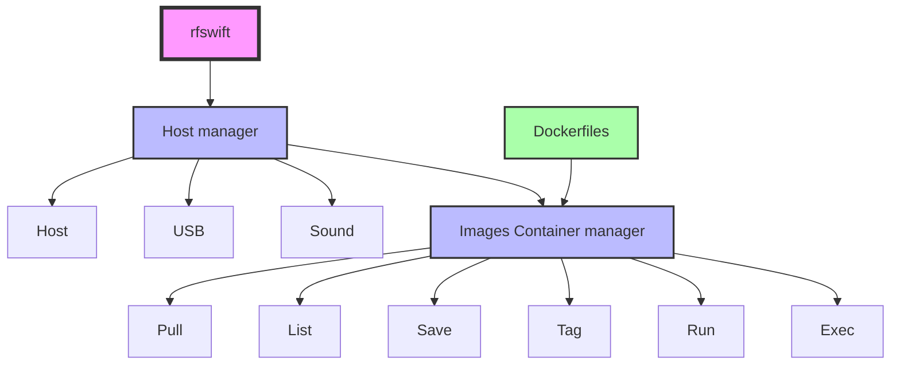

# 👋 Hello! Welcome to the RF Swift documentation!

  <table>
    <tr>
      <td><strong>Supported OSes</strong></td>
      <td></td>
      <td></td>
      <td></td>
    </tr>
    <tr>
      <td><strong>Supported architectures</strong></td>
      <td></td>
      <td></td>
      <td></td>
    </tr>
    <tr>
      <td><strong>Presented at</strong></td>
      <td></td>
      <td>
        
      </td>
      <td>
        
        
      </td>
    </tr>
    <tr>
      <td><strong>Socials</strong></td>
      <td></td>
      <td></td>
      <td>
        
      </td>
    </tr>
  </table>

## What is RF Swift?

**RF Swift** is a toolbox for creating an environment laboratory for your RF assessments, that can easily fit your prerequirements.

This toolbox is probably the **best solution** to deploy a generic, as well as a special environment securely, skipping the headache and waste of time when installing and using RF tools on same host.


  Even if the project could work on macOS with some manual workaround, we do not advertise it for the moment, but this system will be fully supported in the near future.


# RF Swift vs. Specific Security or RF distributions comparison

RF Swift was born from real-world operational needs that no existing distribution could fully address.
During security engagements, we often work on multiple projects within the same week—sometimes even the same day. This creates several challenges that traditional distributions struggle to handle:

- **Isolation between engagements**: Each project needs to remain completely separate to preserve forensic integrity and avoid cross-contamination of traces and artifacts.
- **Reproducible environments**: We need the ability to spin up known-working configurations instantly, without worrying about dependency conflicts or broken toolchains.
- **Experimentation without risk**: Installing experimental tools or libraries for one engagement shouldn't break the setup we rely on for another.

With RF Swift's container-based architecture, each engagement runs in its own isolated environment. You can experiment freely, knowing that a broken dependency or conflicting library won't cascade across your entire system.

| Feature | RF Swift | Pentest Distributions | Dragon OS |
|---------|----------|----------------------|-----------|
| 🖥️ **Host OS Preservation** | ✅ Runs alongside your existing OS | ❌ Requires dedicated partition or VM | ❌ Requires dedicated partition or VM |
| 🧰 **Tool Isolation** | ✅ Tools run in containers without impacting system | ⚠️ Tools can affect system stability | ⚠️ Tools can affect system stability |
| 🚀 **Deployment Speed** | ✅ Fast container deployment | ❌ Full OS installation required | ❌ Full OS installation required |
| 📦 **VM Requirement** | ✅ No VM needed | ⚠️ Needs VM for non-dedicated machines | ⚠️ Needs VM for non-dedicated machines |
| 🔧 **Tool Availability** | ✅ Extensive collection for RF, hardware security, and reversing | ✅ Extensive collection for general pentesting | ✅ Specialized for RF |
| 🔄 **Tool Updates** | ✅ Independent container updates | ⚠️ Tied to system update cycle | ⚠️ Tied to system update cycle |
| 🔁 **Rollback Capability** | ✅ Instant rollback via container images | ❌ Requires snapshots or manual backup | ❌ Requires snapshots or manual backup |
| 💾 **Storage Efficiency** | ✅ Modular—install only what you need | ❌ Requires significant disk space | ❌ Requires significant disk space |
| 🛡️ **Security Isolation** | ✅ Strong container isolation with custom confinement | ⚠️ Limited isolation between applications | ⚠️ Limited isolation between applications |
| 🔌 **Network Containment** | ✅ Per-container network isolation | ⚠️ Requires additional setup | ⚠️ Requires additional setup |
| 🏗️ **Architecture Support** | ✅ x86_64, ARM64, RISC-V64 | ✅ x86_64, ARM64 | ⚠️ Primarily x86_64 |
| 🧩 **Customization** | ✅ Highly modular—pick specific tools | ✅ Customizable, but changes affect entire system | ⚠️ Limited customization |
| 📱 **USB Device Access** | ✅ Streamlined USB forwarding | ✅ Direct access | ✅ Direct access |
| 🔊 **Audio Support** | ✅ Container-based audio support | ✅ Native audio support | ✅ Native audio support |
| 🌐 **Internet Connectivity** | ✅ Configurable per container | ✅ System-wide configuration | ✅ System-wide configuration |

> **Pentest Distributions** includes Kali Linux, Pentoo, Parrot OS, and similar security-focused operating systems.

## Key Benefits of RF Swift

- **Flexibility**: Use RF tools without disrupting your daily work environment
- **Efficiency**: Deploy only the tools you need, when you need them
- **Security**: Strong isolation between containers prevents cross-contamination
- **Portability**: Works across multiple architectures with consistent experience
- **Resource Management**: Optimized resource usage compared to full VMs

## Use Case Scenarios

| Scenario | RF Swift | Kali Linux/Pentoo/Parrot OS | Dragon OS |
|----------|---------|------------------------------|-----------|
| Air-gapped environments | ⭐⭐⭐ | ⭐⭐⭐ | ⭐⭐⭐ |
| Security assessments | ⭐⭐⭐⭐ | ⭐⭐⭐ | ⭐ |
| Quick assessment on personal device | ⭐⭐⭐ | ⭐ | ⭐ |
| Deployment on a burner laptop | ⭐⭐⭐ | ⭐ | ⭐ |
| Low storage environments | ⭐⭐⭐ | ⭐ | ⭐ |
| Multiple architecture development | ⭐⭐⭐ | ⭐⭐ | ⭐ |
| Isolated testing environment | ⭐⭐⭐ | ⭐ | ❌ |
| Organization of traces | ⭐⭐⭐ | ❌ | ❌ |
| Sharing setups with other users | ⭐⭐⭐ | ❌ | ❌ |
| Recording sessions | ⭐⭐⭐ | ❌ | ❌ |

## Comprehensive Container Orchestration

RF Swift provides a complete orchestration solution that goes beyond traditional containers. Unlike standard Docker, RF Swift simplifies the entire workflow with a straightforward learning curve:

RF Swift handles everything from container creation and execution to pulling images, committing changes, and re-tagging. What sets it apart is the seamless integration of USB, video, and audio forwarding in a user-friendly interface—tasks that typically require significant expertise in standard Docker environments.

### Key Components

- **Go binary (rfswift)** - Instruments containers and hosts to simplify the use of tools that may require:
  - Internet connectivity
  - Display
  - Sounds
  - USB accesses
  
  This rfswift is the main program you will interact with to:
  - Run clean containers
  - Execute inside running or paused containers
  - Perform many magic actions that will make things work without a headache

- **Docker images** - Pre-built Docker container images are available in RF Swift's repository. In case you want to bake your own environment, preserve some space, and have a special set-up, you will also find some Docker files you can edit to fit your expectations.

## Questions or Feedback?


  RF Swift is still in active development.
  Have a question or feedback? Feel free to [open an issue](https://github.com/PentHertz/RF-Swift/issues)!


## Next Steps

Dive right into the following section to get started:


  
  
