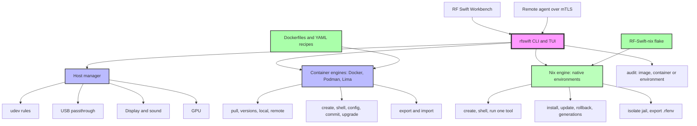

## 👋 Welcome!

  <table>
    <tr>
      <td><strong>Supported OSes</strong></td>
      <td></td>
      <td></td>
      <td></td>
    </tr>
    <tr>
      <td><strong>Supported architectures</strong></td>
      <td></td>
      <td></td>
      <td></td>
    </tr>
    <tr>
      <td><strong>Presented at</strong></td>
      <td></td>
      <td>
        
      </td>
      <td>
        
        
      </td>
    </tr>
    <tr>
      <td><strong>Socials</strong></td>
      <td></td>
      <td></td>
      <td>
        
      </td>
    </tr>
  </table>


**RF Swift v4.0 "Nucleus" is out (v4.0.2).** A native Nix engine that runs the tool sets without containers (and inside a jail with `--isolate` on Linux and macOS), the RF Swift Workbench GUI for assessments, a secure remote agent to drive a lab machine from your laptop, a resource-first CLI, built-in security audits, and native installers for Linux, macOS and Windows. [Read the release notes](/docs/release-notes-v4)


## What is RF Swift?

**RF Swift** builds you a complete hardware and RF security lab in seconds, from a ham shack on a Sunday afternoon to a full engagement on Monday morning. It is a toolbox for creating a laboratory environment for your RF assessments, easily adaptable to your requirements:

- Working tools for specific engagements available in seconds
- Reproducible setups for each context
- Custom recipes for your precise needs
- Freedom from bloated distributions where only 30% of the tools are used and half of what you need is missing
-  No conflicts with your environment or security requirements, unlike dedicated distributions

So this toolbox is probably the **best solution** to deploy a generic, as well as a special environment securely, skipping the headache and waste of time when installing and using RF tools on same host.


  RF Swift runs on Linux, Windows and macOS with one installer each: a shell installer and native packages on Linux, a Homebrew cask or a signed DMG on macOS, and a one-click installer bundle on Windows. See [Getting Started](/docs/getting-started).


## An actively used tool

RF Swift was born from real-world operational needs at [Penthertz](https://penthertz.com/) that no existing distribution could fully address.

During security engagements, we often work on multiple projects within the same week, sometimes even the same day. This creates several challenges that traditional distributions struggle to handle:

- **Isolation between engagements**: Each project needs to remain completely separate to preserve integrity and avoid cross-contamination of traces and artifacts
- **Reproducible environments**: The ability to spin up known-working configurations instantly, without worrying about dependency conflicts or broken toolchains
- **Experimentation without risk**: Installing experimental tools or libraries for one engagement shouldn't break the setup relied on for another
- **Scalability and time saving**: Consultants spend around 1 to 2 days setting up their computers with all the necessary tools, and sometimes more when newly hired
- **No conflict with company environments, especially on Linux**: Not everyone has the luxury of a second laptop for dedicated security work. This solution lets you keep your internal corporate environment intact
- **Maintain own images**: People can maintain their own image and fit them on their needs

## Key Benefits of RF Swift

- **Flexibility**: Use RF tools without disrupting your daily work environment
- **Efficiency**: Deploy only the tools you need, when you need them, down to a single tool with the Nix engine
- **Security**: Manage isolation between containers, and jail native Nix environments, preventing cross-contamination
- **Portability**: Works across multiple architectures with consistent experience
- **Resource Management**: Optimized resource usage compared to full VMs
 
## One workflow for containers and native environments

RF Swift is more than a wrapper around a container engine. One command line, one GUI and one set of ideas (create, enter, configure, audit, export) drive four engines: Docker, Podman and Lima for containers, and Nix for native environments. The engines differ in what they run; the host plumbing they all need (USB, display, sound, udev rules, GPU) is handled by RF Swift, so the learning curve stays flat whichever you pick, and you can switch from a container to a native environment with one flag.

```mermaid
graph TD
    W[RF Swift Workbench] --> A[rfswift CLI and TUI]
    R[Remote agent over mTLS] --> A
    A --> B[Host manager]
    B --> C[udev rules]
    B --> D[USB passthrough]
    B --> F[Display and sound]
    B --> E[GPU]
    A --> G[Container engines: Docker, Podman, Lima]
    A --> N[Nix engine: native environments]
    H[Dockerfiles and YAML recipes] --> G
    X[RF-Swift-nix flake] --> N
    G --> I[pull, versions, local, remote]
    G --> J[create, shell, config, commit, upgrade]
    G --> K[export and import]
    N --> O[create, shell, run one tool]
    N --> P[install, update, rollback, generations]
    N --> Q[isolate jail, export .rfenv]
    A --> S[audit: image, container or environment]

    style A fill:#f9f,stroke:#333,stroke-width:4px
    style B fill:#bbf,stroke:#333,stroke-width:2px
    style G fill:#bbf,stroke:#333,stroke-width:2px
    style N fill:#bfb,stroke:#333,stroke-width:2px
    style H fill:#afa,stroke:#333,stroke-width:2px
    style X fill:#afa,stroke:#333,stroke-width:2px
```

RF Swift handles everything from creation and entry to pulling images or building closures, committing or updating, re-tagging or rolling back. What sets it apart is the seamless integration of USB, display and audio forwarding, the same for a container and for a native environment, tasks that usually take real expertise with a bare engine or a hand-made Nix setup. On Linux and macOS a native environment can also run inside a jail (`--isolate`) that hides your home and the host filesystem while the hardware keeps working. The [command reference](/docs/commands) groups it all by resource: `container`, `image`, `env`, `config`, `network`, `host`, `usb`, `audit`, `agent` and `system`.

### Key Components

- **Go binary (rfswift)** 
 - Instruments containers and hosts to simplify the use of tools that may require:
 - Internet connectivity
 - Display
 - Sounds
 - USB accesses
  
  This ``rfswift`` is the main program you will interact with to:
 - Run clean containers
 - Execute inside running or paused containers
 - Create, enter, update and roll back native Nix environments, jailed or not
 - Perform many magic actions that will make things work without a headache

- **Container images** - Pre-built OCI images are published for x86_64, arm64 and riscv64. To bake your own environment you will also find YAML recipes and Dockerfiles you can edit.

- **Nix environments** - The same tool sets as native, pinned Nix environments (`--engine nix`), defined in the companion [RF-Swift-nix](https://github.com/PentHertz/RF-Swift-nix) repository.

- **RF Swift Workbench** - A desktop GUI (Linux, macOS, Windows) for running assessments: missions, terminals with recordings, notebook, findings, captures, secrets, reports, and an optional coding-agent bridge.

- **Remote agent** - `rfswift agent` serves the engines of a lab machine to the Workbench over mutual TLS.

## Questions or Feedback?


  RF Swift is still in active development.
  Have a question or feedback? Feel free to [open an issue](https://github.com/PentHertz/RF-Swift/issues)!


## Next Steps

Dive right into the following section to get started:


  
  
  
  
  
  
  
