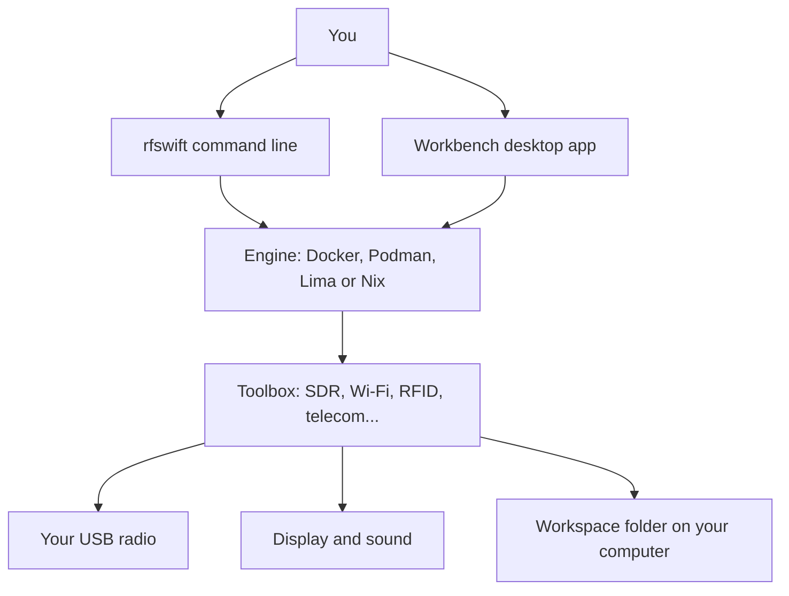
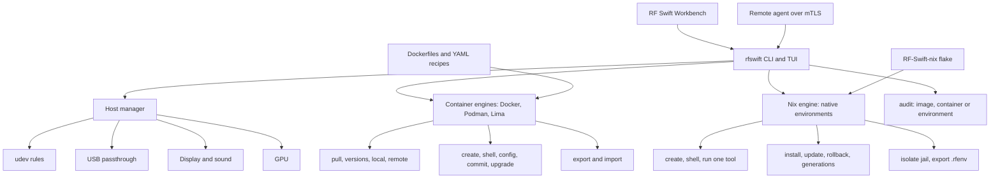

RF Swift gives you a complete radio (RF) and hardware security lab on the computer you already have. You pick a **toolbox** for the job, plug in your radio, and the tools are ready: no compiling, no dependency hunting, no second operating system.


You don't need to know Docker, Linux or radio to start. Read [Key ideas in 5 minutes](/docs/concepts/), then follow the [Quick start](/docs/quick-start/). The words in **bold** on this page are all explained there.


## The problem it solves

Radio tools are hard to install. GNU Radio, SDR++, GQRX, drivers for a HydraSDR, a HackRF or a USRP: each one wants its own libraries and versions, and installing one often breaks another. People lose days setting up a laptop, and the result is fragile and different on every machine.

RF Swift ships those tools **pre-installed and tested together**, grouped by job (SDR, Wi-Fi, Bluetooth, RFID, telecom, automotive, hardware, reversing and more). Each toolbox runs in its own isolated space next to your system, not instead of it. When you are done, your computer is exactly as it was.

## Who it's for

- **Radio amateurs, hobbyists and makers** who want to explore signals without a weekend of setup.
- **Curious beginners** who want to hear their first signal and learn from there.
- **Students and researchers** who need the same working setup on every machine.
- **Security professionals** who run several engagements a week and need each one isolated, reproducible and documented.

It is also what [Penthertz](https://penthertz.com/) uses on its own professional engagements, so the tool sets are exercised in real work, and the same lab is open to everyone.

## How it works


```mermaid
graph TD
    U[You] --> C[rfswift command line]
    U --> W[Workbench desktop app]
    C --> E[Engine: Docker, Podman, Lima or Nix]
    W --> E
    E --> T[Toolbox: SDR, Wi-Fi, RFID, telecom...]
    T --> H[Your USB radio]
    T --> D[Display and sound]
    T --> F[Workspace folder on your computer]
```

1. **You** talk to RF Swift through the `rfswift` command line or the **Workbench** desktop app.
2. RF Swift asks an **engine** to run a **toolbox**. The installer sets the engine up for you.
3. RF Swift connects your **USB radio**, your screen and your sound to the toolbox, and shares a **workspace** folder so your captures land on your own disk.

A typical first session is two commands:

```bash
rfswift container create -i sdr_light -n my_first_lab   # build a lab and step inside
sdrpp                                                   # inside the lab: start SDR++
```

## What you get

- **One program to install.** RF Swift itself is a single self-contained binary, not a Python package: there is no pip, no virtual environment and no runtime to manage on your computer. The installer adds the engine you choose.
- **A Workbench that stands on its own.** The desktop app is a complete, native application: no code editor, no IDE, no plugins and no browser extension to install. Missions, recorded terminals, notes, findings, captures and reports live in one window. See the [Workbench](/docs/guide/workbench/).
- **Stay light with lazy Nix environments.** You don't have to download a whole toolbox. A Nix environment in lazy mode installs nothing up front: type a tool's name and only that tool is fetched, pinned and started. See [Nix engine](/docs/guide/nix-engine/#build-modes-all-at-once-or-on-demand).
- **Your engine, your choice.** The same commands and the same Workbench drive Docker, Podman, Lima and Nix. On a Mac, Nix runs the tools natively (your USB radio opens directly, with no Linux VM in between) and Lima brings USB radios to containers. See [Choose your engine](/docs/engines/).
- **Labs you can reach from anywhere.** The remote agent is built into the same binary. Run it on a lab server or a small board next to the antenna, and drive it from the Workbench on your laptop over mutual TLS. See [Remote agent](/docs/guide/remote-agent/).
- **It completes your system, it doesn't replace it.** Keep Kali, Parrot, DragonOS, or the Linux, Mac or Windows machine you already use. On a distribution, RF Swift adds tools next to its own without touching its packages. On a plain, freshly installed system, one command brings the whole tool set. See [RF Swift and dedicated RF distributions](/docs/comparisons/).

## See it in action



## Command line or Workbench?

Both drive the same labs. Use whichever feels natural, and switch at any time.

| | Command line (`rfswift`) | Workbench (desktop app) |
|---|---|---|
| **Best for** | People at ease in a terminal, scripts, remote machines | People who prefer windows and buttons, and anyone writing a report |
| **Creates and opens labs** | Yes | Yes, with the same options in a dialog |
| **Notes, findings, captures, reports** | Session recordings and an assessment report generator | A full notebook, findings with CVSS scoring, captures, branded reports |
| **Runs on** | Linux, macOS, Windows (x86_64, ARM64, RISCV64) | Linux, macOS, Windows (x86_64, ARM64) |
| **Needs anything else?** | No | No: a standalone app, no editor or plugin |

Learn more: [Workbench tour](/docs/guide/workbench/) · [Command reference](/docs/commands/).

## Why it exists

RF Swift was born from real work at [Penthertz](https://penthertz.com/), where consultants often handle several projects in the same week, sometimes the same day. Dedicated security distributions didn't fit, so RF Swift was built around what they missed:

- **Isolation between engagements.** Each project stays separate, so traces and files from one client never mix with another's.
- **Reproducible setups.** A known-working lab comes up in minutes, identical on every machine.
- **Experiment without risk.** A test tool for one engagement can't break the setup you rely on for the next.
- **Time saved.** Setting up a laptop with every tool used to take one or two days.
- **No conflict with the company laptop.** Not everyone has a second machine for security work. RF Swift leaves your normal environment untouched.
- **Your own images.** Teams can build and maintain toolboxes that fit their needs.

RF Swift has been presented at Black Hat Arsenal Europe 2024, Spectrum 2024, FOSDEM 2025 and CyberOnBoard 2025.

## Choose your path

### I'm new


  
  
  
  
  


### I know what I'm doing


  
  
  
  
  


## Under the hood

{}

RF Swift is more than a wrapper around a container engine. One command line, one GUI and one set of ideas (create, enter, configure, audit, export) drive four engines: Docker, Podman and Lima for containers, and Nix for native environments. The host plumbing they all need (USB, display, sound, udev rules, GPU) is handled by RF Swift, so the learning curve stays flat whichever engine you pick, and you can switch from a container to a native environment with one flag.

**Components**

- **The `rfswift` binary** (Go). It prepares containers and the host so tools that need internet access, a display, sound or USB access work without manual setup. You use it to run clean containers, enter running ones, create, enter, update and roll back native Nix environments (jailed or not), and handle the rest of the plumbing.
- **Container images.** Pre-built OCI images for x86_64, arm64 and riscv64, plus YAML recipes and Dockerfiles to bake your own. See [Choose a toolbox](/docs/guide/list-of-images/) and [Development](/docs/development/).
- **Nix environments.** The same tool sets as native, pinned Nix environments (`--engine nix`), defined in the companion [RF-Swift-nix](https://github.com/PentHertz/RF-Swift-nix) repository. See [Nix engine](/docs/guide/nix-engine/).
- **RF Swift Workbench.** A desktop GUI (Linux, macOS, Windows) for assessments: missions, terminals with recordings, notebook, findings, captures, secrets, reports, and an optional coding-agent bridge. See [Workbench](/docs/guide/workbench/).
- **Remote agent.** `rfswift agent` serves the engines of a lab machine to the Workbench over mutual TLS. See [Remote agent](/docs/guide/remote-agent/).

**Architecture**


```mermaid
graph TD
    W[RF Swift Workbench] --> A[rfswift CLI and TUI]
    R[Remote agent over mTLS] --> A
    A --> B[Host manager]
    B --> C[udev rules]
    B --> D[USB passthrough]
    B --> F[Display and sound]
    B --> E[GPU]
    A --> G[Container engines: Docker, Podman, Lima]
    A --> N[Nix engine: native environments]
    H[Dockerfiles and YAML recipes] --> G
    X[RF-Swift-nix flake] --> N
    G --> I[pull, versions, local, remote]
    G --> J[create, shell, config, commit, upgrade]
    G --> K[export and import]
    N --> O[create, shell, run one tool]
    N --> P[install, update, rollback, generations]
    N --> Q[isolate jail, export .rfenv]
    A --> S[audit: image, container or environment]
```

RF Swift handles everything from creation and entry to pulling images or building closures, committing or updating, re-tagging or rolling back. USB, display and audio forwarding work the same for a container and for a native environment. On Linux and macOS a native environment can also run inside a jail (`--isolate`) that hides your home and the host filesystem while the hardware keeps working. The [command reference](/docs/commands/) groups it all by resource: `container`, `image`, `env`, `config`, `network`, `host`, `usb`, `audit`, `agent` and `system`.

{}

## Questions or feedback?

RF Swift is in active development. Check the [FAQ & troubleshooting](/docs/faq/) page, ask on [Discord](https://discord.gg/NS3HayKrpA), or [open an issue](https://github.com/PentHertz/RF-Swift/issues). What changed in the current release (v4.0.2) is in [What's new in v4.0](/docs/release-notes-v4/).
