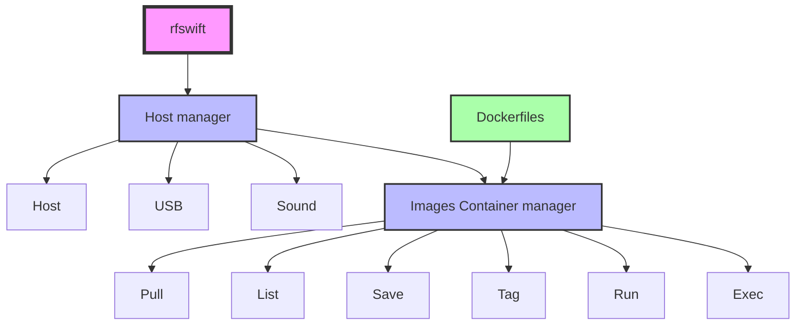

## 👋 Welcome!

  <table>
    <tr>
      <td><strong>Supported OSes</strong></td>
      <td></td>
      <td></td>
      <td></td>
    </tr>
    <tr>
      <td><strong>Supported architectures</strong></td>
      <td></td>
      <td></td>
      <td></td>
    </tr>
    <tr>
      <td><strong>Presented at</strong></td>
      <td></td>
      <td>
        
      </td>
      <td>
        
        
      </td>
    </tr>
    <tr>
      <td><strong>Socials</strong></td>
      <td></td>
      <td></td>
      <td>
        
      </td>
    </tr>
  </table>

## What is RF Swift?

**RF Swift** is a toolbox for creating a laboratory environment for your RF assessments, easily adaptable to your requirements:

- Working tools for specific engagements available in seconds
- Reproducible setups for each context
- Custom recipes for your precise needs
- Freedom from bloated distributions where only 30% of the tools are used and half of what you need is missing
-  No conflicts with your environment or security requirements, unlike dedicated distributions

So this toolbox is probably the **best solution** to deploy a generic, as well as a special environment securely, skipping the headache and waste of time when installing and using RF tools on same host.


  Even if the project could work on macOS with some manual workaround, we do not advertise it for the moment, but this system will be fully supported in the near future.


## An actively used tool

RF Swift was born from real-world operational needs at [Penthertz](https://penthertz.com/) that no existing distribution could fully address.

During security engagements, we often work on multiple projects within the same week—sometimes even the same day. This creates several challenges that traditional distributions struggle to handle:

- **Isolation between engagements**: Each project needs to remain completely separate to preserve integrity and avoid cross-contamination of traces and artifacts
- **Reproducible environments**: The ability to spin up known-working configurations instantly, without worrying about dependency conflicts or broken toolchains
- **Experimentation without risk**: Installing experimental tools or libraries for one engagement shouldn't break the setup relied on for another
- **Scalability and time saving**: Consultants spend around 1–2 days setting up their computers with all the necessary tools—sometimes more when newly hired
- **No conflict with company environments, especially on Linux**: Not everyone has the luxury of a second laptop for dedicated security work. This solution lets you keep your internal corporate environment intact
- **Maintain own images**: People can maintain their own image and fit them on their needs

## Key Benefits of RF Swift

- **Flexibility**: Use RF tools without disrupting your daily work environment
- **Efficiency**: Deploy only the tools you need, when you need them
- **Security**: Manage isolation between containers preventing cross-contamination
- **Portability**: Works across multiple architectures with consistent experience
- **Resource Management**: Optimized resource usage compared to full VMs
 
## Comprehensive Container Orchestration

RF Swift provides a complete orchestration solution that goes beyond traditional containers. Unlike standard Docker, RF Swift simplifies the entire workflow with a straightforward learning curve:

RF Swift handles everything from container creation and execution to pulling images, committing changes, and re-tagging. What sets it apart is the seamless integration of USB, video, and audio forwarding in a user-friendly interface—tasks that typically require significant expertise in standard Docker environments.

### Key Components

- **Go binary (rfswift)** 
  - Instruments containers and hosts to simplify the use of tools that may require:
  - Internet connectivity
  - Display
  - Sounds
  - USB accesses
  
  This ``rfswift`` is the main program you will interact with to:
  - Run clean containers
  - Execute inside running or paused containers
  - Perform many magic actions that will make things work without a headache

- **Docker images** - Pre-built Docker container images are available in RF Swift's repository. In case you want to bake your own environment, preserve some space, and have a special set-up, you will also find some Docker files you can edit to fit your expectations.

## Questions or Feedback?


  RF Swift is still in active development.
  Have a question or feedback? Feel free to [open an issue](https://github.com/PentHertz/RF-Swift/issues)!


## Next Steps

Dive right into the following section to get started:


  
  
  
  
  
