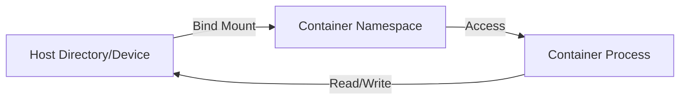

`rfswift config bindings` adds or removes a folder or a device on a container you already created. Use it when you forgot a folder at creation, or when you plug in new hardware.

The most common use shares a folder from your computer with the container:

```bash
rfswift config bindings add -c my_container -s ~/captures -t /root/captures
```


The container restarts, so save your work first. On Linux with Docker, the change is applied in place after one `sudo` prompt. On Podman, the container is committed and created again; add `--recreate` to use that method on Docker too. The shorter spelling `rfswift bindings` also works. See [config](/docs/commands/config).


## Synopsis

Add a folder (volume):

```bash
rfswift config bindings add -c CONTAINER -s SOURCE -t TARGET
```

Add a device:

```bash
rfswift config bindings add -d -c CONTAINER -s SOURCE -t TARGET
```

Remove a folder:

```bash
rfswift config bindings rm -c CONTAINER -s SOURCE -t TARGET
```

Remove a device:

```bash
rfswift config bindings rm -d -c CONTAINER -s SOURCE -t TARGET
```

## Options

`add` and `rm` take the same options:

| Flag | What it does | Required | Example |
|------|--------------|----------|---------|
| `-c, --container STRING` | The container, by name or ID | Yes | `-c my_container` |
| `-s, --source STRING` | The folder or device on your computer | No* | `-s ~/captures` |
| `-t, --target STRING` | Where it appears inside the container | Yes | `-t /root/captures` |
| `-d, --devices` | Treat it as a device rather than a folder | No | `-d` |

*\* If you leave out `-s`, the source is the same path as the target.*

## Examples

### Folders

Share a folder with the container:

```bash
rfswift config bindings add -c my_container \
  -s ~/captures \
  -t /root/captures
```

Share several folders, one command each:

```bash
rfswift config bindings add -c sdr_work -s ~/data -t /root/data
rfswift config bindings add -c sdr_work -s ~/scripts -t /root/scripts
rfswift config bindings add -c sdr_work -s ~/configs -t /root/.config
```

Share a folder read-only, by adding `:ro` to the target:

```bash
rfswift config bindings add -c container \
  -s ~/reference-data \
  -t /root/reference:ro
```

Stop sharing a folder:

```bash
rfswift config bindings rm -c my_container \
  -s ~/captures \
  -t /root/captures
```

### Devices

Give the container the USB bus:

```bash
rfswift config bindings add -d -c sdr_work \
  -s /dev/bus/usb \
  -t /dev/bus/usb
```

When the source and target are the same, `-t` alone is enough:

```bash
rfswift config bindings add -d -c sdr_work \
  -t /dev/bus/usb
```

Add a USB serial adapter:

```bash
rfswift config bindings add -d -c analysis \
  -s /dev/ttyUSB0 \
  -t /dev/ttyUSB0
```


A serial port added with `-d` is attached when needed, so you can plug it in later (see [config serial-hotplug](/docs/commands/config/#config-serial-hotplug)). For other devices you plug and unplug often, share their `/dev` folder as a volume, without `-d`.


## How bindings work

When you add a binding:

1. The active engine (Docker or Podman) updates the container's configuration.
2. The container restarts with the new folder or device.
3. The binding stays until you remove it or delete the container.



### Folder or device?

**Folders (without `-d`)**

- Share a folder from your computer with the container.
- Changes are visible on both sides straight away.
- Use them for data, configuration and scripts.
- They can also share a `/dev` folder, which copes with devices being plugged and unplugged.

**Devices (with `-d`)**

- Give the container direct access to hardware.
- Need the right permissions (cgroup rules).
- Use them for SDRs, serial adapters and USB devices.
- Serial ports are attached when needed; other devices must be present when the binding is applied.

How each engine handles bindings:


  
The Docker daemon applies the binding and the device cgroup rules for the container.

- The daemon needs access to the host device.
- Cgroup rules are applied through the daemon's cgroup driver.
- Your user only needs to be able to talk to Docker (the `docker` group, or `rfswift host docker-access`).
  
  
Podman applies bindings directly, without a daemon. In rootless mode, a few things differ:

- **File ownership**: files created inside the container may appear owned by your user on the host, because of user namespace mapping. Use `podman unshare chown` to fix permissions if needed.
- **Device access**: your user must be able to read and write the device on the host. Check with `ls -l /dev/your_device` and add your user to the right group (for example `dialout` or `plugdev`).
- **USB**: sharing `/dev/bus/usb` as a folder (without `-d`) is often the most reliable approach in rootless mode.
- **Cgroup v2**: RF Swift detects the cgroup version and applies device rules accordingly.
  


## Add now or at creation?

You can share folders when you create the container (`container create -b`) or later with `config bindings`:

| | `config bindings` (later) | `container create -b` (at creation) |
|---|---|---|
| **When** | After creation | At creation |
| **Restart** | The container restarts | Not applicable |
| **Change later** | Add and remove at any time | Fixed, unless you use `config bindings` |
| **Performance** | Same | Same |
| **Engines** | Docker, Podman | Docker, Podman |

Use `config bindings` when needs change during your work: a device you just plugged in, a folder you forgot, temporary access to some data, or trying out a configuration.

Use `-b` at creation when you know what you need up front, for permanent folders and a documented, repeatable setup.

For example, create a container with a scripts folder, add a captures folder later, and add the USB bus once the radio is plugged in:

```bash
rfswift container create -i sdr_full -n work \
  -b /pathto/scripts:/root/scripts

rfswift config bindings add -c work -s /pathto/captures -t /root/captures

rfswift config bindings add -d -c work -s /dev/bus/usb -t /dev/bus/usb
```

## Troubleshooting

### The binding does not appear in the container

Check that the binding was added, look for it inside the container, and if needed remove it and add it again with the right paths:


  
```bash
docker inspect container | grep -A5 Binds

rfswift container shell -c container
ls -la /path/to/binding
exit

rfswift config bindings rm -c container -s source -t target
rfswift config bindings add -c container -s source -t target
```
  
  
```bash
podman inspect container | grep -A5 Binds

rfswift container shell -c container
ls -la /path/to/binding
exit

rfswift config bindings rm -c container -s source -t target
rfswift config bindings add -c container -s source -t target
```
  


### Access to the device is denied

A device usually also needs a cgroup rule for its device type. Check the device's major number (the first number, `189` here), then add the matching rule:

```bash
ls -l /dev/device
# Example: crw-rw---- 1 root dialout 189, 0

rfswift config bindings add -d -c container -s /dev/device -t /dev/device
rfswift config cgroups add -c container -r "c 189:* rwm"
```

Then check your user's permissions:


  
Make sure your user can talk to Docker. If it is not in the `docker` group, add it (or run `rfswift host docker-access`):

```bash
groups $USER | grep docker

sudo usermod -aG docker $USER
newgrp docker
```
  
  
Check the device's permissions on the host and add your user to its group:

```bash
ls -l /dev/ttyUSB0
# crw-rw---- 1 root dialout 188, 0 ...

sudo usermod -aG dialout $USER
newgrp dialout
```

For broad USB access in rootless mode, share the USB bus as a folder instead:

```bash
rfswift config bindings add -c container \
  -s /dev/bus/usb \
  -t /dev/bus/usb
```

With cgroup v2, RF Swift handles device rules automatically. You can check which controllers are available:

```bash
cat /sys/fs/cgroup/user.slice/user-$(id -u).slice/user@$(id -u).service/cgroup.controllers
```
  


### You cannot write to a shared folder

Check the folder's permissions on your computer and fix them:


  
```bash
ls -ld ~/data
chmod 755 ~/data
```

You can also give the container the `DAC_OVERRIDE` capability:

```bash
rfswift config capabilities add -c container -p DAC_OVERRIDE
```
  
  
```bash
ls -ld ~/data
chmod 755 ~/data
```

In rootless Podman, files may be mapped to a different user. Fix the ownership with `podman unshare`:

```bash
podman unshare chown -R 0:0 ~/data
```

On Fedora or RHEL with SELinux, add the `:z` (or `:Z`) label to the target:

```bash
rfswift config bindings add -c container \
  -s ~/data \
  -t /root/data:z
```
  


### “source path does not exist”

The folder or device you gave as the source does not exist. Check it, create the folder if needed, and use a full path:

```bash
ls -la /path/to/source
mkdir -p ~/data
rfswift config bindings add -c container \
  -s /home/user/data \
  -t /root/data
```

### Removing a binding fails

Use exactly the same source and target as when you added it. Check them first:


  
```bash
docker inspect container | grep -A10 Binds

rfswift config bindings rm -c container \
  -s /exact/source/path \
  -t /exact/target/path
```
  
  
```bash
podman inspect container | grep -A10 Binds

rfswift config bindings rm -c container \
  -s /exact/source/path \
  -t /exact/target/path
```
  


As a last resort, create the container again.

### The device is not found

The device may not be at the path you expect. Check it exists, look for it by name, and read the kernel messages (udev rules can rename devices):

```bash
ls -l /dev/bus/usb
ls -l /dev | grep rtl
dmesg | tail -20
```

## Related commands

- [`run`](/docs/commands/run): create containers with folders and devices from the start
- [`engine`](/docs/commands/engine): choose Docker or Podman
- [`cgroups`](/docs/commands/cgroups): device permissions
- [`capabilities`](/docs/commands/capabilities): container capabilities
- [`exec`](/docs/commands/exec): open a shell after adding a binding
