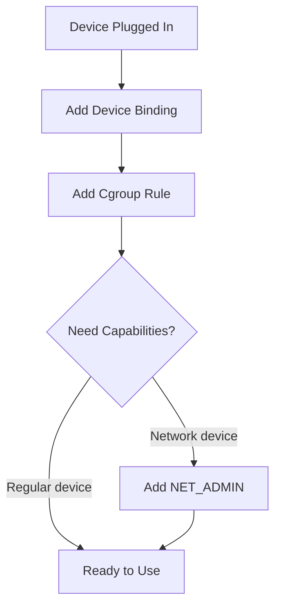

# rfswift cgroups

Dynamically add or remove cgroup device access rules to running containers.

## Synopsis

```bash
# Add cgroup rule
rfswift cgroups add -c CONTAINER -r "RULE"

# Remove cgroup rule
rfswift cgroups rm -c CONTAINER -r "RULE"
```

The `cgroups` command allows you to add or remove Linux cgroup device rules to containers without restarting them. This grants containers permission to access specific hardware devices.

---

## Subcommands

### cgroups add

Add a cgroup device rule to a container.

**Options:**

| Flag | Description | Required | Example |
|------|-------------|----------|---------|
| `-c, --container STRING` | Container ID or name | Yes | `-c my_container` |
| `-r, --rule STRING` | Cgroup device rule | Yes | `-r "c 189:* rwm"` |

### cgroups rm

Remove a cgroup device rule from a container.

**Options:**

| Flag | Description | Required | Example |
|------|-------------|----------|---------|
| `-c, --container STRING` | Container ID or name | Yes | `-c my_container` |
| `-r, --rule STRING` | Cgroup device rule | Yes | `-r "c 189:* rwm"` |

---

## Understanding Cgroup Rules

### Rule Format

Cgroup device rules follow this format:

```
<type> <major>:<minor> <permissions>
```

**Components:**
- **type**: `c` (character device) or `b` (block device)
- **major**: Device major number or `*` for all
- **minor**: Device minor number or `*` for all  
- **permissions**: `r` (read), `w` (write), `m` (mknod)

### Common Device Major Numbers

| Device Type | Major Number | Examples |
|-------------|--------------|----------|
| **USB Serial** | 188, 189 | RTL-SDR, HackRF, USB devices |
| **USB ACM** | 166 | ACM devices, modems |
| **USB Character** | 180 | USB raw character devices |
| **TTY Serial** | 4 | /dev/tty devices |
| **Video** | 81 | /dev/video* (cameras) |
| **Sound** | 116 | /dev/snd/* (audio) |
| **Input** | 13 | /dev/input/* (keyboards, mice) |

### Rule Examples

**USB devices (most SDRs):**
```bash
"c 189:* rwm"    # USB serial devices (major 189)
"c 188:* rwm"    # USB serial devices (major 188)
```

**ACM devices:**
```bash
"c 166:* rwm"    # ACM devices (modems, etc.)
```

**TTY/Serial ports:**
```bash
"c 4:* rwm"      # TTY devices
```

**All USB devices:**
```bash
"c 189:* rwm"
"c 188:* rwm"
"c 180:* rwm"
"c 166:* rwm"
```

**Video devices:**
```bash
"c 81:* rwm"     # Video4Linux devices
```

**Specific device:**
```bash
"c 189:0 rwm"    # Specific USB device (major 189, minor 0)
```

---

## Examples

### Basic Usage

**Add USB device access:**
```bash
rfswift cgroups add -c sdr_work -r "c 189:* rwm"
```

**Add multiple device types:**
```bash
rfswift cgroups add -c analysis -r "c 189:* rwm"
rfswift cgroups add -c analysis -r "c 166:* rwm"
rfswift cgroups add -c analysis -r "c 180:* rwm"
```

**Remove cgroup rule:**
```bash
rfswift cgroups rm -c container -r "c 189:* rwm"
```

### Real-World Scenarios

**USB based SDRs setup:**
```bash
# Create container
rfswift run -i penthertz/rfswift_noble:sdr_full -n sdrtest

# Add device binding
rfswift bindings add -d -c sdrtest -s /dev/bus/usb -t /dev/rtlsdr0

# Add cgroup rule for USB access
rfswift cgroups add -c sdrtest -r "c 189:* rwm"

# Test access (e.g with RTL-SDR)
rfswift exec -c sdrtest
rtl_test -t
exit
```

**USB serial device:**
```bash
# Container for serial work
rfswift run -i penthertz/rfswift_noble:sdr_full -n serial_work

# Add serial device
rfswift bindings add -d -c serial_work -s /dev/ttyUSB0 -t /dev/ttyUSB0

# Add cgroup rules
rfswift cgroups add -c serial_work -r "c 188:* rwm"
rfswift cgroups add -c serial_work -r "c 4:* rwm"

# Access serial
rfswift exec -c serial_work
screen /dev/ttyUSB0 115200
exit
```

---

## Device Access Workflow

### Complete Device Access Setup

To access a hardware device from a container, you need three things:

1. **Device binding** (rfswift bindings)
2. **Cgroup rule** (rfswift cgroups)
3. **Capabilities** (rfswift capabilities) - sometimes


---

## Finding Device Major Numbers

### Using ls -l

```bash
# Check device major:minor numbers
ls -l /dev/device
# Output: crw-rw-rw- 1 root root 189, 0 Jan 12 10:00 /dev/device
#                                 ^^^  ^
#                                 major minor

# Multiple devices
ls -l /dev/device* /dev/otherpatterns
```

### Using stat

```bash
# Get device numbers with stat
stat -c "%t:%T" /dev/device
# Output: bd:0  (189 in hex, 0 in decimal)

# Decimal format
stat -c "%a %n" /dev/device
```

### Using /sys filesystem

```bash
# Find all USB devices
grep -r "189" /sys/class/*

# Check specific device
cat /sys/class/tty/ttyUSB0/dev
# Output: 188:0
```

---

## Troubleshooting

### Permission Denied After Adding Rule

**Problem:** Device still shows permission denied

**Solutions:**
```bash
# Check rule was added
docker inspect container | grep -A10 Devices

# Verify device binding exists
rfswift exec -c container
ls -l /dev/device
exit

# If not visible, add binding first
rfswift bindings add -d -c container -s /dev/device -t /dev/device

# Then add cgroup rule
rfswift cgroups add -c container -r "c 189:* rwm"

# Check device major number is correct
ls -l /dev/rtlsdr0
# crw-rw-rw- 1 root root 189, 0 ...
#                        ^^^ use this number

# May need multiple rules for some devices
rfswift cgroups add -c container -r "c 188:* rwm"
rfswift cgroups add -c container -r "c 180:* rwm"
```

### Wrong Major Number

**Problem:** Rule added but device still not accessible

**Solutions:**
```bash
# Get actual device major number
ls -l /dev/device_name
# crw-rw-rw- 1 root root 189, 0 ...
#                        ^^^

# Or use stat
stat -c "%t:%T" /dev/device_name

# Add rule with correct major number
rfswift cgroups add -c container -r "c 189:* rwm"
```

### Device Not Visible in Container

**Problem:** Cgroup rule added but device doesn't exist in container

**Solution:**
```bash
# This is a binding issue, not cgroups
# Add device binding first
rfswift bindings add -d -c container \
  -s /dev/device \
  -t /dev/device

# Then add cgroup rule
rfswift cgroups add -c container -r "c 189:* rwm"
```

### Wildcard Not Working

**Problem:** `c 189:*` doesn't grant access to all devices

**Solutions:**
```bash
# Try specific major numbers
rfswift cgroups add -c container -r "c 189:* rwm"
rfswift cgroups add -c container -r "c 188:* rwm"

# Or try specific device
ls -l /dev/device
# crw-rw-rw- 1 root root 189, 5 ...
#                        ^^^ ^^^
#                        maj min

rfswift cgroups add -c container -r "c 189:5 rwm"
```

### Cannot Remove Rule

**Problem:** Remove command fails or rule persists

**Solutions:**
```bash
# Use exact rule string
rfswift cgroups rm -c container -r "c 189:* rwm"

# Check current rules
docker inspect container | grep -A10 Devices

# May need to restart container for removal
# (as last resort)
rfswift stop -c container
rfswift exec -c container
```

---

## Related Commands

- [`bindings`](/docs/commands/bindings) - Add device bindings (required first)
- [`capabilities`](/docs/commands/capabilities) - Add capabilities (sometimes needed)
- [`run`](/docs/commands/run) - Create containers with initial device access
- [`exec`](/docs/commands/exec) - Access container after adding rules

---


**Device Access Trinity**: For hardware device access, you need three things: (1) `bindings add -d` to expose the device, (2) `cgroups add` to grant permission, and (3) sometimes `capabilities add` for system privileges!



**Binding First**: Always add the device binding BEFORE adding cgroup rules. The container needs to see the device before you can grant permission to access it!



**USB Devices**: Most SDRs use USB serial (major 189). Use `ls -l /dev/device` to find the major number, then add rule `c 189:* rwm` for full access to all USB serial devices.
