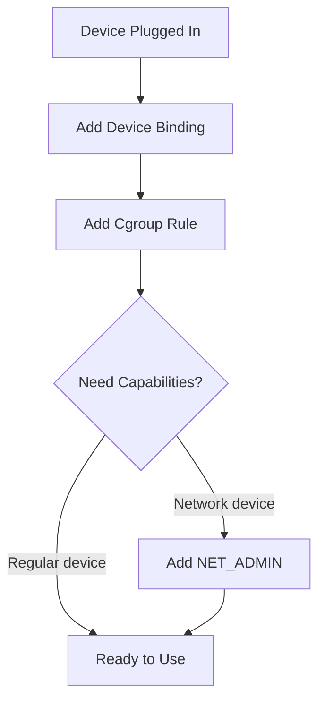

`rfswift config cgroups` gives a container permission to use a type of hardware device, through a cgroup device rule. Use it when a device is visible inside the container but tools cannot open it.

The most common use allows USB devices, which covers most SDRs:

```bash
rfswift config cgroups add -c sdr_work -r "c 189:* rwm"
```


The container restarts, so save your work first. On Linux with Docker, the change is applied in place after one `sudo` prompt. On Podman, the container is committed and created again; add `--recreate` to use that method on Docker too. Rootless Podman does not allow cgroup device rules at all. The shorter spelling `rfswift cgroups` also works. See [config](/docs/commands/config).


## Synopsis

```bash
rfswift config cgroups add -c CONTAINER -r "RULE"
rfswift config cgroups rm  -c CONTAINER -r "RULE"
```

## Options

`add` and `rm` take the same options:

| Flag | What it does | Required | Example |
|------|--------------|----------|---------|
| `-c, --container STRING` | The container, by name or ID | Yes | `-c my_container` |
| `-r, --rule STRING` | The cgroup device rule | Yes | `-r "c 189:* rwm"` |

## How cgroup rules work

### Rule format

A rule has three parts:

```
<type> <major>:<minor> <permissions>
```

- **type**: `c` for a character device, `b` for a block device
- **major**: the device's major number, or `*` for all
- **minor**: the device's minor number, or `*` for all
- **permissions**: `r` (read), `w` (write), `m` (create the device file)

### Common major numbers

| Device type | Major number | Examples |
|-------------|--------------|----------|
| **USB devices** (`/dev/bus/usb`) | 189 | RTL-SDR, HackRF and most SDRs |
| **USB serial** (`/dev/ttyUSB*`) | 188 | USB serial adapters |
| **USB ACM** (`/dev/ttyACM*`) | 166 | ACM devices such as a Proxmark3, modems |
| **USB character** | 180 | Raw USB character devices |
| **TTY serial** | 4 | `/dev/tty` devices |
| **Video** | 81 | `/dev/video*` (cameras) |
| **Sound** | 116 | `/dev/snd/*` (audio) |
| **Input** | 13 | `/dev/input/*` (keyboards, mice) |

### Rule examples

USB devices (most SDRs), and USB serial adapters:

```bash
"c 189:* rwm"    # USB devices (major 189)
"c 188:* rwm"    # USB serial adapters (major 188)
```

ACM devices, and TTY serial ports:

```bash
"c 166:* rwm"    # ACM devices (modems, etc.)
"c 4:* rwm"      # TTY devices
```

All the USB types together:

```bash
"c 189:* rwm"
"c 188:* rwm"
"c 180:* rwm"
"c 166:* rwm"
```

Video devices:

```bash
"c 81:* rwm"     # Video4Linux devices
```

One specific device only:

```bash
"c 189:0 rwm"    # Specific USB device (major 189, minor 0)
```

## Examples

Allow USB devices:

```bash
rfswift config cgroups add -c sdr_work -r "c 189:* rwm"
```

Allow several device types:

```bash
rfswift config cgroups add -c analysis -r "c 189:* rwm"
rfswift config cgroups add -c analysis -r "c 166:* rwm"
rfswift config cgroups add -c analysis -r "c 180:* rwm"
```

Remove a rule:

```bash
rfswift config cgroups rm -c container -r "c 189:* rwm"
```

### A USB SDR

Create the container, give it the USB bus and the USB rule, then test the radio (here an RTL-SDR):

```bash
rfswift container create -i penthertz/rfswift_resolute:sdr_full -n sdrtest
rfswift config bindings add -d -c sdrtest -s /dev/bus/usb -t /dev/bus/usb
rfswift config cgroups add -c sdrtest -r "c 189:* rwm"

rfswift container shell -c sdrtest
rtl_test -t
exit
```

### A USB serial device

Add the serial device and the matching rules, then open it with `screen`:

```bash
rfswift container create -i penthertz/rfswift_resolute:sdr_full -n serial_work
rfswift config bindings add -d -c serial_work -s /dev/ttyUSB0 -t /dev/ttyUSB0
rfswift config cgroups add -c serial_work -r "c 188:* rwm"
rfswift config cgroups add -c serial_work -r "c 4:* rwm"

rfswift container shell -c serial_work
screen /dev/ttyUSB0 115200
exit
```

## What a device needs

To use a hardware device from a container, you need:

1. **The device itself**, added with `rfswift config bindings add -d`.
2. **Permission** to use it, with a cgroup rule (this page).
3. **Sometimes a capability**, with `rfswift config capabilities add` (for example `NET_ADMIN` for network devices).

Add the device first: the container must see it before a rule can grant access.


```mermaid
graph TD
    A[Device Plugged In] --> B[Add Device Binding]
    B --> C[Add Cgroup Rule]
    C --> D{Need Capabilities?}
    D -->|Network device| E[Add NET_ADMIN]
    D -->|Regular device| F[Ready to Use]
    E --> F
```

## Finding a device's major number

### With ls -l

`ls -l` shows the major and minor numbers in decimal, before the date:

```bash
ls -l /dev/device
# Output: crw-rw-rw- 1 root root 189, 0 Jan 12 10:00 /dev/device
#                                 ^^^  ^
#                                 major minor

ls -l /dev/device* /dev/otherpatterns
```

### With stat

`stat` prints the numbers in hexadecimal: `bd` is 189.

```bash
stat -c "%t:%T" /dev/device
# Output: bd:0  (189 in hex, 0 in decimal)
```

### With /sys

```bash
grep -r "189" /sys/class/*

cat /sys/class/tty/ttyUSB0/dev
# Output: 188:0
```

## Troubleshooting

### Still “permission denied” after adding a rule

Check the rule was added, and that the device is visible inside the container:

```bash
docker inspect container | grep -A10 Devices

rfswift container shell -c container
ls -l /dev/device
exit
```

If the device is not visible, add it first, then the rule:

```bash
rfswift config bindings add -d -c container -s /dev/device -t /dev/device
rfswift config cgroups add -c container -r "c 189:* rwm"
```

Check the major number is the right one, and add rules for other types if the device needs them:

```bash
ls -l /dev/bus/usb
# crw-rw-rw- 1 root root 189, 0 ...
#                        ^^^ use this number

rfswift config cgroups add -c container -r "c 188:* rwm"
rfswift config cgroups add -c container -r "c 180:* rwm"
```

### Wrong major number

Read the device's real major number, then add the rule with that number:

```bash
ls -l /dev/device_name
# crw-rw-rw- 1 root root 189, 0 ...
#                        ^^^

stat -c "%t:%T" /dev/device_name

rfswift config cgroups add -c container -r "c 189:* rwm"
```

### The device is not visible in the container

This is a binding problem, not a cgroup one. Add the device first, then the rule:

```bash
rfswift config bindings add -d -c container \
  -s /dev/device \
  -t /dev/device

rfswift config cgroups add -c container -r "c 189:* rwm"
```

### A wildcard rule does not cover your device

Your device may use another major number. Add rules for the likely types, or a rule for that exact device:

```bash
rfswift config cgroups add -c container -r "c 189:* rwm"
rfswift config cgroups add -c container -r "c 188:* rwm"
```

```bash
ls -l /dev/device
# crw-rw-rw- 1 root root 189, 5 ...
#                        ^^^ ^^^
#                        maj min

rfswift config cgroups add -c container -r "c 189:5 rwm"
```

### Removing a rule fails, or the rule stays

Use exactly the same rule string as when you added it, and check the current rules:

```bash
rfswift config cgroups rm -c container -r "c 189:* rwm"
docker inspect container | grep -A10 Devices
```

As a last resort, stop the container and open it again:

```bash
rfswift container stop -c container
rfswift container shell -c container
```

## Related commands

- [`bindings`](/docs/commands/bindings): add the device first
- [`capabilities`](/docs/commands/capabilities): add a capability when needed
- [`run`](/docs/commands/run): create containers with device access from the start
- [`exec`](/docs/commands/exec): open a shell after adding a rule
