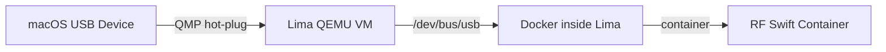

# rfswift macusb

Manage USB device passthrough on macOS via Lima QEMU VM.

## Synopsis

```bash
# List USB devices on macOS host
rfswift macusb list

# Attach a USB device to the Lima VM
rfswift macusb attach --vid VENDOR_ID --pid PRODUCT_ID

# Detach a USB device from the Lima VM
rfswift macusb detach --vid VENDOR_ID --pid PRODUCT_ID

# List USB devices currently attached to the Lima VM
rfswift macusb vm-devices

# Check Lima VM status for USB passthrough
rfswift macusb status
```

The `macusb` command manages USB device passthrough on macOS. Docker Desktop and Podman on macOS run their own Linux VMs that **cannot forward USB devices** into containers. Lima solves this by running a QEMU VM where USB devices can be hot-plugged via the QMP protocol.


This command is **macOS only**. On Linux, USB devices are directly accessible via [`bindings`](/docs/commands/bindings). On Windows, use [`winusb`](/docs/commands/winusb).


---

## How It Works



On macOS, there are **two container engine modes**:

| Mode | Engine flag | USB access | Use case |
|------|-----------|------------|----------|
| **Docker Desktop** | `--engine docker` (default) | No USB | General work, no RF hardware needed |
| **Lima VM** | `--engine lima` | USB hot-plug | RF hardware, SDR dongles |

When you need USB devices in your containers, you must:
1. Attach the device to the Lima VM with `macusb attach`
2. Run your container with `--engine lima` so it runs inside Lima's Docker (where the USB device is visible)

---

## Subcommands

| Subcommand | Description |
|------------|-------------|
| `macusb list` | List all USB devices connected to the macOS host |
| `macusb attach` | Hot-plug a USB device into the Lima VM |
| `macusb detach` | Hot-unplug a USB device from the Lima VM |
| `macusb vm-devices` | List USB devices currently forwarded into the VM |
| `macusb status` | Check Lima installation, VM status, and QMP availability |

---

### macusb list

List all USB devices connected to the macOS host using `system_profiler`. Shows device name, vendor ID, product ID, and serial number.

**No additional options.**

### macusb attach

Hot-plug a USB device from the macOS host into the Lima QEMU VM.

**Options:**

| Flag | Description | Required | Example |
|------|-------------|----------|---------|
| `--vid STRING` | USB Vendor ID (hex) | Yes | `--vid 0x1d50` |
| `--pid STRING` | USB Product ID (hex) | Yes | `--pid 0x604b` |

### macusb detach

Hot-unplug a USB device from the Lima QEMU VM.

**Options:**

| Flag | Description | Required | Example |
|------|-------------|----------|---------|
| `--vid STRING` | USB Vendor ID (hex) | With `--pid` | `--vid 0x1d50` |
| `--pid STRING` | USB Product ID (hex) | With `--vid` | `--pid 0x604b` |
| `--devid STRING` | QMP device ID | Alternative | `--devid usb-1d50-604b` |

You can detach by vendor/product ID pair or by the QMP device ID shown in `vm-devices`.

### macusb vm-devices

List USB devices currently forwarded into the Lima VM via QMP `info usb`.

**No additional options.**

### macusb status

Check the full USB passthrough setup:
- Lima installation
- rfswift VM instance status
- QMP socket availability
- Currently attached USB devices

**No additional options.**

---

### Global Options

| Flag | Description | Default | Example |
|------|-------------|---------|---------|
| `--instance STRING` | Lima instance name | `rfswift` | `--instance myvm` |

---

## Examples

### Complete SDR Workflow on macOS

```bash
# 1. Check that Lima is ready
rfswift macusb status

# 2. List USB devices to find your SDR
rfswift macusb list
# NAME                           VENDOR ID    PRODUCT ID   SERIAL
# HackRF One                     0x1d50       0x604b       000000000000000...
# RTL2838UHIDIR                  0x0bda       0x2838

# 3. Attach HackRF to the Lima VM
rfswift macusb attach --vid 0x1d50 --pid 0x604b

# 4. Verify it's in the VM
rfswift macusb vm-devices

# 5. Run container via Lima's Docker (where USB device lives)
rfswift --engine lima run -i penthertz/rfswift_noble:sdr_light -n sdr_work

# 6. Inside the container, the device is accessible
# $ hackrf_info
# Found HackRF ...

# 7. When done, detach the device
rfswift macusb detach --vid 0x1d50 --pid 0x604b
```

### Attaching Multiple Devices

```bash
# Attach RTL-SDR and HackRF
rfswift macusb attach --vid 0x0bda --pid 0x2838
rfswift macusb attach --vid 0x1d50 --pid 0x604b

# Run container with both devices available
rfswift --engine lima run -i penthertz/rfswift_noble:sdr_full -n multi_sdr
```

### Using a Custom Lima Instance

```bash
# All macusb commands support --instance for non-default VMs
rfswift macusb list --instance my_custom_vm
rfswift macusb attach --vid 0x1d50 --pid 0x604b --instance my_custom_vm
rfswift --engine lima run -i sdr_light -n my_work
```

---

## Setup

### Prerequisites

1. **Lima** and **QEMU** must be installed:
   ```bash
   brew install lima qemu
   ```

2. The Lima VM must use **`vmType: qemu`** (not `vz`) for USB passthrough support.


QEMU is the virtualization backend that Lima uses to run the Linux VM. Lima manages the VM lifecycle, QEMU provides the actual emulation with USB hot-plug support via QMP.


### First-Time Setup

RF Swift can auto-create the Lima VM on first use:

```bash
# Option 1: Let RF Swift create it automatically
rfswift --engine lima run -i penthertz/rfswift_noble:sdr_light -n my_sdr
# → Detects no Lima instance, creates one, installs Docker + udev rules, starts VM

# Option 2: Create manually with the bundled template
limactl create --name rfswift lima/rfswift.yaml
limactl start rfswift
```

The auto-created VM includes:
- Docker engine inside the VM
- USB libraries (`libusb`, `libhidapi`, `libftdi`)
- Kernel modules for USB serial devices (`cp210x`, `ftdi_sio`, `ch341`)
- Udev rules for all common SDR/RF devices (HackRF, RTL-SDR, USRP, BladeRF, Airspy, PlutoSDR, LimeSDR, etc.)

### Supported RF Devices

The Lima VM comes pre-configured with udev rules for:

| Device | Vendor ID |
|--------|-----------|
| HackRF, Great Scott Gadgets | `0x1d50` |
| RTL-SDR (all variants) | `0x0bda` |
| Ettus USRP (B200/B210/B100) | `0x2500`, `0x3923`, `0xfffe` |
| Nuand BladeRF (v1/v2) | `0x2cf0` |
| Airspy, Airspy HF+ | `0x1d50`, `0x03eb` |
| ADALM-Pluto (PlutoSDR) | `0x0456`, `0x2fa2` |
| LimeSDR | `0x0403`, `0x1d50` |
| FTDI devices (probes, serial) | `0x0403` |
| STM32 (VNA, bootloaders) | `0x0483` |
| FUNcube Dongle | `0x04d8` |

---

## Customizing the Lima VM

The Lima VM is configured via a YAML file. RF Swift ships a default template at `lima/rfswift.yaml`, and once created, the instance config lives at `~/.lima/rfswift/lima.yaml`.

### Editing the Configuration

```bash
# Before creating the VM — edit the template
vim lima/rfswift.yaml
limactl create --name rfswift lima/rfswift.yaml

# After creating — edit the live config (requires VM restart)
vim ~/.lima/rfswift/lima.yaml
limactl stop rfswift && limactl start rfswift
```


After editing `~/.lima/rfswift/lima.yaml`, you must stop and start the VM for changes to take effect. Changes to `provision` scripts only run on first creation — use `limactl shell rfswift` to run commands in an existing VM.


### Configuration Reference

Here are the key settings you can tune:

#### VM Resources

Increase CPUs, memory, or disk for heavier workloads (e.g., srsRAN 5G, large IQ captures):

```yaml
cpus: 8          # default: 4
memory: "16GiB"  # default: 8GiB
disk: "200GiB"   # default: 100GiB
```

#### VM Backend

**Must be `qemu`** for USB passthrough. Do not change to `vz`:

```yaml
vmType: qemu     # required — Apple Virtualization (vz) has no USB support
```

#### Host Directory Mounts

Add extra host directories accessible inside the VM:

```yaml
mounts:
  - location: "~"
    writable: true
  - location: "/tmp/lima"
    writable: true
  # Add your own:
  - location: "/Volumes/ExternalSSD/captures"
    writable: true
    mountPoint: "/captures"
```

#### Port Forwarding

Forward additional ports from the VM to the macOS host:

```yaml
portForwards:
  # Docker socket (required — do not remove)
  - guestSocket: "/run/docker.sock"
    hostSocket: "{{.Dir}}/sock/docker.sock"
  # noVNC desktop
  - guestPort: 6080
    hostPort: 6080
  # PulseAudio
  - guestPort: 34567
    hostPort: 34567
  # Add your own — e.g., srsRAN web UI
  - guestPort: 7681
    hostPort: 7681
  # Jupyter notebook
  - guestPort: 8888
    hostPort: 8888
```

#### Guest OS Image

Change the base Linux image (default is Ubuntu 24.04):

```yaml
images:
  - location: "https://cloud-images.ubuntu.com/releases/24.04/release/ubuntu-24.04-server-cloudimg-amd64.img"
    arch: "x86_64"
  - location: "https://cloud-images.ubuntu.com/releases/24.04/release/ubuntu-24.04-server-cloudimg-arm64.img"
    arch: "aarch64"
```

#### DNS

```yaml
dns:
  - 8.8.8.8
  - 8.8.4.4
```

### Adding Custom Udev Rules

If you have RF hardware not covered by the defaults, add udev rules in the `provision` section or directly inside the running VM:

```bash
# Option 1: Add to the YAML template before creation
# In the provision → system script section, add:
cat > /etc/udev/rules.d/99-custom.rules << 'UDEV'
SUBSYSTEMS=="usb", ATTRS{idVendor}=="xxxx", ATTRS{idProduct}=="yyyy", MODE="0666"
UDEV
udevadm control --reload-rules && udevadm trigger

# Option 2: Add to an already running VM
limactl shell rfswift -- sudo bash -c '
  echo "SUBSYSTEMS==\"usb\", ATTRS{idVendor}==\"xxxx\", ATTRS{idProduct}==\"yyyy\", MODE=\"0666\"" \
    > /etc/udev/rules.d/99-custom.rules
  udevadm control --reload-rules && udevadm trigger
'
```

Replace `xxxx` and `yyyy` with your device's vendor and product IDs (find them with `rfswift macusb list`).

### Adding Custom Kernel Modules

The default template loads common USB serial modules. To add more:

```bash
# Load a module in the running VM
limactl shell rfswift -- sudo modprobe <module_name>

# Make it persistent
limactl shell rfswift -- sudo bash -c \
  'echo "<module_name>" >> /etc/modules-load.d/rfswift.conf'
```

### Installing Additional Packages

Need extra tools inside the VM (outside of containers)?

```bash
limactl shell rfswift -- sudo apt install -y <package_name>
```

### Recreating the VM from Scratch

If the VM becomes misconfigured, delete and recreate:

```bash
limactl stop rfswift
limactl delete rfswift

# Recreate from template (or let RF Swift auto-create on next run)
limactl create --name rfswift lima/rfswift.yaml
limactl start rfswift
```


Deleting the VM does **not** delete your workspace files (`~/rfswift-workspace/`) or Docker images — those live on the host.


### Using a Custom Template Location

RF Swift searches for the Lima template in these locations (in order):

1. `<rfswift-binary-dir>/lima/rfswift.yaml`
2. `<rfswift-binary-dir>/../lima/rfswift.yaml`
3. `~/.config/rfswift/lima.yaml`
4. `~/.rfswift/lima.yaml`

To use your own customized template by default, place it at `~/.config/rfswift/lima.yaml`:

```bash
cp lima/rfswift.yaml ~/.config/rfswift/lima.yaml
vim ~/.config/rfswift/lima.yaml  # customize
```

RF Swift will use this template when auto-creating the VM on first `--engine lima` run.

---

## Troubleshooting

### Lima Not Installed

**Problem:** `macusb` commands fail because Lima is not installed

**Solution:**
```bash
brew install lima qemu
```

### QMP Socket Not Found

**Problem:** `macusb status` reports no QMP socket

**Solution:** Your Lima VM must use `vmType: qemu`. The Apple Virtualization framework (`vmType: vz`) does not support USB passthrough.

```bash
# Check your VM config
cat ~/.lima/rfswift/lima.yaml | grep vmType
# Should show: vmType: qemu

# If it shows vz, recreate with QEMU:
limactl delete rfswift
limactl create --name rfswift lima/rfswift.yaml
limactl start rfswift
```

### Device Not Visible in Container

**Problem:** Device attached via `macusb attach` but not visible in the container

**Solution:** Make sure you're using `--engine lima`:
```bash
# Wrong: runs in Docker Desktop (no USB access)
rfswift run -i sdr_light -n my_sdr

# Correct: runs in Lima's Docker (USB devices visible)
rfswift --engine lima run -i sdr_light -n my_sdr
```

### Attach Fails with Permission Error

**Problem:** `macusb attach` returns a QMP error

**Solution:** QEMU USB passthrough may require elevated permissions on macOS:
```bash
# Check if the Lima VM is running
rfswift macusb status

# Restart the VM if needed
limactl stop rfswift && limactl start rfswift
```

---

## Related Commands

- [`--engine`](/docs/commands/engine) - Select container engine (use `--engine lima` for USB)
- [`winusb`](/docs/commands/winusb) - USB management on Windows/WSL2
- [`bindings`](/docs/commands/bindings) - Device bindings on Linux
- [`run`](/docs/commands/run) - Create containers
- [`doctor`](/docs/commands/doctor) - Diagnose environment (includes Lima checks on macOS)

---


**Prerequisites**: Lima and QEMU must be installed (`brew install lima qemu`). The VM must use `vmType: qemu` for USB passthrough support.



**macOS Only**: This command is exclusively for macOS hosts. On Linux, USB devices are directly accessible. On Windows, use [`winusb`](/docs/commands/winusb).



**Remember**: Always use `rfswift --engine lima run ...` when you need USB devices in your containers. Without `--engine lima`, containers run in Docker Desktop which has no USB access.

