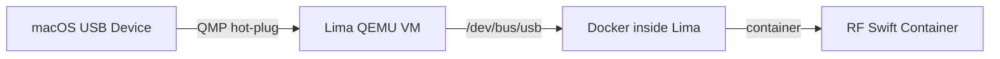

On macOS, Docker Desktop and Podman run their containers in a Linux VM that **cannot receive USB devices**. `rfswift macusb` solves this with Lima: a QEMU virtual machine into which USB devices can be hot-plugged (through the QMP protocol). You attach your SDR to the Lima VM, then create your lab with `--engine lima`.

```bash
rfswift macusb attach                  # pick a device to forward into the Lima VM
rfswift --engine lima container create -i sdr_light -n sdr_work
```


**RF Swift v4**: `rfswift usb` (`list`, `attach`, `detach`, `status`, `vm-devices`) runs these same commands on macOS. `rfswift macusb` still works. See [usb](/docs/commands/usb).



**macOS only.** On Linux, devices are mapped directly (see [config bindings](/docs/commands/bindings)). On Windows, see [winusb](/docs/commands/winusb).


## Synopsis

```bash
rfswift macusb list                                    # USB devices on the macOS host
rfswift macusb attach --vid VENDOR_ID --pid PRODUCT_ID # forward a device into the Lima VM
rfswift macusb detach --vid VENDOR_ID --pid PRODUCT_ID # give it back to macOS
rfswift macusb vm-devices                              # devices currently in the Lima VM
rfswift macusb status                                  # is the Lima VM ready for USB passthrough?
```

## How it works


```mermaid
graph LR
    A[macOS USB Device] -->|QMP hot-plug| B[Lima QEMU VM]
    B -->|/dev/bus/usb| C[Docker inside Lima]
    C -->|container| D[RF Swift Container]
```

On macOS you have two container engines to choose from:

| Mode | Engine flag | USB access | Use it for |
|------|-------------|------------|------------|
| **Docker Desktop** | `--engine docker` (default) | No USB | General work without RF hardware |
| **Lima VM** | `--engine lima` | USB hot-plug | RF hardware, SDR dongles |

To use a USB device in a lab, you need both steps:

1. attach the device to the Lima VM with `macusb attach`;
2. create or run the lab with `--engine lima`, so it runs inside Lima's Docker, where the device is visible.

## Subcommands

| Subcommand | What it does |
|------------|--------------|
| `macusb list` | Lists every USB device connected to the Mac |
| `macusb attach` | Hot-plugs a USB device into the Lima VM |
| `macusb detach` | Hot-unplugs a USB device from the Lima VM |
| `macusb vm-devices` | Lists the USB devices currently forwarded into the VM |
| `macusb status` | Checks the Lima installation, the VM status and whether QMP is available |

### macusb list

Lists every USB device connected to the Mac, using `system_profiler`: device name, vendor ID, product ID and serial number. It takes no options.

### macusb attach

Hot-plugs a USB device from the Mac into the Lima QEMU VM.

| Flag | Description | Required | Example |
|------|-------------|----------|---------|
| `--vid STRING` | USB vendor ID (hex) | No* | `--vid 0x1d50` |
| `--pid STRING` | USB product ID (hex) | No* | `--pid 0x604b` |

\* In an interactive terminal, running it **without** `--vid` and `--pid` opens a picker where you select one or more devices by name. In scripts (non-interactive), both flags are required.

### macusb detach

Hot-unplugs a USB device from the Lima QEMU VM.

| Flag | Description | Required | Example |
|------|-------------|----------|---------|
| `--vid STRING` | USB vendor ID (hex) | No* | `--vid 0x1d50` |
| `--pid STRING` | USB product ID (hex) | No* | `--pid 0x604b` |
| `--devid STRING` | QMP device ID | No* | `--devid usb-1d50-604b` |

\* In an interactive terminal, running it without any flag opens a picker. In scripts, give either `--devid` or both `--vid` and `--pid`. The QMP device ID is the one shown by `vm-devices`.

### macusb vm-devices

Lists the USB devices currently forwarded into the Lima VM (through QMP `info usb`). It takes no options.

### macusb status

Checks the whole USB passthrough setup: the Lima installation, the state of the `rfswift` VM, whether the QMP socket is available, and which USB devices are attached. It takes no options.

### Option for every subcommand

| Flag | Description | Default | Example |
|------|-------------|---------|---------|
| `--instance STRING` | Lima instance name | `rfswift` | `--instance myvm` |

## Examples

### A complete SDR session on macOS

Check that Lima is ready, find your SDR, attach it, create a lab, use the device, then detach it:

```bash
# 1. Check that Lima is ready
rfswift macusb status

# 2. List USB devices to find your SDR
rfswift macusb list
# NAME                           VENDOR ID    PRODUCT ID   SERIAL
# HackRF One                     0x1d50       0x604b       000000000000000...
# RTL2838UHIDIR                  0x0bda       0x2838

# 3. Attach HackRF to the Lima VM
rfswift macusb attach --vid 0x1d50 --pid 0x604b

# 4. Verify it's in the VM
rfswift macusb vm-devices

# 5. Run container via Lima's Docker (where USB device lives)
rfswift --engine lima container create -i penthertz/rfswift_resolute:sdr_light -n sdr_work

# 6. Inside the container, the device is accessible
# $ hackrf_info
# Found HackRF ...

# 7. When done, detach the device
rfswift macusb detach --vid 0x1d50 --pid 0x604b
```

### Several devices at once

Attach an RTL-SDR and a HackRF, then create one lab that sees both:

```bash
rfswift macusb attach --vid 0x0bda --pid 0x2838
rfswift macusb attach --vid 0x1d50 --pid 0x604b
rfswift --engine lima container create -i penthertz/rfswift_resolute:sdr_full -n multi_sdr
```

### A custom Lima instance

Every `macusb` command accepts `--instance` to target a VM other than the default:

```bash
rfswift macusb list --instance my_custom_vm
rfswift macusb attach --vid 0x1d50 --pid 0x604b --instance my_custom_vm
rfswift --engine lima container create -i sdr_light -n my_work
```

## Setup

### What you need

1. **Lima** and **QEMU**:

   ```bash
   brew install lima qemu
   ```

2. A Lima VM of type **`vmType: qemu`** (not `vz`). Only QEMU supports USB passthrough.


Lima manages the VM's life cycle; QEMU is the virtualisation software underneath, and it provides USB hot-plug through QMP.


### First run

RF Swift manages the Lima VM for you, so there is nothing to set up by hand. The first time you use `--engine lima`, RF Swift creates, prepares and starts the VM:

```bash
# Run it: RF Swift sets up the VM automatically
rfswift --engine lima container create -i penthertz/rfswift_resolute:sdr_light -n my_sdr
# -> "Lima instance 'rfswift' not found. Creating it..."
# -> Creates VM, installs Docker + USB tools + udev rules
# -> Starts VM and waits for Docker to be ready
# -> "Lima instance 'rfswift' created and started"
# -> Container runs normally
```

On later runs, RF Swift checks the VM first:

- **the VM exists and is running**: it continues right away;
- **the VM exists but is stopped**: it starts it;
- **the VM doesn't exist**: it creates and prepares it from scratch.


You can still create the VM by hand if you prefer: `limactl create --name rfswift lima/rfswift.yaml && limactl start rfswift`


The VM comes with:

- Docker;
- USB libraries (`libusb`, `libhidapi`, `libftdi`);
- kernel modules for USB serial devices (`cp210x`, `ftdi_sio`, `ch341`);
- a Bluetooth stack (`bluez`, `btusb`, `rfcomm`, `vhci-hcd`);
- udev rules for all common SDR and RF devices (HackRF, RTL-SDR, USRP, BladeRF, Airspy, PlutoSDR, LimeSDR, and more).

### Supported RF devices

The Lima VM ships with udev rules for:

| Device | Vendor ID |
|--------|-----------|
| HackRF, Great Scott Gadgets | `0x1d50` |
| RTL-SDR (all variants) | `0x0bda` |
| Ettus USRP (B200/B210/B100) | `0x2500`, `0x3923`, `0xfffe` |
| Nuand BladeRF (v1/v2) | `0x2cf0` |
| Airspy, Airspy HF+ | `0x1d50`, `0x03eb` |
| ADALM-Pluto (PlutoSDR) | `0x0456`, `0x2fa2` |
| LimeSDR | `0x0403`, `0x1d50` |
| FTDI devices (probes, serial) | `0x0403` |
| STM32 (VNA, bootloaders) | `0x0483` |
| FUNcube Dongle | `0x04d8` |

## Customising the Lima VM

The VM is described by a YAML file. RF Swift ships a default template at `lima/rfswift.yaml`. Once the VM exists, its configuration lives in `~/.lima/rfswift/lima.yaml`.

### Editing the configuration

Edit the template before the VM is created, or the live configuration afterwards (then restart the VM):

```bash
# Before creating the VM, edit the template
vim lima/rfswift.yaml
limactl create --name rfswift lima/rfswift.yaml

# After creating, edit the live config (requires VM restart)
vim ~/.lima/rfswift/lima.yaml
limactl stop rfswift && limactl start rfswift
```


After editing `~/.lima/rfswift/lima.yaml`, stop and start the VM for the changes to apply. `provision` scripts only run when the VM is first created; to run a command in an existing VM, use `limactl shell rfswift`.


### Settings you can change

#### VM resources

Give the VM more CPUs, memory or disk for heavy work (for example srsRAN 5G or large IQ captures):

```yaml
cpus: 8          # default: 4
memory: "16GiB"  # default: 8GiB
disk: "200GiB"   # default: 100GiB
```

`rfswift engine lima set` changes these without editing the file (see [engine](/docs/commands/engine)).

#### VM backend

It **must stay `qemu`** for USB passthrough. Don't change it to `vz`:

```yaml
vmType: qemu     # required, Apple Virtualization (vz) has no USB support
```

#### Host folders inside the VM

Add folders from your Mac that the VM can use:

```yaml
mounts:
  - location: "~"
    writable: true
  - location: "/tmp/lima"
    writable: true
  # Add your own:
  - location: "/Volumes/ExternalSSD/captures"
    writable: true
    mountPoint: "/captures"
```

#### Port forwarding

Forward more ports from the VM to your Mac:

```yaml
portForwards:
  # Docker socket (required, do not remove)
  - guestSocket: "/run/docker.sock"
    hostSocket: "{{.Dir}}/sock/docker.sock"
  # noVNC desktop
  - guestPort: 6080
    hostPort: 6080
  # PulseAudio
  - guestPort: 34567
    hostPort: 34567
  # Add your own, e.g. the srsRAN web UI
  - guestPort: 7681
    hostPort: 7681
  # Jupyter notebook
  - guestPort: 8888
    hostPort: 8888
```

#### Guest operating system

Change the base Linux image (Ubuntu 24.04 by default):

```yaml
images:
  - location: "https://cloud-images.ubuntu.com/releases/24.04/release/ubuntu-24.04-server-cloudimg-amd64.img"
    arch: "x86_64"
  - location: "https://cloud-images.ubuntu.com/releases/24.04/release/ubuntu-24.04-server-cloudimg-arm64.img"
    arch: "aarch64"
```

#### DNS

```yaml
dns:
  - 8.8.8.8
  - 8.8.4.4
```

### Adding udev rules for other hardware

If your RF hardware isn't covered by the default rules, add a rule either in the template's `provision` section (before the VM is created) or directly in the running VM:

```bash
# Option 1: Add to the YAML template before creation
# In the provision -> system script section, add:
cat > /etc/udev/rules.d/99-custom.rules << 'UDEV'
SUBSYSTEMS=="usb", ATTRS{idVendor}=="xxxx", ATTRS{idProduct}=="yyyy", MODE="0666"
UDEV
udevadm control --reload-rules && udevadm trigger

# Option 2: Add to an already running VM
limactl shell rfswift -- sudo bash -c '
  echo "SUBSYSTEMS==\"usb\", ATTRS{idVendor}==\"xxxx\", ATTRS{idProduct}==\"yyyy\", MODE=\"0666\"" \
    > /etc/udev/rules.d/99-custom.rules
  udevadm control --reload-rules && udevadm trigger
'
```

Replace `xxxx` and `yyyy` with your device's vendor and product IDs (`rfswift macusb list` shows them).

### Adding kernel modules

The default template loads the common USB serial modules. To load another one now, and at every boot:

```bash
# Load a module in the running VM
limactl shell rfswift -- sudo modprobe <module_name>

# Make it persistent
limactl shell rfswift -- sudo bash -c \
  'echo "<module_name>" >> /etc/modules-load.d/rfswift.conf'
```

### Installing packages in the VM

To add tools to the VM itself (outside your labs):

```bash
limactl shell rfswift -- sudo apt install -y <package_name>
```

### Rebuilding the VM from scratch

If the VM gets misconfigured, reset it with RF Swift:

```bash
rfswift engine lima reset
rfswift engine lima reset --template ~/my-custom-lima.yaml
```

Or do it by hand with `limactl`:

```bash
limactl stop rfswift
limactl delete rfswift

# Recreate from template (or let RF Swift auto-create on next run)
limactl create --name rfswift lima/rfswift.yaml
limactl start rfswift
```


Deleting the VM does **not** delete your workspace files (`~/rfswift-workspace/`) or Docker images, which live on your Mac.


To change CPU, memory or ports without losing anything, use [`rfswift engine lima reconfig`](/docs/commands/engine/#engine-lima-reconfig) instead: it keeps the VM's files.

### Using your own template by default

RF Swift looks for the Lima template in this order:

1. `<rfswift-binary-dir>/lima/rfswift.yaml`
2. `<rfswift-binary-dir>/../lima/rfswift.yaml`
3. `~/.config/rfswift/lima.yaml`
4. `~/.rfswift/lima.yaml`

To use your own template, copy the default to `~/.config/rfswift/lima.yaml` and edit it. RF Swift uses it the next time it creates the VM on an `--engine lima` run:

```bash
cp lima/rfswift.yaml ~/.config/rfswift/lima.yaml
vim ~/.config/rfswift/lima.yaml  # customize
```

## Troubleshooting

### `macusb` commands fail: Lima is not installed

Install Lima and QEMU:

```bash
brew install lima qemu
```

### `macusb status` reports no QMP socket

Your Lima VM must use `vmType: qemu`. Apple's Virtualization framework (`vmType: vz`) does not support USB passthrough. Check the setting, and recreate the VM with QEMU if needed:

```bash
# Check your VM config
cat ~/.lima/rfswift/lima.yaml | grep vmType
# Should show: vmType: qemu

# If it shows vz, recreate with QEMU:
limactl delete rfswift
limactl create --name rfswift lima/rfswift.yaml
limactl start rfswift
```

### The device is attached but not visible in the lab

The lab must run with `--engine lima`. Without it, the lab runs in Docker Desktop, which has no USB access:

```bash
# Wrong: runs in Docker Desktop (no USB access)
rfswift container create -i sdr_light -n my_sdr

# Correct: runs in Lima's Docker (USB devices visible)
rfswift --engine lima container create -i sdr_light -n my_sdr
```

### `macusb attach` returns a QMP error

QEMU USB passthrough may need elevated permissions on macOS. Check that the VM is running, and restart it if needed:

```bash
# Check if the Lima VM is running
rfswift macusb status

# Restart the VM if needed (RF Swift manages this automatically)
rfswift engine lima reconfig

# Or use limactl directly
limactl stop rfswift && limactl start rfswift
```

## Related

- [engine](/docs/commands/engine): choose the engine (`--engine lima` for USB) and manage the Lima VM
- [usb](/docs/commands/usb): the cross-platform USB command
- [winusb](/docs/commands/winusb): USB on Windows and WSL 2
- [config bindings](/docs/commands/bindings): devices on Linux
- [container create](/docs/commands/run)
- [doctor](/docs/commands/doctor): checks Lima on macOS
