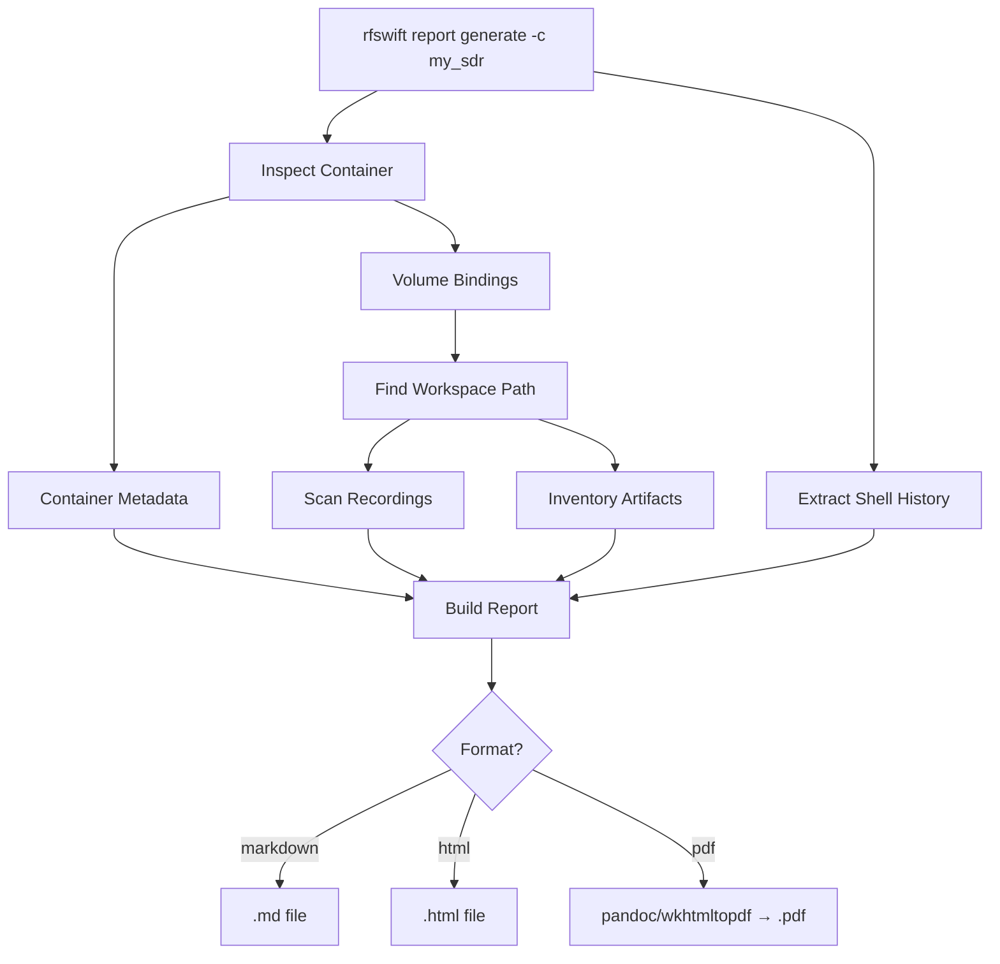

# rfswift report

Generate structured assessment reports from container sessions.

## Synopsis

```bash
# Generate a Markdown report (default)
rfswift report generate -c CONTAINER

# Generate an HTML report
rfswift report generate -c CONTAINER --format html

# Generate a PDF report (requires pandoc or wkhtmltopdf)
rfswift report generate -c CONTAINER --format pdf

# Custom title and output path
rfswift report generate -c CONTAINER --title "Assessment Report" -o report.html -f html
```

The `report` command collects data from a container and its workspace, then generates a structured document combining container metadata, session recordings, shell history, and workspace artifacts.

This is designed for **professional pentesters** writing client deliverables, **researchers** documenting experiments, and **educators** creating lab reports.

---

## Subcommands

### report generate

Collect data from a container and generate a report.

**Options:**

| Flag | Description | Default | Example |
|------|-------------|---------|---------|
| `-c, --container STRING` | Container name | Interactive picker | `-c my_sdr` |
| `-f, --format STRING` | Output format: `markdown`, `html`, `pdf` | `markdown` | `-f html` |
| `-o, --output STRING` | Output file path | Auto-generated | `-o report.html` |
| `-t, --title STRING` | Report title | Auto-generated | `-t "HackRF Assessment"` |

When `-c` is omitted in an interactive terminal, a container picker is shown.

---

## Report Contents

Each generated report contains the following sections:

### 1. Container Summary

| Field | Source |
|-------|--------|
| Container name & ID | Docker/Podman API |
| Image name & hash | Container inspection |
| State (running/stopped) | Container status |
| Creation date & age | Container metadata |
| Workspace path | Volume bindings |

### 2. Environment Configuration

Full container configuration: network mode, privileged mode, device mappings, Linux capabilities, cgroup rules, ulimits, and volume bindings.

### 3. Session Recordings

Inventories all `.cast` (asciinema) and `rfswift-*.log` (script) files found in the workspace directory and current working directory. Includes file size and date.

### 4. Shell History

Extracted from the container's `/root/.bash_history` or `/root/.zsh_history`. Shows all commands run inside the container during the assessment.

### 5. Workspace Artifacts

Full file inventory of the workspace directory with smart categorization:

| Category | File Extensions |
|----------|----------------|
| **capture** | `.iq`, `.raw`, `.cf32`, `.cs8`, `.cu8`, `.cfile`, `.sigmf-data`, `.pcap`, `.pcapng` |
| **config** | `.json`, `.yml`, `.yaml`, `.xml`, `.conf`, `.sigmf-meta` |
| **log** | `.log`, `.txt` |
| **script** | `.py`, `.sh`, `.grc` |
| **image** | `.png`, `.jpg`, `.svg`, `.pdf` |

### 6. Notes Section

An editable section for assessor findings, observations, and conclusions.

---

## Output Formats


  
**Markdown** (default) — no dependencies, works everywhere.

```bash
rfswift report generate -c my_sdr
# → rfswift-report-my_sdr-20260317-143022.md
```

The Markdown output can be:
- Edited in any text editor
- Converted to other formats with pandoc
- Rendered on GitHub, GitLab, or any Markdown viewer
- Included in Git repositories alongside your code
  
  
**HTML** — styled, print-ready, zero dependencies.

```bash
rfswift report generate -c my_sdr --format html
# → rfswift-report-my_sdr-20260317-143022.html
```

The HTML output features:
- Professional styling with responsive tables
- Color-coded category badges for artifacts
- Dark-themed code blocks for shell history
- Print-friendly CSS (`Ctrl+P` or `Cmd+P` to print/save as PDF from browser)
- No external dependencies (all CSS inline)
  
  
**PDF** — requires `pandoc` or `wkhtmltopdf`.

```bash
rfswift report generate -c my_sdr --format pdf -o assessment.pdf
```

PDF generation uses external tools:
```bash
# Install pandoc (recommended)
sudo apt install pandoc      # Debian/Ubuntu
brew install pandoc           # macOS
sudo dnf install pandoc       # Fedora

# Alternative: wkhtmltopdf
sudo apt install wkhtmltopdf
```

If neither tool is installed, RF Swift generates an HTML file instead and shows an installation message.
  


---

## Examples

### Basic Assessment Report

```bash
# Run an SDR assessment
rfswift run -i penthertz/rfswift_noble:sdr_full -n hackrf_assessment --record

# ... do your work inside the container ...
# hackrf_info
# rtl_433 -f 433.92M -s 2M > /workspace/captures/433mhz.iq
# exit

# Generate the report
rfswift report generate -c hackrf_assessment --format html -o hackrf-report.html
```

### Report with Custom Title

```bash
rfswift report generate -c client_pentest \
  --title "Wireless Security Assessment — Client X — March 2026" \
  --format pdf \
  -o client-x-wireless-assessment.pdf
```

### Interactive Mode

```bash
# No flags — picks container from a list, generates Markdown
rfswift report generate
```

### Typical Professional Workflow

```bash
# 1. Create container with workspace and recording
rfswift run -i penthertz/rfswift_noble:sdr_full -n pentest_wifi --record

# 2. All captures go to ~/rfswift-workspace/pentest_wifi/
#    Inside the container, /workspace is the shared directory
cd /workspace
mkdir captures logs
airodump-ng wlan0 -w captures/scan
# ... assessment work ...

# 3. Generate report with all artifacts
rfswift report generate -c pentest_wifi \
  --title "Wi-Fi Penetration Test — Site Alpha" \
  --format html

# 4. Report includes:
#    - Container config (image, caps, devices)
#    - Session recording from --record
#    - Shell history (all commands you ran)
#    - Workspace files (captures/scan-01.cap, etc.)
```

---

## How It Works



The report generator:
1. **Inspects the container** via Docker/Podman API for metadata and configuration
2. **Finds the workspace** by looking for the `/workspace` mount in the container's volume bindings
3. **Scans for recordings** (`.cast` files) in the workspace and current directory
4. **Extracts shell history** from the container's `~/.bash_history` or `~/.zsh_history` via `docker cp`
5. **Inventories workspace files** with smart categorization based on file extensions
6. **Renders the report** using Go templates (Markdown or HTML), optionally converting to PDF

---

## Related Commands

- [`run`](/docs/commands/run) - Create containers (use `--record` to capture sessions)
- [`log`](/docs/commands/log) - Record and replay terminal sessions
- [`bindings`](/docs/commands/bindings) - Manage volume and device bindings
- [`exec`](/docs/commands/exec) - Enter containers (use `--record` to capture sessions)

---


**Tip**: Use `--record` with `rfswift run` and `rfswift exec` to automatically capture session recordings that will appear in the report.



**Workspace integration**: Reports automatically find and inventory files in the container's workspace directory (`~/rfswift-workspace/<name>/`). All captures, configs, and logs saved to `/workspace` inside the container are included in the report.

