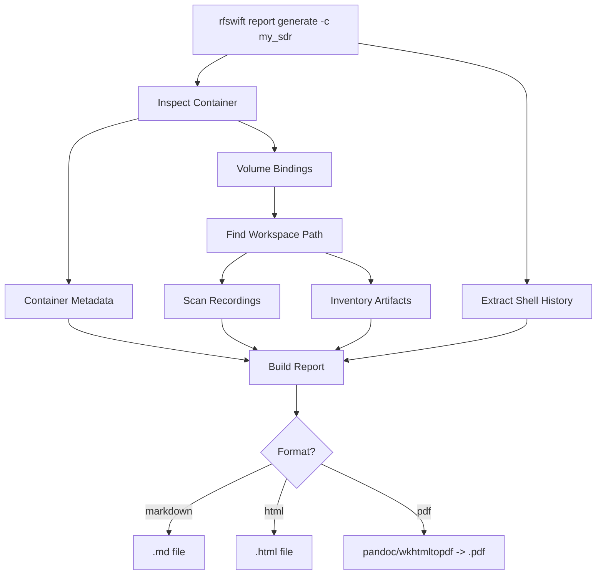


**RF Swift v4 canonical spelling**: `rfswift system report`. The legacy form `rfswift report` still works and prints a notice pointing at the new name. Flags are identical. See the [command tree](/docs/commands/#the-v4-command-tree).


`rfswift report` turns a lab into a written report. It gathers the container's details, its session recordings, the commands you ran and the files in its workspace, and writes them as Markdown, HTML or PDF.

It is useful for assessment deliverables, for documenting research experiments, and for lab write-ups in a course.

```bash
rfswift report generate -c my_sdr --format html
```

## Synopsis

```bash
# Generate a Markdown report (default)
rfswift report generate -c CONTAINER

# Generate an HTML report
rfswift report generate -c CONTAINER --format html

# Generate a PDF report (requires pandoc or wkhtmltopdf)
rfswift report generate -c CONTAINER --format pdf

# Custom title and output path
rfswift report generate -c CONTAINER --title "Assessment Report" -o report.html -f html
```

## Subcommands

### report generate

Collects the data from a container and writes the report.

| Flag | Description | Default | Example |
|------|-------------|---------|---------|
| `-c, --container STRING` | Container name | Interactive picker | `-c my_sdr` |
| `-f, --format STRING` | Output format: `markdown`, `html`, `pdf` | `markdown` | `-f html` |
| `-o, --output STRING` | Output file path | Auto-generated | `-o report.html` |
| `-t, --title STRING` | Report title | Auto-generated | `-t "HackRF Assessment"` |

In an interactive terminal, leaving out `-c` shows a list of containers to pick from.

---

## Report contents

Every report has these sections:

### 1. Container summary

| Field | Source |
|-------|--------|
| Container name & ID | Docker/Podman API |
| Image name & hash | Container inspection |
| State (running/stopped) | Container status |
| Creation date & age | Container metadata |
| Workspace path | Volume bindings |

### 2. Environment configuration

The container's full configuration: network mode, privileged mode, device mappings, Linux capabilities, cgroup rules, ulimits and volume bindings.

### 3. Session recordings

Lists every `.cast` (asciinema) and `rfswift-*.log` (script) file found in the workspace and in the current directory, with its size and date.

### 4. Shell history

Every command run inside the container during the assessment, taken from `/root/.bash_history` or `/root/.zsh_history`.

### 5. Workspace artifacts

Every file in the workspace, sorted into categories by extension:

| Category | File Extensions |
|----------|----------------|
| **capture** | `.iq`, `.raw`, `.cf32`, `.cs8`, `.cu8`, `.cfile`, `.sigmf-data`, `.pcap`, `.pcapng` |
| **config** | `.json`, `.yml`, `.yaml`, `.xml`, `.conf`, `.sigmf-meta` |
| **log** | `.log`, `.txt` |
| **script** | `.py`, `.sh`, `.grc` |
| **image** | `.png`, `.jpg`, `.svg`, `.pdf` |

### 6. Notes section

A section to fill in with your findings, observations and conclusions.

---

## Output formats


  
**Markdown** (the default) has no dependencies and works everywhere.

```bash
rfswift report generate -c my_sdr
# -> rfswift-report-my_sdr-20260317-143022.md
```

You can edit it in any text editor, convert it with pandoc, read it on GitHub, GitLab or any Markdown viewer, and keep it in a Git repository next to your code.
  
  
**HTML** is styled and ready to print, with no dependencies.

```bash
rfswift report generate -c my_sdr --format html
# -> rfswift-report-my_sdr-20260317-143022.html
```

It has readable tables, colour-coded categories for the artifacts, dark code blocks for the shell history, and print-friendly styles: press `Ctrl+P` (or `Cmd+P`) in the browser to print it or save it as PDF. All styles are inline, so the file stands alone.
  
  
**PDF** requires `pandoc` or `wkhtmltopdf`.

```bash
rfswift report generate -c my_sdr --format pdf -o assessment.pdf
```

It uses one of these external tools:

```bash
# Install pandoc (recommended)
sudo apt install pandoc      # Debian/Ubuntu
brew install pandoc           # macOS
sudo dnf install pandoc       # Fedora

# Alternative: wkhtmltopdf
sudo apt install wkhtmltopdf
```

If neither is installed, RF Swift writes an HTML file instead and tells you what to install.
  


---

## Examples

### A basic assessment report

Create a lab with session recording, do your work, then generate an HTML report:

```bash
# Run an SDR assessment
rfswift container create -i penthertz/rfswift_resolute:sdr_full -n hackrf_assessment --record

# ... do your work inside the container ...
# hackrf_info
# rtl_433 -f 433.92M -s 2M > /workspace/captures/433mhz.iq
# exit

# Generate the report
rfswift report generate -c hackrf_assessment --format html -o hackrf-report.html
```

### A report with your own title

```bash
rfswift report generate -c client_pentest \
  --title "Wireless Security Assessment - Client X - March 2026" \
  --format pdf \
  -o client-x-wireless-assessment.pdf
```

### Pick the container from a list

Without flags, RF Swift asks which container to use and writes Markdown:

```bash
# No flags: picks container from a list, generates Markdown
rfswift report generate
```

### A typical engagement

Create a lab that records the session, save your captures to `/workspace`, then generate the report:

```bash
# 1. Create container with workspace and recording
rfswift container create -i penthertz/rfswift_resolute:sdr_full -n pentest_wifi --record

# 2. All captures go to ~/rfswift-workspace/pentest_wifi/
#    Inside the container, /workspace is the shared directory
cd /workspace
mkdir captures logs
airodump-ng wlan0 -w captures/scan
# ... assessment work ...

# 3. Generate report with all artifacts
rfswift report generate -c pentest_wifi \
  --title "Wi-Fi Penetration Test - Site Alpha" \
  --format html

# 4. Report includes:
# - Container config (image, caps, devices)
# - Session recording from --record
# - Shell history (all commands you ran)
# - Workspace files (captures/scan-01.cap, etc.)
```

---

## How it works


```mermaid
graph TD
    A[rfswift report generate -c my_sdr] --> B[Inspect Container]
    B --> C[Container Metadata]
    B --> D[Volume Bindings]
    D --> E[Find Workspace Path]
    E --> F[Scan Recordings]
    E --> G[Inventory Artifacts]
    A --> H[Extract Shell History]
    C --> I[Build Report]
    F --> I
    G --> I
    H --> I
    I --> J{Format?}
    J -->|markdown| K[.md file]
    J -->|html| L[.html file]
    J -->|pdf| M[pandoc/wkhtmltopdf -> .pdf]
```

Step by step, the report generator:

1. **inspects the container** through the Docker or Podman API for its details and configuration;
2. **finds the workspace** from the `/workspace` mount in the container's volume bindings;
3. **looks for recordings** (`.cast` files) in the workspace and the current directory;
4. **copies the shell history** out of the container (`~/.bash_history` or `~/.zsh_history`, with `docker cp`);
5. **lists the workspace files**, sorted into categories by extension;
6. **writes the report** from Go templates (Markdown or HTML), and converts it to PDF if asked.

---

## Good to know

- Add `--record` to `rfswift container create` and `rfswift container shell` so your sessions are recorded and appear in the report.
- Reports find the container's workspace (`~/rfswift-workspace/<name>/`) on their own. Everything you save to `/workspace` inside the lab (captures, configs, logs) is listed.

## Related

- [container create](/docs/commands/run): use `--record` to record sessions
- [log](/docs/commands/log): record and replay terminal sessions
- [config bindings](/docs/commands/bindings): volume and device bindings
- [container shell](/docs/commands/exec): use `--record` to record sessions
