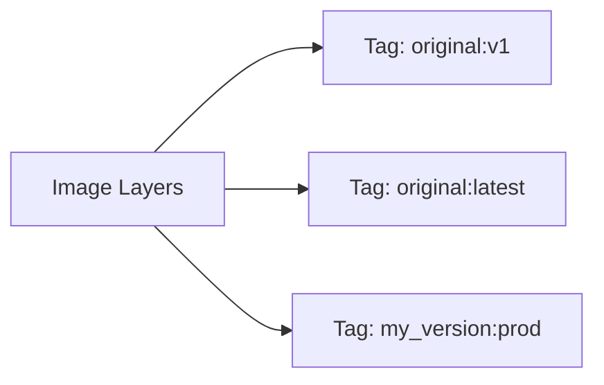

# rfswift retag

Create new tags for existing Docker images or rename image tags.

## Synopsis

```bash
rfswift retag -i IMAGE_REFERENCE -t NEW_TAG
```

The `retag` command creates a new tag for an existing Docker image. This is useful for organizing images, creating aliases, marking versions, or preparing images for distribution.

---

## Options

| Flag | Description | Required | Example |
|------|-------------|----------|---------|
| `-i, --image STRING` | Source image reference | Yes | `-i penthertz/rfswift:sdr_full` |
| `-t, --tag STRING` | New tag name | Yes | `-t my_sdr:production` |

---

## Examples

### Basic Usage

**Create new tag for existing image:**
```bash
rfswift retag -i penthertz/rfswift:sdr_full -t my_sdr:v1
```

**Create alias for convenience:**
```bash
rfswift retag -i penthertz/rfswift:sdr_full -t sdr:latest
```

**Mark as production:**
```bash
rfswift retag -i my_custom_image:test -t my_custom_image:production
```

**Version tagging:**
```bash
rfswift retag -i my_image:latest -t my_image:v1.0.0
```

### Real-World Scenarios

**Environment-based tagging:**
```bash
# Pull image
rfswift images pull -i penthertz/rfswift:sdr_full

# Create environment-specific tags
rfswift retag -i penthertz/rfswift:sdr_full -t sdr_work:development
rfswift retag -i penthertz/rfswift:sdr_full -t sdr_work:staging
rfswift retag -i penthertz/rfswift:sdr_full -t sdr_work:production
```

**Version management:**
```bash
# Tag current version
rfswift retag -i my_custom_sdr:latest -t my_custom_sdr:v1.2.0

# Keep latest tag updated
rfswift retag -i my_custom_sdr:v1.2.0 -t my_custom_sdr:latest

# Create stable release tag
rfswift retag -i my_custom_sdr:v1.2.0 -t my_custom_sdr:stable
```

---

## How Retag Works

### Tag Creation Process

When you retag an image:

1. **No duplication**: New tag points to same image layers
2. **No disk space used**: Both tags reference same underlying data
3. **Multiple tags allowed**: One image can have many tags
4. **Original tag remains**: Source tag is NOT removed



**Example:**
```bash
# Original image
docker images
# penthertz/rfswift:sdr_full  a1b2c3d4e5f6  2.5GB

# Create new tag
rfswift retag -i penthertz/rfswift:sdr_full -t my_sdr:work

# Both tags exist, pointing to same image
docker images
# penthertz/rfswift:sdr_full  a1b2c3d4e5f6  2.5GB
# my_sdr:work                 a1b2c3d4e5f6  2.5GB
# Same image ID, no extra disk space
```

---

## Retag vs Rename

### Key Differences

| Feature | `retag` | `rename` |
|---------|---------|----------|
| **Target** | Images | Containers |
| **Operation** | Creates new tag | Changes container name |
| **Original** | Remains unchanged | Changed |
| **Multiple names** | Yes (many tags) | No (one name) |
| **Disk usage** | None | None |

---

## Tag Naming Conventions

### Recommended Patterns

**Version-based:**
```bash
# Semantic versioning
my_image:v1.2.3
my_image:v1.2
my_image:v1

# Date-based
my_image:2025.01.12
my_image:2026_q1

# Git-based
my_image:commit_a1b2c3d
my_image:branch_develop
```

**Environment-based:**
```bash
my_image:development
my_image:dev
my_image:testing
my_image:test
my_image:staging
my_image:stage
my_image:production
my_image:prod
```

**Purpose-based:**
```bash
my_image:latest
my_image:stable
my_image:experimental
my_image:beta
my_image:release
```

**Combined:**
```bash
my_image:v1.2.3_production
my_image:v1.2_stable
my_image:2026.01_dev
my_image:v1_experimental
```

### Tag Best Practices

**Good tag names:**
```bash
# Clear and descriptive
sdr_analysis:v2.1.0_production
sdr_analysis:stable
sdr_analysis:2026_q1_release

# Environment markers
app:prod_v1.2
app:dev_latest
app:staging_candidate
```

**Avoid:**
```bash
# Ambiguous
image:1
image:a
image:test1

# Too generic
my_tag
temp
old
new
```

---

## Troubleshooting

### Source Image Not Found

**Error:** `Error: No such image: source:tag`

**Solutions:**
```bash
# List available images
rfswift images local

# Check exact image name
docker images | grep image_name

# Pull if needed
rfswift images pull -i penthertz/rfswift:sdr_full

# Then retag
rfswift retag -i penthertz/rfswift:sdr_full -t my_sdr:v1
```

### Invalid Tag Format

**Error:** `invalid reference format`

**Solutions:**
```bash
# Check tag format (no spaces, special chars)
# Good
rfswift retag -i image:old -t image:new

# Bad
rfswift retag -i image:old -t "image with spaces:new"
rfswift retag -i image:old -t "image:new tag"

# Use underscores or hyphens
rfswift retag -i image:old -t image_new:v1
rfswift retag -i image:old -t image-new:v1
```

### Tag Already Exists

**Problem:** Tag already points to different image

**Solution:**
```bash
# Check existing tag
rfswift images local

# Remove old tag first
rfswift delete old_image:new_tag

# Then create new tag
rfswift retag -i source:tag -t new_tag:version

# Or: Tag overwrites automatically with same ID
rfswift retag -i source:tag -t existing:tag
```

### Permission Denied

**Error:** `Permission denied`

**Solutions:**
```bash
# Use sudo
sudo rfswift retag -i source:tag -t new:tag

# Or add user to docker group
sudo usermod -aG docker $USER
newgrp docker

# Then retry
rfswift retag -i source:tag -t new:tag
```

### Cannot Retag While Container Running

**Problem:** Want to retag image being used by container

**Solution:**
```bash
# This is actually OK - containers are unaffected
# Tags can be changed while containers are running

# Container continues using the image it was started with
# New tag just provides another reference to same image
rfswift retag -i penthertz/rfswift:sdr_full -t my_sdr:v1
# Running containers using penthertz/rfswift:sdr_full are unaffected
```

---

## Related Commands

- [`images`](/docs/commands/images) - List and manage images
- [`rename`](/docs/commands/rename) - Rename containers
- [`build`](/docs/commands/build) - Build images to tag
- [`delete`](/docs/commands/delete) - Remove old tags
- [`export`](/docs/commands/export) - Export tagged images

---


**No Disk Space Used**: Retagging creates a new reference to the same image data. Multiple tags for one image don't use extra disk space - they all point to the same layers!



**Original Tag Remains**: Unlike `rename` for containers, `retag` doesn't remove the original tag. Both the old and new tags will exist. Use `delete` to remove unwanted tags.



**Version Management**: Use `retag` to create semantic version tags (v1.2.3), major version tags (v1), and special tags (latest, stable). This makes version management and rollback much easier!
