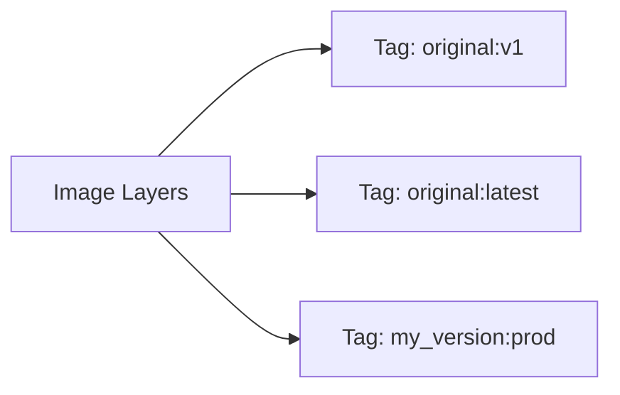

`rfswift image tag` gives an existing image an extra name (a tag). Use it to organise images, create short aliases, mark versions such as `stable` or `v1.2.0`, or prepare an image for sharing.

The most common use gives an official image a shorter local name:

```bash
rfswift image tag -i penthertz/rfswift_resolute:sdr_full -t my_sdr:v1
```


`rfswift image tag` is the v4 spelling. The older `rfswift retag` still works, takes the same flags and prints a notice with the new name. See the [command tree](/docs/commands/#the-v4-command-tree).


## Synopsis

```bash
rfswift image tag -i IMAGE_REFERENCE -t NEW_TAG
```

## Options

| Flag | What it does | Required | Example |
|------|--------------|----------|---------|
| `-i, --image STRING` | The image to tag | Yes | `-i penthertz/rfswift_resolute:sdr_full` |
| `-t, --tag STRING` | The new tag | Yes | `-t my_sdr:production` |


Run it without `-i` in a terminal and RF Swift shows a scrollable list of your local images and their tags.


## Examples

Give an image a new tag:

```bash
rfswift image tag -i penthertz/rfswift_resolute:sdr_full -t my_sdr:v1
```

Create a short alias:

```bash
rfswift image tag -i penthertz/rfswift_resolute:sdr_full -t sdr:latest
```

Mark a tested image as production:

```bash
rfswift image tag -i my_custom_image:test -t my_custom_image:production
```

Give an image a version number:

```bash
rfswift image tag -i my_image:latest -t my_image:v1.0.0
```

### One image, one tag per environment

Pull the image once, then give it a tag for each environment:

```bash
rfswift image pull -i penthertz/rfswift_resolute:sdr_full
rfswift image tag -i penthertz/rfswift_resolute:sdr_full -t sdr_work:development
rfswift image tag -i penthertz/rfswift_resolute:sdr_full -t sdr_work:staging
rfswift image tag -i penthertz/rfswift_resolute:sdr_full -t sdr_work:production
```

### Version tags

Tag the current build with its version, keep `latest` pointing at it, and mark it stable:

```bash
rfswift image tag -i my_custom_sdr:latest -t my_custom_sdr:v1.2.0
rfswift image tag -i my_custom_sdr:v1.2.0 -t my_custom_sdr:latest
rfswift image tag -i my_custom_sdr:v1.2.0 -t my_custom_sdr:stable
```

## How tagging works

A tag is only a name that points to an image. When you add one:

1. **Nothing is copied.** The new tag points to the same image layers.
2. **No disk space is used.** Both tags share the same data.
3. **You can have many tags.** One image can carry as many tags as you like.
4. **The original tag stays.** The source tag is not removed.


```mermaid
graph LR
    A[Image Layers] --> B[Tag: original:v1]
    A --> C[Tag: original:latest]
    A --> D[Tag: my_version:prod]
```

After tagging, both names show the same image ID, and no extra space is used:

```bash
# Original image
docker images
# penthertz/rfswift_resolute:sdr_full  a1b2c3d4e5f6  2.5GB

# Create new tag
rfswift image tag -i penthertz/rfswift_resolute:sdr_full -t my_sdr:work

# Both tags exist, pointing to same image
docker images
# penthertz/rfswift_resolute:sdr_full  a1b2c3d4e5f6  2.5GB
# my_sdr:work                 a1b2c3d4e5f6  2.5GB
# Same image ID, no extra disk space
```


Unlike renaming a container, tagging an image does not remove the original name: both tags exist afterwards. Use `rfswift image rm` to remove a tag you no longer want.


## Tagging an image or renaming a container?

| | `rfswift image tag` (legacy `retag`) | `rfswift container rename` |
|---|---|---|
| **Works on** | Images | Containers |
| **What it does** | Adds a tag | Changes the container's name |
| **Original name** | Kept | Replaced |
| **Several names** | Yes, many tags | No, one name |
| **Disk space** | None | None |

## Choosing tag names

Tags are easiest to use when they say what the image is. Common patterns:

Versions, dates or Git references:

```bash
my_image:v1.2.3
my_image:v1.2
my_image:v1
my_image:2025.01.12
my_image:2026_q1
my_image:commit_a1b2c3d
my_image:branch_develop
```

Environments:

```bash
my_image:development
my_image:dev
my_image:testing
my_image:test
my_image:staging
my_image:stage
my_image:production
my_image:prod
```

Purpose:

```bash
my_image:latest
my_image:stable
my_image:experimental
my_image:beta
my_image:release
```

A combination of these:

```bash
my_image:v1.2.3_production
my_image:v1.2_stable
my_image:2026.01_dev
my_image:v1_experimental
```

Clear, descriptive tags work well:

```bash
sdr_analysis:v2.1.0_production
sdr_analysis:stable
sdr_analysis:2026_q1_release
app:prod_v1.2
app:dev_latest
app:staging_candidate
```

Avoid tags that are ambiguous or too generic:

```bash
image:1
image:a
image:test1
my_tag
temp
old
new
```

Version tags such as `v1.2.3`, a major-version tag such as `v1`, and special tags such as `latest` or `stable` make it easy to go back to an earlier version.

## Troubleshooting

### “No such image”

The full error is `Error: No such image: source:tag`. The image you want to tag is not on this computer, or its name is slightly different. List your images, pull the image if needed, then tag it:

```bash
rfswift image local
docker images | grep image_name
rfswift image pull -i penthertz/rfswift_resolute:sdr_full
rfswift image tag -i penthertz/rfswift_resolute:sdr_full -t my_sdr:v1
```

### “invalid reference format”

The new tag contains characters that are not allowed, such as spaces. Use underscores or hyphens instead.

This works:

```bash
rfswift image tag -i image:old -t image:new
rfswift image tag -i image:old -t image_new:v1
rfswift image tag -i image:old -t image-new:v1
```

This fails:

```bash
rfswift image tag -i image:old -t "image with spaces:new"
rfswift image tag -i image:old -t "image:new tag"
```

### The tag already points to another image

Check your images, remove the old tag, then create the new one:

```bash
rfswift image local
rfswift image rm -i old_image:new_tag
rfswift image tag -i source:tag -t new_tag:version
```

You can also tag over it directly: the tag then moves to the new image.

```bash
rfswift image tag -i source:tag -t existing:tag
```

### “Permission denied”

Your user cannot talk to Docker. On Linux, `rfswift host docker-access` grants access without logging out. You can also add your user to the `docker` group by hand, or run the command with `sudo`:

```bash
rfswift host docker-access
```

```bash
sudo usermod -aG docker $USER
newgrp docker
rfswift image tag -i source:tag -t new:tag
```

```bash
sudo rfswift image tag -i source:tag -t new:tag
```

### Tagging an image that a running container uses

This is fine. Running containers keep using the image they started from, and the new tag is only one more name for the same image:

```bash
rfswift image tag -i penthertz/rfswift_resolute:sdr_full -t my_sdr:v1
```

## Related commands

- [`images`](/docs/commands/images): list and manage images
- [`rename`](/docs/commands/rename): rename containers
- [`build`](/docs/commands/build): build images to tag
- [`delete`](/docs/commands/delete): remove old tags
- [`export`](/docs/commands/export): export tagged images
