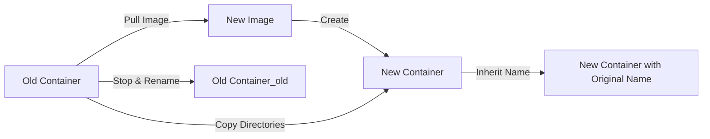

# rfswift upgrade

Upgrade containers to newer image versions while preserving selected data directories.

## Synopsis

```bash
rfswift upgrade -c CONTAINER_NAME [-i IMAGE_NAME] [-r REPOSITORIES]
```

The `upgrade` command follows this pattern: pull new image → create new container → copy preserved directories → inherit original container name. This enables seamless version upgrades while maintaining important data.

---

## Options

| Flag | Description | Required | Example |
|------|-------------|----------|---------|
| `-c, --container STRING` | Container name or ID to upgrade | Yes | `-c my_container` |
| `-i, --image STRING` | Target image name/tag | No (defaults to latest) | `-i telecom_15012025` |
| `-r, --repositories STRING` | Comma-separated directories to preserve | No | `-r /root/tools,/opt/data` |

---

## Examples

### Basic Usage

**Upgrade to latest version:**
```bash
rfswift upgrade -c my_container
```

**Upgrade to specific version:**
```bash
rfswift upgrade -c sdr_work -i penthertz/rfswift:sdr_full
```

**Upgrade with preserved directories:**
```bash
rfswift upgrade -c analysis_work \
  -i penthertz/rfswift:sdr_full \
  -r /root/scripts,/root/captures,/opt/tools
```

**Downgrade to previous version:**
```bash
rfswift upgrade -c production -i penthertz/rfswift:v0.6.4
```

---

## How Upgrade Works

### Upgrade Process

The upgrade command follows this sequence:

1. **Validate**: Check source container exists
2. **Pull**: Download target image (if not present locally)
3. **Create**: Start new container from target image
4. **Copy**: Transfer preserved directories from old to new container
5. **Stop**: Stop old container
6. **Rename**: Rename old container (adds `_old` suffix)
7. **Inherit**: New container inherits original name
8. **Cleanup**: Old container remains stopped for verification



### What Gets Preserved

| Content | Preserved? | How |
|---------|-----------|-----|
| Directories in `-r` flag | ✅ Yes | Copied to new container |
| Files in preserved dirs | ✅ Yes | Complete copy |
| Other directories | ❌ No | Use new image defaults |
| Container name | ✅ Yes | Inherited by new container |
| Mounted volumes | ⚠️ Reconfigure | Must remount manually |
| Network settings | ⚠️ Reconfigure | Must reconfigure manually |
| Port bindings | ⚠️ Reconfigure | Must reconfigure manually |

### What Doesn't Get Preserved

**Important:** The upgrade command creates a completely new container, so:

- ❌ Volume bindings (must remount)
- ❌ Device mappings (must reconfigure)
- ❌ Network configuration (must reconfigure)
- ❌ Port bindings (must reconfigure)
- ❌ Capabilities (must reconfigure)
- ❌ Cgroup rules (must reconfigure)

**Solution:** After upgrade, reconfigure these settings:
```bash
# Upgrade
rfswift upgrade -c work -r /root/data

# Reconfigure volumes
rfswift bindings add -c work -s ~/captures -t /root/captures

# Reconfigure devices
rfswift bindings add -c work -d -s /dev/rtlsdr0 -t /dev/rtlsdr0

# Reconfigure capabilities
rfswift capabilities add -c work -p NET_ADMIN
```

---

## Troubleshooting

### Container Not Found

**Error:** `Error: No such container: container_name`

**Solutions:**
```bash
# List containers
rfswift last
```

### Image Pull Failed

**Error:** `Error pulling image`

**Solutions:**
```bash
# Check network connectivity
ping registry.hub.docker.com

# Pull manually first
docker pull penthertz/rfswift:sdr_full

# Retry upgrade
rfswift upgrade -c container -i penthertz/rfswift:sdr_full
```

### Preserved Directory Not Found

**Error:** `Directory /root/nonexistent not found in source container`

**Solutions:**
```bash
# Check what directories exist
rfswift exec -c old_container
ls -la /root/
exit

# Adjust -r flag to existing directories only
rfswift upgrade -c container -r /root/existing,/opt/tools
```

### Old Container Still Running

**Problem:** Upgrade completes but old container still active

**Solution:**
```bash
# Stop old container manually
rfswift stop -c container_old

# Verify new container is running
docker ps | grep container

# Remove old container when satisfied
rfswift remove -c container_old
```

### Configuration Lost After Upgrade

**Problem:** Network/volume/device settings missing

**Cause:** Upgrade creates new container, doesn't copy Docker configuration

**Solution:**
```bash
# Document current configuration before upgrade
docker inspect old_container > old_container_config.json

# After upgrade, reconfigure manually
rfswift bindings add -c container -s ~/data -t /root/data
rfswift capabilities add -c container -p NET_ADMIN
rfswift cgroups add -c container -r "c 189:* rwm"
rfswift ports bind -c container -b "8080/tcp:8080"
```

### Rollback Failed

**Problem:** Can't restore old container after bad upgrade

**Solution:**
```bash
# If you have backup
rfswift import container -i backup.tar.gz -n container_restored
rfswift run -i container_restored -n container

# If old container still exists
rfswift remove -c container  # Remove bad new container
rfswift rename -n container_old -d container
rfswift exec -c container
```

---

## Related Commands

- [`run`](/docs/commands/run) - Create new containers
- [`commit`](/docs/commands/commit) - Save container state before upgrade
- [`export`](/docs/commands/export) - Backup before upgrade
- [`import`](/docs/commands/import) - Restore from backup if upgrade fails
- [`images`](/docs/commands/images) - Check available images for upgrade


---


**Always Backup First**: Before upgrading, create a backup with `export container`. This allows easy rollback if the upgrade has issues. The old container is kept as `container_old` for verification.



**Reconfiguration Required**: Upgrade creates a new container, so volume bindings, device mappings, network settings, and capabilities must be reconfigured manually after upgrade. Document these before upgrading!



**Selective Preservation**: Use the `-r` flag to preserve only necessary directories. Preserving too much may carry over conflicts, while preserving too little requires more post-upgrade setup. Balance based on your needs!
