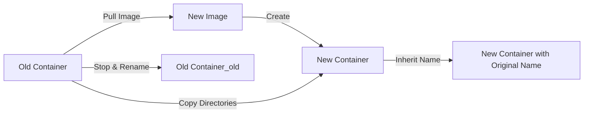


**RF Swift v4 canonical spelling**: `rfswift container upgrade`. The legacy form `rfswift upgrade` and the short alias `rfswift system upgrade` still work and print a notice pointing at the new name. Flags are identical. See the [command tree](/docs/commands/#the-v4-command-tree).


Upgrade containers to newer image versions while preserving selected data directories.

## Synopsis

```bash
rfswift container upgrade -c CONTAINER_NAME [-i IMAGE_NAME] [-r REPOSITORIES]
```

The `upgrade` command follows this pattern: pull new image -> create new container -> copy preserved directories -> inherit original container name. This enables seamless version upgrades while maintaining important data.

---

## Options

| Flag | Description | Required | Example |
|------|-------------|----------|---------|
| `-c, --container STRING` | Container name or ID to upgrade | Yes | `-c my_container` |
| `-i, --image STRING` | Target image name/tag | No (defaults to latest) | `-i telecom_15012025` |
| `-r, --repositories STRING` | Comma-separated directories to preserve | No | `-r /root/tools,/opt/data` |

---

## Examples

### Basic usage

**Upgrade to latest version:**
```bash
rfswift container upgrade -c my_container
```

**Upgrade to specific version:**
```bash
rfswift container upgrade -c sdr_work -i penthertz/rfswift_resolute:sdr_full
```

**Upgrade with preserved directories:**
```bash
rfswift container upgrade -c analysis_work \
  -i penthertz/rfswift_resolute:sdr_full \
  -r /root/scripts,/root/captures,/opt/tools
```

**Downgrade to previous version:**
```bash
rfswift container upgrade -c production -i penthertz/rfswift_resolute:sdr_full_0.0.7
```

---

## How upgrade works

### Upgrade process

The upgrade command follows this sequence:

1. **Validate**: Check source container exists
2. **Pull**: Download target image (if not present locally)
3. **Create**: Start new container from target image
4. **Copy**: Transfer preserved directories from old to new container
5. **Stop**: Stop old container
6. **Rename**: Rename old container (adds `_old` suffix)
7. **Inherit**: New container inherits original name
8. **Cleanup**: Old container remains stopped for verification


```mermaid
graph LR
    A[Old Container] -->|Pull Image| B[New Image]
    B -->|Create| C[New Container]
    A -->|Copy Directories| C
    A -->|Stop & Rename| D[Old Container_old]
    C -->|Inherit Name| E[New Container with Original Name]
```

### What gets preserved

| Content | Preserved? | How |
|---------|-----------|-----|
| Directories in `-r` flag | Yes | Copied to new container |
| Files in preserved dirs | Yes | Complete copy |
| Other directories | No | Use new image defaults |
| Container name | Yes | Inherited by new container |
| Volume bindings | Yes | Automatically inherited |
| Network settings | Yes | Automatically inherited |
| Port bindings | Yes | Automatically inherited |
| Device mappings | Yes | Automatically inherited |
| Capabilities | Yes | Automatically inherited |
| Cgroup rules | Yes | Automatically inherited |
| Environment variables | Yes | Automatically inherited |
| Privileged mode | Yes | Automatically inherited |
| Seccomp profile | Yes | Automatically inherited |

The upgrade command now **automatically preserves** all host bindings, network settings, device mappings, capabilities, cgroup rules, and port bindings from the original container. A timestamped backup image is created before the old container is removed.

### What doesn't get preserved

- Files outside of `-r` directories (new image defaults apply)
- Running processes (container is restarted fresh)

---

## Troubleshooting

### Container not found

**Error:** `Error: No such container: container_name`

**Solutions:**
```bash
# List containers
rfswift container last
```

### Image pull failed

**Error:** `Error pulling image`

**Solutions:**
```bash
# Check network connectivity
ping registry.hub.docker.com

# Pull manually first
docker pull penthertz/rfswift_resolute:sdr_full

# Retry upgrade
rfswift container upgrade -c container -i penthertz/rfswift_resolute:sdr_full
```

### Preserved directory not found

**Error:** `Directory /root/nonexistent not found in source container`

**Solutions:**
```bash
# Check what directories exist
rfswift container shell -c old_container
ls -la /root/
exit

# Adjust -r flag to existing directories only
rfswift container upgrade -c container -r /root/existing,/opt/tools
```

### Old container still running

**Problem:** Upgrade completes but old container still active

**Solution:**
```bash
# Stop old container manually
rfswift container stop -c container_old

# Verify new container is running
docker ps | grep container

# Remove old container when satisfied
rfswift container rm -c container_old
```

### Configuration lost after upgrade

**Problem:** Network/volume/device settings missing after upgrade

**Note:** This should no longer occur. RF Swift now automatically preserves all container settings (bindings, devices, network, capabilities, cgroups, ports) during upgrade. If you experience this issue, ensure you're running the latest version of RF Swift.

**Workaround (for older versions):**
```bash
# Document current configuration before upgrade
docker inspect old_container > old_container_config.json

# After upgrade, reconfigure manually
rfswift bindings add -c container -s ~/data -t /root/data
rfswift capabilities add -c container -p NET_ADMIN
rfswift cgroups add -c container -r "c 189:* rwm"
rfswift ports bind -c container -b "8080:8080/tcp"
```

### Rollback failed

**Problem:** Can't restore old container after bad upgrade

**Solution:**
```bash
# If you have backup
rfswift image import container -i backup.tar.gz -n container_restored
rfswift container create -i container_restored -n container

# If old container still exists
rfswift container rm -c container  # Remove bad new container
rfswift container rename -n container_old -d container
rfswift container shell -c container
```

---

## Related commands

- [`run`](/docs/commands/run) - Create new containers
- [`commit`](/docs/commands/commit) - Save container state before upgrade
- [`export`](/docs/commands/export) - Backup before upgrade
- [`import`](/docs/commands/import) - Restore from backup if upgrade fails
- [`images`](/docs/commands/images) - Check available images for upgrade


---


**Always Backup First**: Before upgrading, create a backup with `export container`. This allows easy rollback if the upgrade has issues. The old container is kept as `container_old` for verification.



**Settings Preserved**: RF Swift now automatically inherits all container settings (bindings, devices, network mode, capabilities, cgroup rules, ports, environment variables) from the original container during upgrade. No manual reconfiguration needed.



**Selective Preservation**: Use the `-r` flag to preserve only necessary directories. Preserving too much may carry over conflicts, while preserving too little requires more post-upgrade setup. Balance based on your needs!
