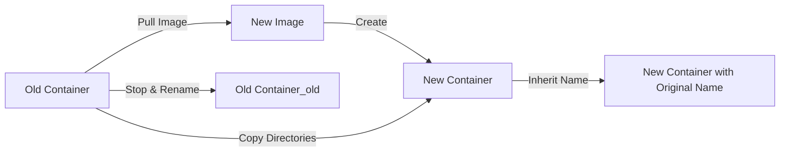

`rfswift container upgrade` moves a container to a newer (or another) image and copies over the folders you choose. Use it when a new version of your toolbox is published and you want its tools without starting from scratch.

```bash
rfswift container upgrade -c my_container -r /root/captures,/opt/tools
```

In short: it pulls the new image, creates a new container from it, copies the folders you listed, and gives the new container the original name. Your container's settings (mounts, devices, network, ports, capabilities...) are carried over.


**Other spellings**: the legacy form `rfswift upgrade` and the short alias `rfswift system upgrade` still work and print a notice. The flags are the same. See the [command tree](/docs/commands/#the-v4-command-tree).


## Synopsis

```bash
rfswift container upgrade -c CONTAINER_NAME [-i IMAGE_NAME] [-r REPOSITORIES]
```

## Options

| Flag | Description | Required | Example |
|------|-------------|----------|---------|
| `-c, --container STRING` | Container name or ID to upgrade | Yes | `-c my_container` |
| `-i, --image STRING` | Target image name/tag | No (defaults to latest) | `-i telecom_15012025` |
| `-r, --repositories STRING` | Comma-separated directories to preserve | No | `-r /root/tools,/opt/data` |

## Examples

### Basic usage

#### Upgrade to latest version
```bash
rfswift container upgrade -c my_container
```

#### Upgrade to specific version
```bash
rfswift container upgrade -c sdr_work -i penthertz/rfswift_resolute:sdr_full
```

#### Upgrade with preserved directories
```bash
rfswift container upgrade -c analysis_work \
  -i penthertz/rfswift_resolute:sdr_full \
  -r /root/scripts,/root/captures,/opt/tools
```

#### Downgrade to previous version
```bash
rfswift container upgrade -c production -i penthertz/rfswift_resolute:sdr_full_0.0.7
```

## How upgrade works

### Upgrade process

The steps, in order:

1. **Check**: the source container exists.
2. **Pull**: download the target image, if it is not already on your computer.
3. **Create**: start a new container from the target image.
4. **Copy**: copy the folders listed with `-r` from the old container to the new one.
5. **Stop**: stop the old container.
6. **Rename**: rename the old container with an `_old` suffix.
7. **Inherit**: the new container takes the original name.
8. **Keep**: the old container stays stopped so you can check the result.


```mermaid
graph LR
    A[Old Container] -->|Pull Image| B[New Image]
    B -->|Create| C[New Container]
    A -->|Copy Directories| C
    A -->|Stop & Rename| D[Old Container_old]
    C -->|Inherit Name| E[New Container with Original Name]
```

### What gets preserved

| Content | Preserved? | How |
|---------|-----------|-----|
| Directories in `-r` flag | Yes | Copied to new container |
| Files in preserved dirs | Yes | Complete copy |
| Other directories | No | Use new image defaults |
| Container name | Yes | Inherited by new container |
| Volume bindings | Yes | Automatically inherited |
| Network settings | Yes | Automatically inherited |
| Port bindings | Yes | Automatically inherited |
| Device mappings | Yes | Automatically inherited |
| Capabilities | Yes | Automatically inherited |
| Cgroup rules | Yes | Automatically inherited |
| Environment variables | Yes | Automatically inherited |
| Privileged mode | Yes | Automatically inherited |
| Seccomp profile | Yes | Automatically inherited |

All host bindings, network settings, device mappings, capabilities, cgroup rules and port bindings are **carried over automatically**. A timestamped backup image is created before the old container is removed.

### What doesn't get preserved

- Files outside the `-r` folders: the new image's versions are used.
- Running processes: the new container starts fresh.

## Troubleshooting

### Container not found

The error message is: `Error: No such container: container_name`

To fix it:
```bash
# List containers
rfswift container last
```

### Image pull failed

The error message is: `Error pulling image`

To fix it:
```bash
# Check network connectivity
ping registry.hub.docker.com

# Pull manually first
docker pull penthertz/rfswift_resolute:sdr_full

# Retry upgrade
rfswift container upgrade -c container -i penthertz/rfswift_resolute:sdr_full
```

### Preserved directory not found

The error message is: `Directory /root/nonexistent not found in source container`

To fix it:
```bash
# Check what directories exist
rfswift container shell -c old_container
ls -la /root/
exit

# Adjust -r flag to existing directories only
rfswift container upgrade -c container -r /root/existing,/opt/tools
```

### Old container still running

The upgrade finished, but the old container is still running.

To fix it:
```bash
# Stop old container manually
rfswift container stop -c container_old

# Verify new container is running
docker ps | grep container

# Remove old container when satisfied
rfswift container rm -c container_old
```

### Configuration lost after upgrade

Network, folder or device settings are missing after the upgrade.

This should not happen anymore: RF Swift carries all container settings (bindings, devices, network, capabilities, cgroups, ports) over during an upgrade. If you still see it, update RF Swift to the latest version.

#### Workaround (for older versions)
```bash
# Document current configuration before upgrade
docker inspect old_container > old_container_config.json

# After the upgrade, set them again by hand
rfswift config bindings add -c container -s ~/data -t /root/data
rfswift config capabilities add -c container -p NET_ADMIN
rfswift config cgroups add -c container -r "c 189:* rwm"
rfswift config ports bind -c container -b "8080:8080/tcp"
```

### Rollback failed

You can't get the old container back after a bad upgrade.

To fix it:
```bash
# If you have backup
rfswift image import container -i backup.tar.gz -n container_restored
rfswift container create -i container_restored -n container

# If old container still exists
rfswift container rm -c container  # Remove bad new container
rfswift container rename -n container_old -d container
rfswift container shell -c container
```

## Related commands

- [`container create`](/docs/commands/run/): create a new container
- [`container commit`](/docs/commands/commit/): save a container's state before upgrading
- [`image export`](/docs/commands/export/): back up to a file before upgrading
- [`image import`](/docs/commands/import/): restore from that file if the upgrade fails
- [`image versions`](/docs/commands/images/): see which image versions are available


**Back up first**: before upgrading, export the container with `rfswift image export container`, so you can roll back if something goes wrong. The old container is also kept as `container_old` until you check the result.



**Choose the `-r` folders carefully**: keep only the folders you need. Copying too much can bring old conflicts along; copying too little means more setup afterwards.
