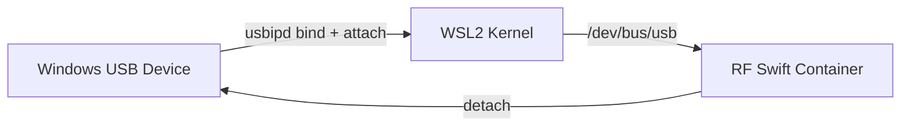

# rfswift winusb

Manage USB devices on Windows hosts for WSL2 container passthrough.

## Synopsis

```bash
# List USB devices on Windows host
rfswift winusb list

# Attach a USB device to WSL container
rfswift winusb attach -i BUSID

# Detach a USB device from WSL container
rfswift winusb detach -i BUSID
```

The `winusb` command manages USB device passthrough between a Windows host and WSL2 containers. It uses `usbipd` under the hood to bind and attach USB devices, making them accessible inside RF Swift containers running in WSL2.


This command is **Windows/WSL2 only**. On native Linux, use [`bindings`](/docs/commands/bindings) to manage USB device access instead.


---

## Subcommands

| Subcommand | Description |
|------------|-------------|
| `winusb list` | List all USB devices connected to the Windows host |
| `winusb attach` | Attach a USB device from the Windows host to the WSL container |
| `winusb detach` | Detach a USB device from the WSL container |

---

### winusb list

List all USB devices connected to the Windows host, showing bus IDs, device IDs, vendor/product IDs, and descriptions.

**No additional options.**

### winusb attach

Attach a USB device from the Windows host to the WSL2 container by bus ID.

**Options:**

| Flag | Description | Required | Example |
|------|-------------|----------|---------|
| `-i, --busid STRING` | Bus ID of the USB device to attach | Yes | `-i 2-3` |

### winusb detach

Detach a USB device from the WSL2 container, returning it to the Windows host.

**Options:**

| Flag | Description | Required | Example |
|------|-------------|----------|---------|
| `-i, --busid STRING` | Bus ID of the USB device to detach | Yes | `-i 2-3` |

---

## Examples

### Listing USB Devices

**List all available USB devices:**
```bash
rfswift winusb list
```

**Example output:**
```
USB Devices:
BusID: 1-2, DeviceID: 0bda:2838, VendorID: 0bda, ProductID: 2838, Description: RTL2838UHIDIR
BusID: 2-3, DeviceID: 1d50:6089, VendorID: 1d50, ProductID: 6089, Description: HackRF One
```

### Attaching a USB Device

**Attach an SDR device to the WSL container:**
```bash
# First, find the bus ID
rfswift winusb list

# Attach using the bus ID
rfswift winusb attach -i 2-3
```

**Attach and use in a container:**
```bash
# Attach device
rfswift winusb attach -i 1-2

# Enter container and use
rfswift exec -c sdr_work
# Device is now available inside the container
```

### Detaching a USB Device

**Return a device to the Windows host:**
```bash
rfswift winusb detach -i 2-3
```

**Detach before unplugging:**
```bash
# Always detach before physically removing the device
rfswift winusb detach -i 1-2
```

### Typical WSL2 SDR Workflow

```bash
# 1. List devices to find your SDR
rfswift winusb list

# 2. Attach the SDR to WSL
rfswift winusb attach -i 1-2

# 3. Run an RF Swift container
rfswift run -i penthertz/rfswift_noble:sdr_full -n sdr_work

# 4. Work with the SDR inside the container
rfswift exec -c sdr_work

# 5. When done, detach the device
rfswift winusb detach -i 1-2
```

---

## How It Works

### usbipd Integration

The `winusb` command relies on [usbipd-win](https://github.com/dorssel/usbipd-win), which must be installed on the Windows host. The workflow is:

1. **List** queries `usbipd` for all connected USB devices
2. **Attach** binds the device via `usbipd` and forwards it over USB/IP to WSL2
3. **Detach** releases the device from WSL2 and returns it to the Windows host



---

## Troubleshooting

### usbipd Not Found

**Problem:** `winusb` commands fail because `usbipd` is not installed

**Solutions:**
```powershell
# Install usbipd-win on Windows (run in PowerShell as Administrator)
winget install --interactive --exact dorssel.usbipd-win

# Verify installation
usbipd --version
```

### Device Not Showing in List

**Problem:** `winusb list` does not show your USB device

**Solutions:**
```bash
# Ensure the device is physically connected to the Windows host
# Check Windows Device Manager for the device

# On the Windows side, verify usbipd can see it
# (run in PowerShell)
usbipd list
```

### Attach Fails with Permission Error

**Problem:** `winusb attach` returns a permission error

**Solutions:**
```bash
# usbipd requires Administrator privileges on Windows
# Run your WSL terminal as Administrator

# Alternatively, ensure the usbipd service is running
# (run in PowerShell as Administrator)
sc query usbipd
```

### Device Not Visible in Container After Attach

**Problem:** Device is attached but not visible inside the container

**Solutions:**
```bash
# Check if the device appears in WSL
lsusb

# If visible in WSL but not in the container, add a device binding
rfswift bindings add -d -c sdr_work \
  -s /dev/bus/usb \
  -t /dev/bus/usb

# You may also need cgroup rules
rfswift cgroups add -c sdr_work -r "c 189:* rwm"
```

### Device Disconnects Unexpectedly

**Problem:** USB device disconnects from WSL during use

**Solutions:**
```bash
# Re-attach the device
rfswift winusb attach -i 1-2

# If the issue persists, check Windows power management:
# Open Device Manager > USB devices > Properties > Power Management
# Uncheck "Allow the computer to turn off this device to save power"

# Ensure WSL2 kernel supports USB/IP
wsl --update
```

---

## Related Commands

- [`run`](/docs/commands/run) - Create containers to use with attached USB devices
- [`bindings`](/docs/commands/bindings) - Manage device bindings inside containers (Linux and WSL2)
- [`host`](/docs/commands/host) - Configure host system settings

---


**Prerequisites**: The `winusb` command requires [usbipd-win](https://github.com/dorssel/usbipd-win) to be installed on the Windows host. Install it via `winget install dorssel.usbipd-win` in an elevated PowerShell prompt.



**Windows/WSL2 Only**: This command is exclusively for Windows hosts running RF Swift through WSL2. On native Linux, USB devices are directly accessible and should be passed to containers using the [`bindings`](/docs/commands/bindings) command instead.



**Administrator Access**: Attaching and detaching USB devices via `usbipd` typically requires Administrator privileges on Windows. Run your terminal as Administrator if you encounter permission errors.

