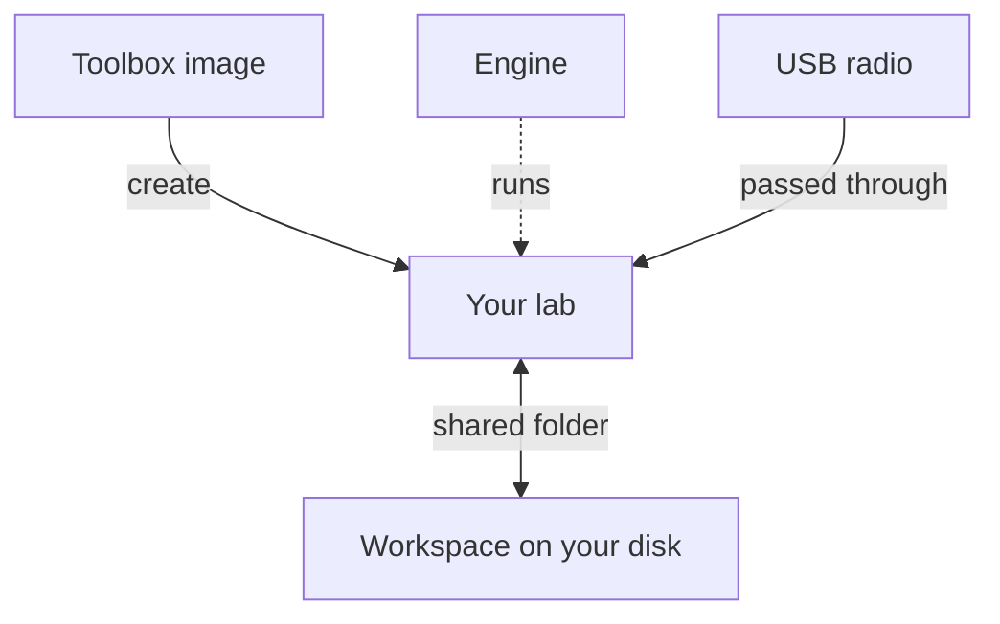

You don't need to know containers, Linux or radio to use RF Swift. You only need the handful of ideas on this page. Each one comes with an everyday comparison and the command that goes with it.

## The big picture



You pick a **toolbox**, RF Swift builds a **lab** from it using an **engine**, connects your **radio**, and shares a **workspace** folder with your computer. That's it. The rest of this page explains each box.

## SDR (software-defined radio)

**What it is:** a radio where most of the work happens in software on your computer. The small USB device (an RTL-SDR dongle, a HydraSDR, a HackRF, a USRP, a bladeRF...) only captures raw radio waves. Programs such as SDR++, GQRX or GNU Radio then show the spectrum, tune to a frequency and decode what's being sent.

**Think of it as** a microphone for radio waves. The microphone records; the software on your computer does the listening.

RF Swift ships those programs and the drivers for common SDRs, ready to use. Not into radio? RF Swift also has toolboxes for Wi-Fi, Bluetooth, RFID/NFC, cars, hardware hacking, reversing, networks and more.

## Toolbox (image)

**What it is:** a ready-made, pre-installed set of tools for one job. Technically it's a container **image**. Each toolbox has a short name: `sdr_light` (the essential radio tools), `sdr_full` (every radio tool), `wifi`, `bluetooth`, `rfid`, `automotive`, `hardware`, `reversing`, `telecom_5G` and many others.

**Think of it as** a flat-packed workshop: everything you need for one trade, packed and tested together. You download it once.

```bash
rfswift image remote             # the toolboxes you can download
rfswift image pull -i sdr_light  # download one
```

Not sure which to pick? See [Choose a toolbox](/docs/guide/list-of-images/). `sdr_light` is a good first choice.

## Lab (container)

**What it is:** a working space built from a toolbox. Technically it's a **container**: an isolated space that runs next to your system and uses the tools of the toolbox. You give each lab a name.

**Think of it as** a workshop room built from the flat-pack. You can build several rooms from the same pack (one per project), mess one up, throw it away and build a fresh one in seconds. Your own computer stays clean.

```bash
rfswift container create -i sdr_light -n mylab   # build "mylab", step inside
rfswift container shell -c mylab                 # come back later
rfswift container rm -c mylab                    # delete it (files stay)
```

Run `rfswift container create` with no options and a guided wizard asks you the questions instead.

## Engine

**What it is:** the program that actually runs your labs. RF Swift works with four, and **the installer picks and sets one up for you**, so you can skip this section at first.

| Engine | In one sentence |
|---|---|
| **Docker** | The most common choice. On macOS and Windows it comes as Docker Desktop. |
| **Podman** | Like Docker but with no background service and no root rights, good on shared or security-focused machines. |
| **Lima** | macOS only: a small Linux virtual machine that lets your labs reach USB radios, which Docker Desktop on macOS can't do. |
| **Nix** | No containers at all: the same tools are installed natively on your system, pinned to exact versions. The lightest option, and a great fit for macOS (see below). |

**Think of it as** the building the workshop rooms live in. RF Swift handles the plumbing (USB, display, sound) the same way whichever building you use. What each engine is best at: [Choose your engine](/docs/engines/).

## Nix environment (the native alternative)

**What it is:** instead of a container, the **Nix engine** installs a toolbox's tools straight onto your computer, as your user, pinned to exact versions so they never clash with your system. It's handy on a laptop without Docker, or when you want tools as close to the hardware as possible.

**Lazy mode keeps it light.** Add `--lazy` (or tick **Lazy tools** in the Workbench) and nothing is installed up front: each tool is fetched the first time you type its name, then kept pinned. Use `sdrpp` and only SDR++ lands on your disk.

**Think of it as** a tool rack that fills itself: you reach for a tool, and it appears.

```bash
rfswift --engine nix container create -i sdr_light -n radio --lazy   # native, nothing installed yet
rfswift env shell radio                                              # enter it later; type sdrpp and only SDR++ is fetched
rfswift env run sdr_light sdrpp                                      # just run SDR++, no environment at all
```

**On a Mac** Nix is a particularly good fit: the tools run natively on macOS, your USB radio opens directly and sound plays natively, with no Linux VM in between.

Containers and Nix environments are created, entered and listed the same way, so pick whichever suits your machine. More in [Nix engine](/docs/guide/nix-engine/).

## Workspace

**What it is:** a folder shared between your computer and a lab. Every lab gets one automatically:

| On your computer | Inside the lab |
|---|---|
| `~/rfswift-workspace/<lab name>/` | `/workspace` |

Save a capture to `/workspace` inside the lab and it appears instantly in `~/rfswift-workspace/<lab name>/` on your computer, and the other way round.

**Think of it as** the pass-through window between the workshop and your office. The workspace **stays on your disk** even after you delete the lab, so your captures and notes are never lost. Details: [Files & devices](/docs/guide/sharing-files/).

## Devices and USB passthrough

**What it is:** giving the lab access to hardware plugged into your computer, like your SDR or a Proxmark3. How it works depends on your system:


  
Nothing to do: the USB devices are shared with the lab by default. With Podman or Nix, run `rfswift host udev` once so your user is allowed to open radio hardware (these **udev rules** are Linux's permission rules for devices; Docker doesn't need them).
  
  
Docker Desktop on macOS can't pass USB devices through. For hardware, RF Swift uses **Lima** (installed with `brew install lima qemu`): attach the device with `rfswift usb attach`, then create the lab with `rfswift --engine lima container create ...`. See [usb](/docs/commands/usb/).
  
  
Labs run inside WSL 2, a Linux virtual machine built into Windows. RF Swift forwards your radio into it with usbipd-win: `rfswift usb attach` shows a picker. Windows asks for administrator approval once per device. See [Windows](/docs/guide/windows/).
  


The screen and sound are forwarded too, so graphical tools such as SDR++ open in a normal window and you hear the audio.

## Profile

**What it is:** a saved set of options (toolbox, network, devices, features) with a name, so you don't retype long commands.

**Think of it as** a favourite recipe.

```bash
rfswift profile init                                # create the built-in presets
rfswift profile list                                # see them
rfswift container create --profile sdr-full -n my_sdr
```

## The Workbench and missions

**What it is:** the RF Swift desktop app, for people who prefer windows and buttons, or who need to write a report. It is completely standalone: no code editor, IDE, plugin or browser extension to install. Each lab becomes a **mission**: one place with its terminals (recorded), a notebook, findings, captures and a report. A **project** groups the missions of one engagement.

**Think of it as** a lab notebook that is wired into the workshop. The Workbench and the command line manage the same labs, so you can mix them freely. Tour: [Workbench](/docs/guide/workbench/).

## The command line (CLI)

**What it is:** the `rfswift` command you type in a terminal. Commands are grouped by what they act on: `rfswift container ...`, `rfswift image ...`, `rfswift env ...`, `rfswift host ...`, `rfswift usb ...`. Add `--help` to anything to see what it does:

```bash
rfswift --help
rfswift container create --help
```

Most commands open an interactive picker when you leave out a required option, so you can't really get lost. `rfswift` is a single self-contained program (no Python or other runtime to install), and it also contains the **remote agent**, which lets the Workbench on your laptop drive a lab machine or a small board somewhere else. Full list: [Command reference](/docs/commands/).

## Cheat sheet

| I want to... | Do this |
|---|---|
| Check that my computer is ready | `rfswift doctor` |
| See which toolboxes exist | `rfswift image remote` |
| Create a lab, guided | `rfswift container create` |
| Create a radio lab directly | `rfswift container create -i sdr_light -n mylab` |
| Go back into a lab | `rfswift container shell -c mylab` |
| List my labs | `rfswift container last` |
| Stop a lab | `rfswift container stop -c mylab` |
| Delete a lab (files stay) | `rfswift container rm -c mylab` |
| Find my files | `~/rfswift-workspace/mylab/` on my computer |
| Pass a USB radio through (macOS, Windows) | `rfswift usb attach` |
| Run one tool without containers | `rfswift env run sdr_light sdrpp` |
| Stay light: install tools only when I use them | `rfswift --engine nix container create -i sdr_light -n mylab --lazy` |
| Update RF Swift | `rfswift update` |

## Ready?


  
  

