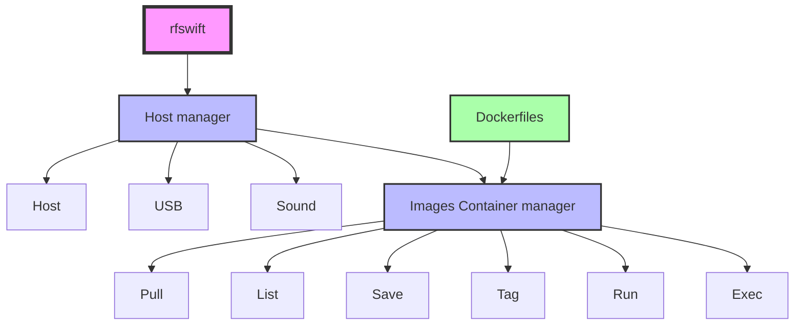

# Getting Started with RF Swift 🚀

This guide will help you get started with RF Swift by covering system requirements, installation steps, and next actions.

## Supported Platforms

RF Swift is designed to work across multiple platforms and architectures to suit your specific environment.

### Operating Systems

| Platform | x86_64/amd64 | arm64/v8 | riscv64 |
|----------|--------------|----------|---------|
| Windows  | ✅ Fully supported | ❓ Limited testing | ❌ Not supported |
| Linux    | ✅ Fully supported | ✅ Fully supported | ✅ Fully supported |
| macOS    | ❓ Limited support | ✅ Supported (better inside a VM for USB devices) | ❌ Not supported |

### Tested Single-Board Computers

| SBC | Status | Comments |
|-----|--------|----------|
| Raspberry Pi 5 | ✅ | Works perfectly with most tools |
| Milk-V Jupiter | ✅ | Works perfectly with most tools, but slower than Raspberry Pi 5 |
| Orange Pi RV2  | ✅ | Works perfectly with most tools, but slower than Milk-V Jupiter |
| Milk-V Mars | ❌ | Software support is currently unavailable. Docker installation is problematic |
| UP Squared Series | ✅ | Works perfectly with most tools |

## System Requirements

The minimum requirements to run RF Swift are:


  
  ### Linux Requirements

  
  On Linux, Docker, BuildX, and Go can be directly installed with the `install.sh` script included in the repository.
  

  #### Essential Components
  
  - **Docker**: Required to run RF Swift containers
    ```bash
    curl -fsSL "https://get.docker.com/" | sh
    ```
  - **xhost**: Required for GUI application support (install via your distribution's package manager)
  - **PulseAudio**: Required for audio support (install via your distribution's package manager)
  
  #### Optional Components
  
  - **Go Compiler**: Required if you want to build RF Swift from source
  - **BuildX**: Required for cross-architecture compilation

  #### Quick Installation

  RF Swift provides a comprehensive installation script that automatically installs all required tools and dependencies on Linux systems.

  ```bash
  # Clone the repository
  git clone https://github.com/PentHertz/RF-Swift.git
  cd RF-Swift
  
  # Run the installation script to automatically install all dependencies
  ./install.sh
  ```

  The `install.sh` script will:
  - Install Docker if not already present
  - Set up BuildX for cross-architecture support
  - Install Go compiler if needed
  - Configure xhost for GUI application access
  - Set up PulseAudio for sound
  - Configure user permissions for Docker
  - Download and install the latest RF Swift binary

  This is the recommended method for Linux users as it ensures all components are correctly configured to work together.
  

  
  ### Windows Requirements

  #### Required Software
  
  - [Docker Desktop](https://docs.docker.com/desktop/install/windows-install/) to run containers
  - [usbipd](https://learn.microsoft.com/en-us/windows/wsl/connect-usb) to bind USB devices to the host

  #### For Audio Support
  
  For programs requiring PulseAudio:
  1. Follow the setup guide on [Linux Uprising](https://www.linuxuprising.com/2021/03/how-to-get-sound-pulseaudio-to-work-on.html)
  2. Use the updated binaries available at [pgaskin.net/pulseaudio-win32](https://pgaskin.net/pulseaudio-win32/)

  
  Make sure Docker Desktop runs in [WSL2 mode](https://docs.docker.com/desktop/wsl/#enabling-docker-support-in-wsl-2-distros) for optimal performance and compatibility.
  

  #### Installation Steps
  
  1. Install Docker Desktop and ensure WSL2 integration is enabled
  2. Install usbipd for USB device support
  3. Set up PulseAudio if audio functionality is needed
  4. Download the latest RF Swift binary from the releases page
  

  
  ### macOS Requirements

  
  macOS support will be fully implemented soon. Currently, some features may have limited functionality.
  

  #### Current Status
  
  - Container functionality works without USB forwarding
  - For full functionality including USB device support, running in a Linux VM is recommended
  
  #### Required Software
  
  - Docker Desktop for macOS
  - XQuartz for X11 forwarding (optional)
  
  #### Known Limitations
  
  - USB device forwarding is not currently supported natively
  - Some specialized RF tools may have compatibility issues
  


## Architecture Overview

RF Swift organizes its functionality in a hierarchical structure:



This structure allows RF Swift to provide:
- Comprehensive container management
- Host resource integration
- Device forwarding (USB, audio, display)
- Streamlined workflow for RF testing and development

## Next Steps

Dive right into the following sections to continue:


  
  


## Troubleshooting

If you encounter issues during installation or usage:

1. Check the [GitHub Issues](https://github.com/PentHertz/RF-Swift/issues) page for known problems
2. Verify your Docker installation is working correctly with `docker run hello-world`
3. Ensure you have the required permissions (e.g., user is in the docker group on Linux)
4. Join our [Discord community](https://discord.gg/NS3HayKrpA) for direct assistance

## Feature Compatibility Matrix

| Feature | Linux | Windows | macOS |
|---------|-------|---------|-------|
| Container Execution | ✅ | ✅ | ✅ |
| GUI Applications | ✅ | ✅ | ✅ (with XQuartz) |
| USB Device Forwarding | ✅ | ✅ (with usbipd) | ❌ |
| Audio Support | ✅ | ✅ (with PulseAudio) | ❓ Limited |
| Hardware Acceleration | ✅ | ❓ Limited | ❓ Limited |
| Cross-Compilation | ✅ | ✅ (in WSL) | ✅ |