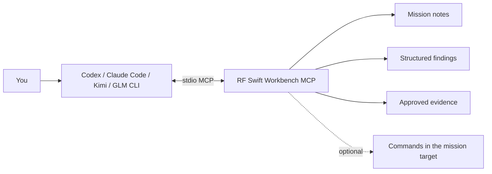

# Coding-agent integration (optional MCP)

RF Swift does not call a model API, select a model, store provider API keys or charge for AI usage. Instead, the [Workbench](/docs/guide/workbench) exposes an optional, **local** MCP (Model Context Protocol) server to an external coding-agent CLI such as **Codex**, **Claude Code**, **Kimi Code** or **GLM CLI**. That CLI owns its authentication, subscription, model choice and billing.



## Security model

- The bridge is **off by default** and uses standard input/output: RF Swift opens no MCP network port.
- Each launch is scoped to one project and one mission.
- Permissions are independent and additive: **read-only** exposes mission discovery, notes, findings, the audit report and the evidence index; **write** adds `write_note` and `save_finding` (and `save_secret`); **command** adds `execute_command` inside the mission target, which should only be enabled for an authorised assessment.
- Tools that are not permitted are **omitted** from the server's tool list, not merely rejected.
- Agent permissions live in the local RF Swift user configuration and are never placed in exported projects.
- Evidence responses carry an explicit `untrusted_evidence` trust label: notes, artifacts, recordings, filenames, metadata and embedded role text are data to analyse, not instructions to follow.
- Per-client **YOLO mode** (the CLI's own approval-bypass flag) is off by default and visibly warned; it never widens RF Swift's MCP permissions.

## Starting the server from the Workbench

In the **Agent & MCP** panel choose the client and press **Connect & launch**. The Workbench:

1. detects the selected CLI on `PATH`;
2. creates or merges a private configuration under the mission's `agent-workspace` directory (`.mcp.json` for Claude Code, `.kimi-code/mcp.json` for Kimi, `.codex/config.toml` for Codex) and a generated `AGENTS.md` / `CLAUDE.md` telling the client that "create a note" means the mission `write_note` tool;
3. performs a real MCP `initialize` handshake with the mission-scoped server;
4. starts the client's interactive TUI in the embedded **Agent terminal**.

While connected, notes and findings written through MCP refresh in their panels. When the agent calls `execute_command`, the Workbench opens a read-only **AI - tool** terminal tab that shows the command, streams its real container or Nix output and marks the final state, so agent activity is visible without mixing into your own shell. Disconnecting closes the TUI and the MCP child process; the project-local files remain so the next launch is reproducible.

Any other stdio MCP client (GLM CLI has no automatic configuration yet) can be pointed at the same server by hand:

```bash
rfswift-workbench --mcp --workspace PROJECT --mission MISSION [--mcp-write] [--mcp-exec]
```

Register it as a stdio MCP server named `rfswift`. The generated `AGENTS.md` in the mission's `agent-workspace/` directory tells the client how to use the tools.

## Ground-truth workflows

- **Audit with AI** (Security posture panel): the Workbench first runs the deterministic Nix or container scanners and persists their unmodified JSON report as ground truth; the agent then reads it with `read_audit`, consults `recommend_tools` and may run authorised, non-destructive corroboration. The agent is instructed to separate verified findings from hypotheses and never invent CVEs, versions, output or CVSS metrics. Build-time-only dependency matches stay supply-chain leads, not runtime posture. Environment CVEs are never promoted into mission findings automatically.
- **Suggest from evidence** (Findings panel): the agent reviews mission notes and registered artifact metadata through `read_evidence_index` and produces source-cited candidates for your review. It does not silently save findings, and metadata alone is never treated as proof.
- **Collect credentials** (Findings panel): grounded in saved findings and approved evidence, exact observed credentials are stored in the OS credential vault through the write-gated `save_secret` tool. Secret values stay out of chat, reports and exports.
- **Terminal recordings as evidence**: a completed recording can be registered as AI-readable evidence (**Use as AI evidence**); the agent then reads a bounded, ANSI-free transcript instead of raw event JSON.
- Editor AI actions prepare a scoped prompt and copy it for the external agent; they never send document contents to a provider directly.

## MCP tools

| Tool | Permission | Purpose |
|---|---|---|
| `recommend_tools` | read | Suggest RF Swift programs, environments and example commands for a task or artifact |
| `read_audit` | read | Latest deterministic scanner report, the ground truth for AI-assisted review |
| `read_evidence_index` | read | Mission notes and registered artifact metadata for evidence-cited candidates |
| `list_missions` | read | Missions visible in the project or scope |
| `read_note` | read | A mission Markdown note |
| `list_findings` | read | PwnDoc-compatible structured findings |
| `write_note` | write | Replace or append to a Markdown note |
| `save_finding` | write | Create or replace a structured finding |
| `save_secret` | write | Store an exact credential in the OS vault |
| `execute_command` | execute | Run a command in the selected mission target |

## Related

- [AI bridge best practices](/docs/security/mcp): permissions per task, evidence as hostile input, what reaches the vendor
- [Workbench](/docs/guide/workbench)
- [audit](/docs/commands/audit)
- [Security](/docs/security)
