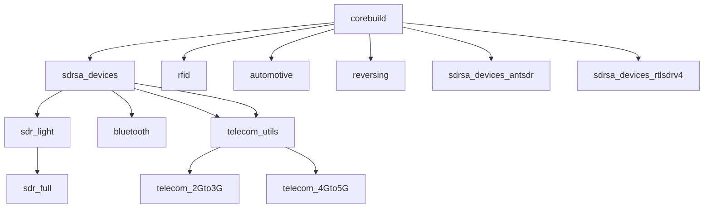

RF Swift has an `images` options that allows to deal with remote and local images.

Let us discover these different options.

## Remote images

You can list remote images associated to the architecture you are using with the `images remote` command set:

```bash
rfswift images remote
...
 💿 Official Images                                                                                                 
┌──────────────────────────────┬──────────────────────┬────────────────────────────────────────────────┬──────────────┐
│ Tag                          │ Pushed Date          │ Image                                          │ Architecture │
├──────────────────────────────┼──────────────────────┼────────────────────────────────────────────────┼──────────────┤
│ sdr_full_amd64               │ 2024-09-03T08:09:08Z │ penthertz/rfswift:sdr_full_amd64               │ amd64        │
├──────────────────────────────┼──────────────────────┼────────────────────────────────────────────────┼──────────────┤
│ bluetooth                    │ 2024-09-03T04:54:41Z │ penthertz/rfswift:bluetooth                    │ amd64        │
├──────────────────────────────┼──────────────────────┼────────────────────────────────────────────────┼──────────────┤
│ telecom                      │ 2024-09-03T04:24:10Z │ penthertz/rfswift:telecom                      │ amd64        │
├──────────────────────────────┼──────────────────────┼────────────────────────────────────────────────┼──────────────┤
│ sdrsa_devices_antsdr         │ 2024-09-03T01:54:23Z │ penthertz/rfswift:sdrsa_devices_antsdr         │ amd64        │
├──────────────────────────────┼──────────────────────┼────────────────────────────────────────────────┼──────────────┤
│ extrasofts_amd64             │ 2024-09-03T01:45:27Z │ penthertz/rfswift:extrasofts_amd64             │ amd64        │
├──────────────────────────────┼──────────────────────┼────────────────────────────────────────────────┼──────────────┤
│ extraoot1_amd64              │ 2024-09-03T01:03:38Z │ penthertz/rfswift:extraoot1_amd64              │ amd64        │
├──────────────────────────────┼──────────────────────┼────────────────────────────────────────────────┼──────────────┤
│ extraoot2_amd64              │ 2024-09-03T01:02:21Z │ penthertz/rfswift:extraoot2_amd64              │ amd64        │
├──────────────────────────────┼──────────────────────┼────────────────────────────────────────────────┼──────────────┤
│ mldlsofts_amd64              │ 2024-09-03T00:54:35Z │ penthertz/rfswift:mldlsofts_amd64              │ amd64        │
├──────────────────────────────┼──────────────────────┼────────────────────────────────────────────────┼──────────────┤
│ sdr_light                    │ 2024-09-03T00:51:03Z │ penthertz/rfswift:sdr_light                    │ amd64        │
├──────────────────────────────┼──────────────────────┼────────────────────────────────────────────────┼──────────────┤
│ reversing                    │ 2024-09-03T00:37:44Z │ penthertz/rfswift:reversing                    │ amd64        │
├──────────────────────────────┼──────────────────────┼────────────────────────────────────────────────┼──────────────┤
│ telecom_amd64                │ 2024-09-03T00:32:08Z │ penthertz/rfswift:telecom_amd64                │ amd64        │
├──────────────────────────────┼──────────────────────┼────────────────────────────────────────────────┼──────────────┤
│ wifi_amd64                   │ 2024-09-03T00:15:16Z │ penthertz/rfswift:wifi_amd64                   │ amd64        │
...
```

You will see that some tag are specific to the architecture `sdr_light_amd64`, but others like `sdr_light` do not include the architecture.
First you should know that those two tags are the same, but `sdr_light` can be used also against aarch64/arm64, and riscv64 as well.

To better explain the different pre-compiled image, look at this table showing the main images you will be interested in:




Here is you will find images hierarchy:



So if you want to build one of your own, do not hesitate to take one these images as a reference.


## List local images

To list pulled, but also built images, you can issue the `images local` command, that will display these local images and details:

```bash
  📦 RF Swift Images                                                                                          
┌──────────────────────┬─────────────────┬──────────────┬───────────────────────────┬─────────────┬────────────┐
│ Repository           │ Tag             │ Image ID     │ Created                   │ Size        │ Status     │
├──────────────────────┼─────────────────┼──────────────┼───────────────────────────┼─────────────┼────────────┤
│ myrfswift            │ latest          │ sha256:0bdb2 │ 2024-09-01T00:56:27+02:00 │ 16635.22 MB │ Custom     │
├──────────────────────┼─────────────────┼──────────────┼───────────────────────────┼─────────────┼────────────┤
│ penthertz/rfswiftdev │ sdr_full_amd64  │ sha256:0bdb2 │ 2024-09-01T00:56:27+02:00 │ 16635.22 MB │ Up to date │
├──────────────────────┼─────────────────┼──────────────┼───────────────────────────┼─────────────┼────────────┤
│ penthertz/rfswiftdev │ sdr_light_amd64 │ sha256:476c0 │ 2024-09-01T00:34:55+02:00 │ 9617.12 MB  │ Up to date │
├──────────────────────┼─────────────────┼──────────────┼───────────────────────────┼─────────────┼────────────┤
│ penthertz/rfswift    │ sdr_full        │ sha256:50ce1 │ 2024-08-02T14:45:46+02:00 │ 10383.56 MB │ Custom     │
└──────────────────────┴─────────────────┴──────────────┴───────────────────────────┴─────────────┴────────────┘
```


  The status can serve as a good indicator to show if the images are up-to-date when using official tags.


If an update is necessary you can issue a `images pull` command as follows:

```bash
rfswift images pull -i penthertz/rfswift:<tag_name>
```

## Next

In next pages, you will have a better idea of tools installed for each images, as well as other details.

Dive right into the following section to get started:


  
  

