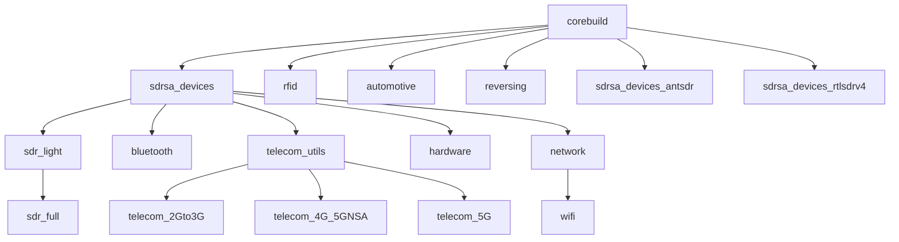

# RF Swift Container Images

RF Swift provides a comprehensive set of container images to support various radio frequency and hardware security workflows. This guide explains how to manage these images and understand the available options.

## Image Management Commands

RF Swift offers the `images` command group to interact with both remote and local images:

```bash
rfswift images --help
```

Key subcommands include:
- `remote`: List available images from the repository
- `local`: List downloaded images on your system

## Remote Image Repository

### Listing Available Images

To view all available images for your architecture from the official repository:

```bash
rfswift images remote
```

This command displays a table of available images with important details:

```
  💿 Official Images                                                                                                 
┌──────────────────────────────┬──────────────────────┬────────────────────────────────────────────────┬──────────────┐
│ Tag                          │ Pushed Date          │ Image                                          │ Architecture │
├──────────────────────────────┼──────────────────────┼────────────────────────────────────────────────┼──────────────┤
│ sdr_full_nvidiagpu_amd64     │ 2025-03-24T17:37:59Z │ penthertz/rfswift_noble:sdr_full_nvidiagpu_amd64     │ amd64        │
│ hardware                     │ 2025-03-24T17:33:21Z │ penthertz/rfswift_noble:hardware                     │ amd64        │
│ sdr_full_intelgpu_amd64      │ 2025-03-24T17:09:38Z │ penthertz/rfswift_noble:sdr_full_intelgpu_amd64      │ amd64        │
│ sdr_full                     │ 2025-03-24T16:43:07Z │ penthertz/rfswift_noble:sdr_full                     │ amd64        │
│ telecom_5G                   │ 2025-03-24T16:36:22Z │ penthertz/rfswift_noble:telecom_5G                   │ amd64        │
...
```

### Understanding Image Tags

The image naming system follows a consistent pattern:

1. **Generic tags** (e.g., `sdr_full`, `bluetooth`) work across supported architectures with multi-architecture builds
2. **Architecture-specific tags** (e.g., `sdr_light_amd64`, `bluetooth_arm64`) target single architectures
3. **Specialized hardware tags** (e.g., `sdr_full_nvidiagpu_amd64`) include optimizations for specific hardware


When in doubt, use the generic tags (without architecture suffix) as RF Swift will automatically select the correct version for your system. Use architecture-specific tags only when you need a particular variant.


### Core Image Categories

| Category | Description | Example Images |
|----------|-------------|----------------|
| **SDR** | Software-defined radio tools | `sdr_light`, `sdr_full`, `sdr_full_nvidiagpu_amd64` |
| **Telecom** | Mobile network analysis | `telecom_utils`, `telecom_2Gto3G`, `telecom_4G_5GNSA`, `telecom_5G` |
| **Short-range** | Bluetooth, Wi-Fi and RFID | `bluetooth`, `wifi`, `rfid` |
| **Hardware** | Hardware security tools | `hardware`, `reversing` |
| **Automotive** | Vehicle communications | `automotive` |
| **Base images** | Foundation for other images | `corebuild`, `sdrsa_devices` |

## Image Hierarchy

RF Swift images are structured in a layered hierarchy, with specialized images building on more general base images:



This hierarchy provides several benefits:
- **Layer reuse**: Reduces overall disk space when using multiple images
- **Consistency**: Common tools are identical across related images
- **Specialization**: Higher-level images include more specialized tools
- **Base for customization**: You can build your own images starting from any level

## Recommended Images



## Managing Local Images

### Listing Local Images

To see images you've already downloaded or created:

```bash
rfswift images local
```

This shows details about local images, including their status:

```
  📦 RF Swift Images                                                                                          
┌──────────────────────┬─────────────────┬──────────────┬───────────────────────────┬─────────────┬────────────┐
│ Repository           │ Tag             │ Image ID     │ Created                   │ Size        │ Status     │
├──────────────────────┼─────────────────┼──────────────┼───────────────────────────┼─────────────┼────────────┤
│ myrfswift            │ latest          │ sha256:0bdb2 │ 2024-09-01T00:56:27+02:00 │ 16635.22 MB │ Custom     │
│ penthertz/rfswiftdev │ sdr_full_amd64  │ sha256:0bdb2 │ 2024-09-01T00:56:27+02:00 │ 16635.22 MB │ Up to date │
│ penthertz/rfswiftdev │ sdr_light_amd64 │ sha256:476c0 │ 2024-09-01T00:34:55+02:00 │ 9617.12 MB  │ Up to date │
│ penthertz/rfswift    │ sdr_full        │ sha256:50ce1 │ 2024-08-02T14:45:46+02:00 │ 10383.56 MB │ Custom     │
└──────────────────────┴─────────────────┴──────────────┴───────────────────────────┴─────────────┴────────────┘
```

**Image Status Indicators:**
- **Up to date**: Image matches the latest version in the repository
- **Update available**: A newer version exists in the repository
- **Custom**: Image has been modified locally (through tagging or container commits)

### Pulling Images

To download an image from the repository:

```bash
rfswift images pull -i sdr_light
```

Options:
- `-i, --image`: Image tag to download (required)
- `-t, --tag`: Local tag to apply to the pulled image (optional)
- `-r, --repository`: Alternate repository source (optional)

Example with custom tag:
```bash
rfswift images pull -i sdr_full -t my_sdr:v1
```

### Updating Images

To update an image that shows "Update available":

```bash
rfswift images pull -i sdr_full
```

RF Swift will automatically download the latest version.

### Saving and Loading Images

For offline use or transfer between systems:

```bash
# Export an image to a file
rfswift images save -i sdr_light -o sdr_light.tar.gz

# Import an image from a file
rfswift images load -i sdr_light.tar.gz
```

## Disk Space Considerations

RF Swift images vary in size based on included tools:

| Image Type | Typical Size Range | Examples |
|------------|---------------------|----------|
| Base images | 2-5 GB | `corebuild` |
| Specialized tools | 5-10 GB | `bluetooth`, `wifi`, `reversing` |
| Comprehensive suites | 10-20 GB | `sdr_full`, `telecom_5G` |

**Important Note on Actual Disk Usage:**
The sizes displayed by `rfswift images local` show the virtual size of each image. However, due to Docker's layer-based architecture and the hierarchical structure of RF Swift images, the actual disk space used is often significantly less than the sum of all image sizes.

For example, if you have both `sdr_light` (9GB) and `sdr_full` (16GB) images:
- The displayed total might suggest 25GB of usage
- The actual disk usage might be closer to 17GB since both images share common base layers

This layer sharing happens automatically and is one of the key benefits of RF Swift's hierarchical image design. When you pull multiple related images (like those in the same branch of the hierarchy diagram), you're only downloading and storing the unique layers for each image.

To manage disk space efficiently:
1. Use specialized images rather than all-inclusive ones when possible
2. Leverage the image hierarchy - related images share layers and consume less space
3. Remove unused images with `rfswift delete -c image:tag`
4. Clean up unused containers with `rfswift remove -c container_name`
5. Consider creating custom images with only the tools you need

## Next Steps

Explore these sections to learn more about available tools and configuration options:


  
  
