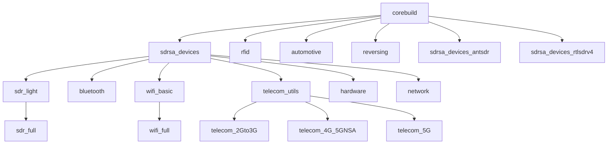

RF Swift has an `images` options that allows to deal with remote and local images.

Let us discover these different options.

## Remote images

You can list remote images associated to the architecture you are using with the `images remote` command set:

```bash
rfswift images remote
...
  💿 Official Images                                                                                                 
┌──────────────────────────────┬──────────────────────┬────────────────────────────────────────────────┬──────────────┐
│ Tag                          │ Pushed Date          │ Image                                          │ Architecture │
├──────────────────────────────┼──────────────────────┼────────────────────────────────────────────────┼──────────────┤
│ sdr_full_nvidiagpu_amd64     │ 2025-03-24T17:37:59Z │ penthertz/rfswift:sdr_full_nvidiagpu_amd64     │ amd64        │
├──────────────────────────────┼──────────────────────┼────────────────────────────────────────────────┼──────────────┤
│ hardware                     │ 2025-03-24T17:33:21Z │ penthertz/rfswift:hardware                     │ amd64        │
├──────────────────────────────┼──────────────────────┼────────────────────────────────────────────────┼──────────────┤
│ sdr_full_intelgpu_amd64      │ 2025-03-24T17:09:38Z │ penthertz/rfswift:sdr_full_intelgpu_amd64      │ amd64        │
├──────────────────────────────┼──────────────────────┼────────────────────────────────────────────────┼──────────────┤
│ sdr_full                     │ 2025-03-24T16:43:07Z │ penthertz/rfswift:sdr_full                     │ amd64        │
├──────────────────────────────┼──────────────────────┼────────────────────────────────────────────────┼──────────────┤
│ telecom_5G                   │ 2025-03-24T16:36:22Z │ penthertz/rfswift:telecom_5G                   │ amd64        │
├──────────────────────────────┼──────────────────────┼────────────────────────────────────────────────┼──────────────┤
│ telecom_2Gto3G               │ 2025-03-24T16:14:59Z │ penthertz/rfswift:telecom_2Gto3G               │ amd64        │
├──────────────────────────────┼──────────────────────┼────────────────────────────────────────────────┼──────────────┤
│ telecom_4G_5GNSA             │ 2025-03-24T16:08:08Z │ penthertz/rfswift:telecom_4G_5GNSA             │ amd64        │
├──────────────────────────────┼──────────────────────┼────────────────────────────────────────────────┼──────────────┤
│ network                      │ 2025-03-24T16:03:53Z │ penthertz/rfswift:network                      │ amd64        │
├──────────────────────────────┼──────────────────────┼────────────────────────────────────────────────┼──────────────┤
│ telecom_utils                │ 2025-03-24T15:53:28Z │ penthertz/rfswift:telecom_utils                │ amd64        │
├──────────────────────────────┼──────────────────────┼────────────────────────────────────────────────┼──────────────┤
│ deeptempest                  │ 2025-03-24T15:39:08Z │ penthertz/rfswift:deeptempest                  │ amd64        │
├──────────────────────────────┼──────────────────────┼────────────────────────────────────────────────┼──────────────┤
│ reversing                    │ 2025-03-24T15:36:32Z │ penthertz/rfswift:reversing                    │ amd64        │
├──────────────────────────────┼──────────────────────┼────────────────────────────────────────────────┼──────────────┤
│ sdr_light                    │ 2025-03-24T15:35:17Z │ penthertz/rfswift:sdr_light                    │ amd64        │
├──────────────────────────────┼──────────────────────┼────────────────────────────────────────────────┼──────────────┤
│ wifi                         │ 2025-03-24T15:34:11Z │ penthertz/rfswift:wifi                         │ amd64        │
├──────────────────────────────┼──────────────────────┼────────────────────────────────────────────────┼──────────────┤
│ sdrsa_devices_antsdr         │ 2025-03-24T15:32:58Z │ penthertz/rfswift:sdrsa_devices_antsdr         │ amd64        │
├──────────────────────────────┼──────────────────────┼────────────────────────────────────────────────┼──────────────┤
│ bluetooth                    │ 2025-03-24T15:24:19Z │ penthertz/rfswift:bluetooth                    │ amd64        │
├──────────────────────────────┼──────────────────────┼────────────────────────────────────────────────┼──────────────┤
│ bluetooth_amd64              │ 2025-03-24T15:23:31Z │ penthertz/rfswift:bluetooth_amd64              │ amd64        │
├──────────────────────────────┼──────────────────────┼────────────────────────────────────────────────┼──────────────┤
│ automotive                   │ 2025-03-24T15:19:40Z │ penthertz/rfswift:automotive                   │ amd64        │
├──────────────────────────────┼──────────────────────┼────────────────────────────────────────────────┼──────────────┤
│ sdrsa_devices                │ 2025-03-24T15:19:16Z │ penthertz/rfswift:sdrsa_devices                │ amd64        │
├──────────────────────────────┼──────────────────────┼────────────────────────────────────────────────┼──────────────┤
│ sdrsa_devices_rtlsdrv4       │ 2025-03-24T15:19:15Z │ penthertz/rfswift:sdrsa_devices_rtlsdrv4       │ amd64        │
├──────────────────────────────┼──────────────────────┼────────────────────────────────────────────────┼──────────────┤
│ rfid                         │ 2025-03-24T15:18:29Z │ penthertz/rfswift:rfid                         │ amd64        │
└──────────────────────────────┴──────────────────────┴────────────────────────────────────────────────┴──────────────┘
....
```

You will see that some tag are specific to the architecture `sdr_light_amd64`, but others like `sdr_light` do not include the architecture.
First you should know that those two tags are the same, but `sdr_light` can be used also against aarch64/arm64, and riscv64 as well.

To better explain the different pre-compiled image, look at this table showing the main images you will be interested in:




Here is you will find images hierarchy:



So if you want to build one of your own, do not hesitate to take one these images as a reference.


## List local images

To list pulled, but also built images, you can issue the `images local` command, that will display these local images and details:

```bash
  📦 RF Swift Images                                                                                          
┌──────────────────────┬─────────────────┬──────────────┬───────────────────────────┬─────────────┬────────────┐
│ Repository           │ Tag             │ Image ID     │ Created                   │ Size        │ Status     │
├──────────────────────┼─────────────────┼──────────────┼───────────────────────────┼─────────────┼────────────┤
│ myrfswift            │ latest          │ sha256:0bdb2 │ 2024-09-01T00:56:27+02:00 │ 16635.22 MB │ Custom     │
├──────────────────────┼─────────────────┼──────────────┼───────────────────────────┼─────────────┼────────────┤
│ penthertz/rfswiftdev │ sdr_full_amd64  │ sha256:0bdb2 │ 2024-09-01T00:56:27+02:00 │ 16635.22 MB │ Up to date │
├──────────────────────┼─────────────────┼──────────────┼───────────────────────────┼─────────────┼────────────┤
│ penthertz/rfswiftdev │ sdr_light_amd64 │ sha256:476c0 │ 2024-09-01T00:34:55+02:00 │ 9617.12 MB  │ Up to date │
├──────────────────────┼─────────────────┼──────────────┼───────────────────────────┼─────────────┼────────────┤
│ penthertz/rfswift    │ sdr_full        │ sha256:50ce1 │ 2024-08-02T14:45:46+02:00 │ 10383.56 MB │ Custom     │
└──────────────────────┴─────────────────┴──────────────┴───────────────────────────┴─────────────┴────────────┘
```


  The status can serve as a good indicator to show if the images are up-to-date when using official tags.


If an update is necessary you can issue a `images pull` command as follows:

```bash
rfswift images pull -i <tag_name>
```

## Next

In next pages, you will have a better idea of tools installed for each images, as well as other details.

Dive right into the following section to get started:


  
  

