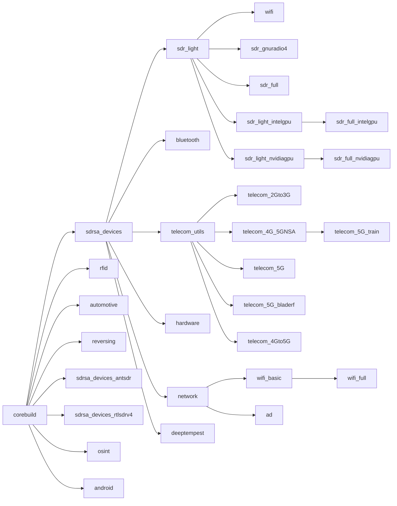

In RF Swift, a **toolbox** is a container image: a ready-made set of tools, drivers and libraries for one kind of job. You pick a toolbox, RF Swift creates a lab from it, and the tools inside already work together. This page helps you choose one, then explains how to download and manage images.


If you have an SDR and want to see and listen to signals, `sdr_light` is the right first toolbox. You can add others later: toolboxes share their common parts, so a second one downloads only what is new.



Toolboxes are full container images of several GB. If you only need a handful of tools, a **lazy Nix environment** installs nothing up front and fetches each tool the first time you run it: `rfswift container create --engine nix -i sdr_light -n radio --lazy`, or tick **Lazy tools** in the Workbench. The toolbox names below work for both. See [Add more software](/docs/guide/installing-software/).


## Which toolbox do I need?

Find your job in the left column. The name on the right is what you type after `-i` (or pick in the Workbench's **Environment / image** field). To see exactly what each toolbox contains, open [Included tools](/docs/guide/list-of-tools/).

| I work on… | Toolbox |
|---|---|
| Software-defined radio, everyday use | `sdr_light` |
| Software-defined radio, the complete set | `sdr_full` |
| Trying GNU Radio 4.0 next to GNU Radio 3.10 | `sdr_gnuradio4` |
| Electromagnetic emanation analysis | `deeptempest` |
| Wi-Fi | `wifi_basic`, `wifi_full`, or `wifi` (Wi-Fi tools on top of `sdr_light`) |
| Bluetooth Classic and Low Energy | `bluetooth` |
| RFID and NFC | `rfid` |
| Cellular networks, shared utilities | `telecom_utils` |
| Cellular 2G and 3G | `telecom_2Gto3G` |
| Cellular 4G and 5G NSA | `telecom_4G_5GNSA` |
| Cellular 5G standalone | `telecom_5G` (`telecom_5G_bladerf` for bladeRF) |
| Cellular 4G to 5G, combined | `telecom_4Gto5G` |
| Cellular 5G training, extended | `telecom_5G_train` |
| Vehicles | `automotive` |
| Hardware security | `hardware` |
| Reverse engineering, firmware analysis, static code review | `reversing` |
| Network security | `network` |
| Active Directory engagements | `ad` |
| Android applications and devices | `android` |
| Open-source intelligence | `osint` |


On x86_64, `sdr_light` and `sdr_full` also come with Intel or NVIDIA GPU drivers and gr-fosphor: `sdr_light_intelgpu`, `sdr_light_nvidiagpu`, `sdr_full_intelgpu`, `sdr_full_nvidiagpu`. Use them only if you want GPU acceleration.


## Download and use a toolbox

You don't need a separate download step: creating a lab downloads the toolbox the first time.

```bash
rfswift container create -i sdr_light -n radio
```

If you prefer to download in advance, for example before you go somewhere without internet, pull it:

```bash
rfswift image pull -i sdr_light
```

In the Workbench, type the toolbox name in the **Environment / image** field of **New mission**; a **Download image** button shows the progress layer by layer.


The same tool sets exist as **native Nix environments**: `rfswift env catalog` lists them and `rfswift container create --engine nix -i sdr_light -n radio` creates one without any container engine. See the [Nix engine guide](/docs/guide/nix-engine/).


## Managing images

The `rfswift image` command group handles everything about images. The pre-v4 spellings (`rfswift images ...`, `rfswift delete`, `rfswift download`, ...) still work and print a notice with the new name.

```bash
rfswift image --help
```

| Command | What it does |
|---|---|
| `rfswift image remote` | List the images published for your computer's architecture |
| `rfswift image local` | List the images already on your computer, and whether they are up to date |
| `rfswift image pull -i IMAGE` | Download or update an image |
| `rfswift image versions` | List every published version of each image |
| `rfswift image rm -i IMAGE` | Delete an image |
| `rfswift image download` / `import` / `export` | Move images as archive files, for example to an offline machine |
| `rfswift image audit IMAGE` | Scan an image for known vulnerabilities |

The full list of subcommands and flags is on the [image](/docs/commands/image/) reference page.

### See what is published

```bash
rfswift image remote
```

This displays a table of available images:

```
  💿 Official Images
┌──────────────────────────┬──────────────────────┬─────────────────────────────────────────────────────┬──────────────┐
│ Tag                      │ Pushed Date          │ Image                                               │ Architecture │
├──────────────────────────┼──────────────────────┼─────────────────────────────────────────────────────┼──────────────┤
│ sdr_full_nvidiagpu_amd64 │ 2025-03-24T17:37:59Z │ penthertz/rfswift_resolute:sdr_full_nvidiagpu_amd64 │ amd64        │
│ hardware                 │ 2025-03-24T17:33:21Z │ penthertz/rfswift_resolute:hardware                 │ amd64        │
│ sdr_full_intelgpu_amd64  │ 2025-03-24T17:09:38Z │ penthertz/rfswift_resolute:sdr_full_intelgpu_amd64  │ amd64        │
│ sdr_full                 │ 2025-03-24T16:43:07Z │ penthertz/rfswift_resolute:sdr_full                 │ amd64        │
│ telecom_5G               │ 2025-03-24T16:36:22Z │ penthertz/rfswift_resolute:telecom_5G               │ amd64        │
...
```

### Understanding image tags

1. **Generic tags** (e.g. `sdr_full`, `bluetooth`) work across supported architectures with multi-architecture builds.
2. **Architecture-specific tags** (e.g. `sdr_light_amd64`, `bluetooth_arm64`) target a single architecture.
3. **Specialized hardware tags** (e.g. `sdr_full_nvidiagpu_amd64`) include optimizations for specific hardware.


When in doubt, use the generic tags (without architecture suffix): RF Swift automatically selects the correct version for your system. Use architecture-specific tags only when you need a particular variant.


Short names such as `sdr_full` expand to `penthertz/rfswift_resolute:sdr_full` through the `repotag` setting of your [configuration file](/docs/guide/configurations/).

### Image categories

| Category | Description | Images |
|----------|-------------|--------|
| **SDR** | Software-defined radio tools | `sdr_light`, `sdr_full`, `sdr_light_intelgpu`, `sdr_full_nvidiagpu`, `deeptempest`, `sdr_gnuradio4` |
| **Telecom** | Mobile network analysis | `telecom_utils`, `telecom_2Gto3G`, `telecom_4G_5GNSA`, `telecom_5G`, `telecom_5G_bladerf`, `telecom_4Gto5G`, `telecom_5G_train` |
| **Short-range** | Bluetooth, Wi-Fi and RFID | `bluetooth`, `wifi`, `rfid` |
| **Hardware** | Hardware security tools | `hardware`, `reversing` |
| **Automotive** | Vehicle communications | `automotive` |
| **Network** | General network security tools | `network` |
| **Active Directory** | Windows domain engagements | `ad` |
| **Mobile** | Android application and device assessment | `android` |
| **OSINT** | Open-source intelligence and reconnaissance | `osint` |
| **Base images** | Foundation for other images | `corebuild`, `sdrsa_devices`, `sdrsa_devices_antsdr`, `sdrsa_devices_rtlsdrv4` |


`ad`, `android` and `osint` extend RF Swift beyond radio into full engagement territory, and `sdr_gnuradio4` lets you try GNU Radio 4.0 in seconds without disturbing the GNU Radio 3.10 setup you already rely on. See the [v3.0.0 release notes](/docs/archive/release-notes-v3/).


### How images build on each other

RF Swift images are layered: specialized images build on more general base images.


```mermaid
graph LR;
    A[corebuild]-->B[sdrsa_devices];
    A-->C[rfid];
    A-->D[automotive];
    A-->E[reversing];
    A-->F[sdrsa_devices_antsdr];
    A-->G[sdrsa_devices_rtlsdrv4];
    B[sdrsa_devices]-->H[sdr_light];
    B[sdrsa_devices]-->I[bluetooth];
    B[sdrsa_devices]-->L[telecom_utils];
    B[sdrsa_devices]-->R[hardware];
    B[sdrsa_devices]-->S[network];
    B[sdrsa_devices]-->DT[deeptempest];
    A-->OS[osint];
    A-->AN[android];
    S[network]-->WB[wifi_basic];
    WB-->WF[wifi_full];
    S[network]-->AD[ad];
    H-->J[wifi];
    H-->G4[sdr_gnuradio4];
    H-->K[sdr_full];
    H-->H2[sdr_light_intelgpu];
    H-->H3[sdr_light_nvidiagpu];
    H2-->K2[sdr_full_intelgpu];
    H3-->K3[sdr_full_nvidiagpu];
    L-->M[telecom_2Gto3G];
    L-->N[telecom_4G_5GNSA];
    L-->O[telecom_5G];
    L-->O2[telecom_5G_bladerf];
    L-->P[telecom_4Gto5G];
    N-->P2[telecom_5G_train];
```

This hierarchy gives you:

- **Layer reuse**: less disk space when you use several images.
- **Consistency**: common tools are identical across related images.
- **Specialization**: higher-level images include more specialized tools.
- **A base for customization**: you can [build your own images](/docs/development/yaml-recipe-guide/) starting from any level.

### All images and supported architectures



### Images on your computer

```bash
rfswift image local
```

This shows the images you have downloaded or created, and their status:

```
  📦 RF Swift Images
┌──────────────────────┬─────────────────┬──────────────┬───────────────────────────┬─────────────┬────────────┐
│ Repository           │ Tag             │ Image ID     │ Created                   │ Size        │ Status     │
├──────────────────────┼─────────────────┼──────────────┼───────────────────────────┼─────────────┼────────────┤
│ myrfswift            │ latest          │ sha256:0bdb2 │ 2024-09-01T00:56:27+02:00 │ 16635.22 MB │ Custom     │
│ penthertz/rfswiftdev │ sdr_full_amd64  │ sha256:0bdb2 │ 2024-09-01T00:56:27+02:00 │ 16635.22 MB │ Up to date │
│ penthertz/rfswiftdev │ sdr_light_amd64 │ sha256:476c0 │ 2024-09-01T00:34:55+02:00 │ 9617.12 MB  │ Up to date │
│ penthertz/rfswift    │ sdr_full        │ sha256:50ce1 │ 2024-08-02T14:45:46+02:00 │ 10383.56 MB │ Custom     │
└──────────────────────┴─────────────────┴──────────────┴───────────────────────────┴─────────────┴────────────┘
```

- **Up to date**: the image matches the latest version in the repository.
- **Update available**: a newer version exists in the repository.
- **Custom**: the image was modified locally (through tagging or container commits).

Add `-v` to show version information, and `-f` to filter by name (`rfswift image local -v -f sdr`).

### Pulling and updating

```bash
rfswift image pull -i sdr_light                  # download, or update when "Update available"
rfswift image pull -i sdr_full -t my_sdr:v1      # give it a local tag of your choice
rfswift image pull -i sdr_full -V 0.1.1          # a specific published version
```

| Flag | Description |
|---|---|
| `-i, --image` | Image to download (required) |
| `-t, --tag` | Local tag to apply to the pulled image |
| `-V, --version` | A specific published version (`rfswift image versions` lists them) |

### Saving and loading images as files

For offline use or to move images between computers:

```bash
# Save an image to a file
rfswift image download -i sdr_light -o sdr_light.tar.gz

# Load it on the other computer
rfswift image import image -i sdr_light.tar.gz
```

The complete offline workflow is in [Offline / air-gapped install](/docs/air-gapped-installation/).

## Disk space

Images vary in size with the tools they include:

| Image type | Typical size | Examples |
|------------|--------------|----------|
| Base images | 2-5 GB | `corebuild` |
| Specialized tools | 5-10 GB | `bluetooth`, `wifi`, `reversing` |
| Comprehensive suites | 10-20 GB | `sdr_full`, `telecom_5G` |

The sizes shown by `rfswift image local` are the virtual size of each image. Because images are made of shared layers, the space actually used is often much less than the sum. For example, with both `sdr_light` (9 GB) and `sdr_full` (16 GB):

- the displayed total suggests 25 GB;
- the real usage is closer to 17 GB, since both share their base layers.

This happens automatically: when you pull related images (on the same branch of the hierarchy above), you only download and store the layers that differ.

To keep disk usage low:

1. Use specialized images rather than all-inclusive ones when possible.
2. Stay on one branch of the hierarchy: related images share layers.
3. Remove images you no longer use: `rfswift image rm -i IMAGE`.
4. Remove old containers: `rfswift container rm -c NAME` (their workspace folder is kept).
5. Consider [building your own image](/docs/development/yaml-recipe-guide/) with only the tools you need.

[Caches & fast delivery](/docs/guide/caches/) explains where images are stored and how a team can share them.

## Next steps


  
  
  

