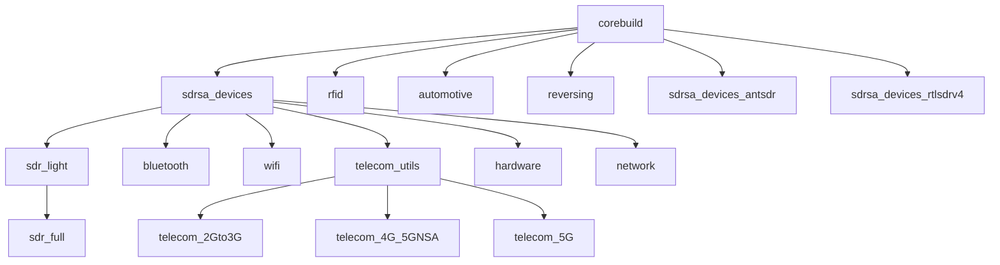

# RF Swift Tool Collection

RF Swift provides a comprehensive suite of specialized tools for radio frequency and hardware security work. This page catalogs the tools available in each pre-built image.


RF Swift is in active development. The tool collection is regularly expanded and optimized for all supported architectures.


## Image Hierarchy

Each RF Swift image builds upon a foundation of tools, with specialized images adding domain-specific capabilities. Understanding this hierarchy helps you choose the most appropriate image for your needs:



## Tool Categories

### Core SDR Devices Support

The `sdrsa_devices` image serves as the foundation for many RF Swift images, providing essential drivers and utilities for software-defined radio hardware.




**Specialized Device Support:**
- For RTL-SDR v4 devices: Use the `rtlsdrv4_devices_install` function
- For ANTSDR devices: Use the `antsdr__devices_install` function


#### Common Device Troubleshooting

##### RTL-SDR Kernel Module Conflicts

If your RTL-SDR device is unavailable when using tools like `nfc-spy`, the DVB-T kernel module may have claimed it. Blacklist the module with:

```bash
echo "blacklist dvb_usb_rtl28xxu" | sudo tee /etc/modprobe.d/blacklist-dvb_usb_rtl28xxu.conf
```

You'll need to restart your host system after adding this blacklist entry.

##### PlutoSDR Connection Issues

If the PlutoSDR doesn't appear with `iio_info -s` and you see errors like:

```
with backends: local xml ip usb
Unable to create Local IIO context : No such file or directory (2)
ERROR: Unable to create Avahi DNS-SD client :Daemon not running
Scanning for IIO contexts failed: Text file busy (26)
```

This can be resolved in two ways:
1. On Linux hosts: Ensure `avahi-daemon` is running on your host system
2. Inside the container: Run the Avahi daemon with:
   ```bash
   avahi-daemon --no-drop-root --no-rlimits
   ```

### SDR Light Tools

The `sdr_light` image includes essential software-defined radio tools for signal capture, analysis, and basic decoding.



### SDR Full Environment

The `sdr_full` image builds on `sdr_light` to provide a comprehensive SDR development and analysis environment, including GNU Radio and specialized plugins.

#### GNU Radio Out-Of-Tree Modules

These modules extend GNU Radio's capabilities for specific protocols and signal types:



#### Additional SDR Software



### RFID Tools

The `rfid` image focuses on radio-frequency identification analysis and exploitation:




**RFID Device Requirements:**
When using RFID tools, you need to ensure that your RFID reader device (typically appearing as `/dev/ttyACM0`) is properly bound to the container:

```bash
# When creating a new container
rfswift run -i rfid -n rfid_tools -s /dev/ttyACM0:/dev/ttyACM0

# Or with an existing container
rfswift bindings add -c rfid_tools -d -t /dev/ttyACM0
```


### Bluetooth Analysis

The `bluetooth` image contains specialized tools for Bluetooth protocol analysis and security testing:




**Required Capability:**
Bluetooth tools require the `NET_ADMIN` capability to function properly. Always include this capability when running the container:

```bash
rfswift run -i bluetooth -n bt_tools -a NET_ADMIN
```

Without this capability, many Bluetooth tools will fail with permission errors when attempting to configure network interfaces.


### Wi-Fi Security

The `wifi` image provides tools for Wi-Fi network analysis, packet capture, and security assessment:




**Required Capability:**
Wi-Fi tools require the `NET_ADMIN` capability to manipulate wireless interfaces. Always include this capability when running the container:

```bash
rfswift run -i wifi -n wifi_tools -a NET_ADMIN
```

If you see errors about insufficient permissions when using Wi-Fi tools, this capability is likely missing.


### Telecommunications

The telecommunications images are divided into several categories based on mobile network generations:

#### Telecom Utilities

Foundation tools for cellular network analysis:



#### 2G/3G Analysis Tools

Tools for GSM, UMTS, and related technologies:



#### 4G/5G Analysis Tools

Tools for LTE, 5G-NSA:



#### 5G Analysis Tools

Tools for 5G technologies:



### Automotive Security

The `automotive` image contains tools for vehicle network analysis and communication:



### Hardware Reverse Engineering

The `reversing` image provides tools for firmware analysis and hardware reverse engineering:



### Network Analysis

The `network` image contains general network analysis and security tools:



### Hardware Security

The `hardware` image focuses on general hardware security testing and analysis:



## Tool Usage Tips

### Tool Directory Organization

RF Swift organizes tools in specialized directories for easier discovery:

- `/rftools` - Contains radio frequency analysis tools
- `/hardware` - Hardware security and testing tools
- `/automotive` - Vehicle communication and analysis tools 
- `/reverse` - Reverse engineering and firmware analysis tools

These directories complement the standard system paths (`/usr/bin`, `/usr/local/bin`) and contain specialized tools, scripts, and resources.

### Finding Available Tools

To discover which tools are available in your current container:

```bash
# List all executable commands in standard paths
find /usr/bin /usr/local/bin -type f -executable | sort

# List RF tools in the dedicated directory
ls -la /rftools

# List tools in other specialized directories
ls -la /hardware
ls -la /automotive
ls -la /reverse
// and more

# Search for a specific tool across all locations
find /usr/bin /usr/local/bin /rftools /hardware /automotive /reverse -name "*sdr*" -type f -executable
```

### Tool Documentation

Most tools include built-in help available through the `-h` or `--help` flags:

```bash
tool_name --help
```

For more detailed documentation, many tools include man pages:

```bash
man tool_name
```

### Creating Tool Aliases

For frequently used tools with complex options, consider creating aliases in your container:

```bash
echo 'alias rtlpower-optimized="rtl_power -f 88M:108M:25k -g 50 -i 10 -e 1h power.csv"' >> ~/.zshrc
source ~/.zshrc
```

## Next Steps

Continue to the Configurations page to learn how to customize your RF Swift environment:


  
