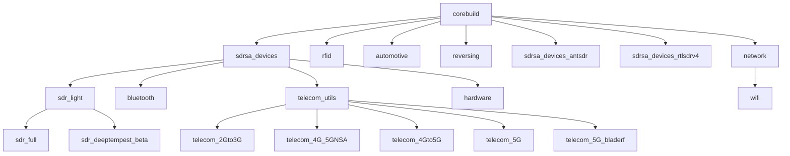

# RF Swift Tool Collection

RF Swift provides a comprehensive suite of specialized tools for radio frequency and hardware security work. This page catalogs the tools available in each pre-built image.


RF Swift is in active development. The tool collection is regularly expanded and optimized for all supported architectures.



**Installation Status Key:**
- ✅ **Installed by default** - Tool is included when you build/pull the image
- ❌ **Install manually** - Tool function exists but must be run manually after container creation
- ❓ **Limited support** - Tool may have architecture-specific issues


## Image Hierarchy

Each RF Swift image builds upon a foundation of tools, with specialized images adding domain-specific capabilities. Understanding this hierarchy helps you choose the most appropriate image for your needs:



## Tool Categories

### Core SDR Devices Support

The `sdrsa_devices` image serves as the foundation for many RF Swift images, providing essential drivers and utilities for software-defined radio hardware.




**Device-Specific Notes:**
- **UHD vs ANTSDR**: Choose either standard UHD or ANTSDR variant during build (mutually exclusive)
- **RTL-SDR versions**: Standard rtl-sdr or rtlsdrv4 blog version (mutually exclusive)
- **Manual installation tools**: SoapySDR modules, SoapyPlutoSDR, and pocketVNA require manual installation after container creation


#### Common Device Troubleshooting

##### RTL-SDR Kernel Module Conflicts

If your RTL-SDR device is unavailable when using tools like `nfc-spy`, the DVB-T kernel module may have claimed it. Blacklist the module with:

```bash
echo "blacklist dvb_usb_rtl28xxu" | sudo tee /etc/modprobe.d/blacklist-dvb_usb_rtl28xxu.conf
```

You'll need to restart your host system after adding this blacklist entry.

##### PlutoSDR Connection Issues

If the PlutoSDR doesn't appear with `iio_info -s` and you see errors like:

```
with backends: local xml ip usb
Unable to create Local IIO context : No such file or directory (2)
ERROR: Unable to create Avahi DNS-SD client :Daemon not running
Scanning for IIO contexts failed: Text file busy (26)
```

This can be resolved in two ways:
1. On Linux hosts: Ensure `avahi-daemon` is running on your host system
2. Inside the container: Run the Avahi daemon with:
   ```bash
   avahi-daemon --no-drop-root --no-rlimits
   ```

### SDR Light Tools

The `sdr_light` image includes essential software-defined radio tools for signal capture, analysis, and basic decoding.




**Tool Locations:**
Most SDR tools are installed in standard system paths (`/usr/bin`, `/usr/local/bin`), with specialized tools in:
- `/rftools/sdr/` - SDR-specific applications
- `/rftools/analysers/` - Spectrum analyzer software
- `/rftools/generators/` - Signal generator software


### SDR Full Environment

The `sdr_full` image builds on `sdr_light` to provide a comprehensive SDR development and analysis environment, including GNU Radio and specialized plugins.

#### GNU Radio Out-Of-Tree Modules

These modules extend GNU Radio's capabilities for specific protocols and signal types:




**Known Issues:**
- **gr-ccsds**: Currently broken due to strtod_l dependency issues
- **deep-tempest**: Available in separate `sdr_deeptempest_beta` image due to specific dependencies
- **gr-fosphor**: Only included in GPU-enabled builds (requires OpenCL/CUDA)
- **gr-signal-hound**: Requires manual installation (architecture-specific)


#### Additional SDR Software




**Major Software Suites:**
- **SDR++**: Modern cross-platform SDR software with plugin support
- **SDRAngel**: Advanced SDR software with extensive plugin ecosystem
- **GQRX**: Popular SDR receiver powered by GNU Radio
- **SigDigger**: Signal analysis and reverse engineering tool
- **URH**: Universal Radio Hacker for wireless protocol analysis (with HydraSDR fork enhancements)


### RFID Tools

The `rfid` image focuses on radio-frequency identification analysis and exploitation:




**RFID Device Requirements:**
When using RFID tools, you need to ensure that your RFID reader device (typically appearing as `/dev/ttyACM0`) is properly bound to the container:

```bash
# When creating a new container
rfswift run -i rfid -n rfid_tools -s /dev/ttyACM0:/dev/ttyACM0

# Or with an existing container
rfswift bindings add -c rfid_tools -d -t /dev/ttyACM0 # or without -d if you want to unplug and replug it when container is running
```


### Bluetooth Analysis

The `bluetooth` image contains specialized tools for Bluetooth protocol analysis and security testing:




**Required Capability:**
Bluetooth tools require the `NET_ADMIN` capability to function properly. Always include this capability when running the container:

```bash
rfswift run -i bluetooth -n bt_tools -a NET_ADMIN
```

Without this capability, many Bluetooth tools will fail with permission errors when attempting to configure network interfaces.



**Python Virtual Environments:**
Some Bluetooth tools run in isolated Python environments:
- **Mirage**: Uses Python 3.10 venv at `/opt/mirage-env/`, accessed via wrapper script at `/usr/sbin/mirage`
- **Bluing**: Uses Python 3.10 venv at `/rftools/bluetooth/bluing/`, run with `bluing_run` script

**Tool Locations:**
- `/rftools/bluetooth/` - Main Bluetooth tools directory
- `/rftools/bluetooth/firmwares/` - Firmware for various BLE sniffers (Btlejack, Injectable NRF52840, Sniffle)


### Wi-Fi Security

The `wifi` image provides tools for Wi-Fi network analysis, packet capture, and security assessment:




**Required Capability:**
Wi-Fi tools require the `NET_ADMIN` capability to manipulate wireless interfaces. Always include this capability when running the container:

```bash
rfswift run -i wifi -n wifi_tools -a NET_ADMIN
```

If you see errors about insufficient permissions when using Wi-Fi tools, this capability is likely missing.



**WPA3 Attack Tools:**
RF Swift includes a complete suite of WPA3 vulnerability testing tools:
- **dragonslayer** - Dragonfly handshake vulnerabilities
- **dragonforce** - Downgrade and DoS attacks
- **dragondrain-and-time** - Resource exhaustion
- **wacker** - SAE timing attacks

All WPA3 tools are located in `/rftools/wifi/wpa3/`


### Telecommunications

The telecommunications images are divided into several categories based on mobile network generations:

#### Telecom Utilities

Foundation tools for cellular network analysis:




**Python Libraries:**
- **pycrate**: Complete Python cellular protocol stack
- **CryptoMobile**: Mobile network cryptography (Milenage, TUAK, Kasumi, etc.)
- **pysctp**: Python SCTP bindings for signaling protocols
- **bromelia**: Diameter protocol stack for LTE/5G core


#### 2G/3G Analysis Tools

Tools for GSM, UMTS, and related technologies:




**Architecture Limitations:**
- **YateBTS**: Requires Qt5 dependencies, may have limited multi-arch support
- **OpenBTS/OpenBTS-UMTS**: x86_64 only due to build dependencies
- **OsmoCom suite**: Builds on all architectures but requires significant system resources



**Tool Locations:**
- `/telecom/2G/` - 2G base stations and tools
- `/telecom/3G/` - 3G/UMTS tools
- `/telecom/SIM/` - SIM card programming tools
- Configuration files in `/root/config/osmobts/`


#### 4G/5G Analysis Tools

Tools for LTE and 5G-NSA:




**srsRAN 4G**:
Complete LTE stack including:
- **srsENB**: LTE eNodeB (base station)
- **srsEPC**: Evolved Packet Core
- **srsUE**: UE simulator


#### 5G Analysis Tools

Tools for 5G standalone (SA) and core networks:




**MongoDB Requirement:**
Open5GS requires MongoDB for subscriber database. The container includes:
- MongoDB 6.0 from official repository
- Web UI for subscriber management (Node.js based)
- Database directory at `/data/db/`

To start all Open5GS components: `Open5Gs_deployall`



### Automotive Security

The `automotive` image contains tools for vehicle network analysis and communication:




**Tool Locations:**
- `/automotive/` - Main automotive tools directory
- CAN/LIN/FlexRay tools
- Vehicle protocol analyzers


### Hardware Reverse Engineering

The `reversing` image provides tools for firmware analysis and hardware reverse engineering:




**Architecture-Specific Tools:**
- **Ghidra**: Java-based, works on all architectures
- **Radare2/Cutter**: x86_64 only due to Qt dependencies
- **Unicorn/Keystone**: x86_64 only (ARM64 builds broken)
- **Binwalk v3**: Requires Rust 1.82+, uses cargo for installation



**Tool Locations:**
- `/reverse/` - Reverse engineering tools and projects
- Ghidra at `/reverse/ghidra_X.X.X_PUBLIC/`
- ImHex: x86_64 uses .deb, ARM64 uses AppImage extraction


### Network Analysis

The `network` image contains general network analysis and security tools:




**Major Frameworks:**
- **Metasploit**: Full penetration testing framework (x86_64/aarch64)
- **NetExec**: Network protocol exploitation
- **Kismet**: Wireless/Bluetooth packet capture and analysis
- **Caido**: Modern web security testing platform
- **Burp Suite Community**: Multi-architecture support (JAR fallback for non-x86_64)


### Hardware Security

The `hardware` image focuses on general hardware security testing and analysis:




**Logic Analyzer Software:**
- **Logic 2 (Saleae)**: x86_64 only, uses `--no-sandbox` flag automatically
- **PulseView/Sigrok**: Built from source with ARM64 libsigrokdecode patch
- **DSView**: Built from source for DSLogic devices



**Tool Locations:**
- `/hardware/` - Logic analyzers, programmers, and debugging tools
- Arduino IDE wrapper at `/usr/sbin/arduino`
- OpenOCD with extensive debug probe support


## Tool Usage Tips

### Tool Directory Organization

RF Swift organizes tools in specialized directories for easier discovery:

- `/rftools/` - Radio frequency analysis tools
  - `/rftools/sdr/` - SDR software and utilities
  - `/rftools/bluetooth/` - Bluetooth tools and firmwares
  - `/rftools/wifi/` - WiFi security tools
  - `/rftools/rfid/` - RFID readers and utilities
  - `/rftools/calibration/` - VNA and calibration tools
  - `/rftools/analysers/` - Spectrum analyzer software
  - `/rftools/generators/` - Signal generator software
- `/hardware/` - Hardware security and testing tools
- `/automotive/` - Vehicle communication and analysis tools
- `/reverse/` - Reverse engineering and firmware analysis tools
- `/telecom/` - Telecommunications tools
  - `/telecom/2G/` - GSM/2G base stations
  - `/telecom/3G/` - UMTS/3G tools  
  - `/telecom/4G/` - LTE/4G tools
  - `/telecom/5G/` - 5G SA/NSA tools
  - `/telecom/SIM/` - SIM card tools
- `/security/` - Security testing tools (Caido, etc.)
- `/opt/network/` - Network security tools
- `/opt/crack/` - Password cracking tools
- `/sast/` - Static analysis security testing

These directories complement the standard system paths (`/usr/bin`, `/usr/local/bin`) and contain specialized tools, scripts, and resources.

### Finding Available Tools

To discover which tools are available in your current container:

```bash
# List all executable commands in standard paths
find /usr/bin /usr/local/bin -type f -executable | sort

# List RF tools in the dedicated directory
ls -la /rftools

# List tools in other specialized directories
ls -la /hardware
ls -la /automotive
ls -la /reverse
ls -la /telecom

# Search for a specific tool across all locations
find /usr/bin /usr/local/bin /rftools /hardware /automotive /reverse /telecom -name "*sdr*" -type f -executable
```

### Manual Tool Installation

Some tools are not installed by default but can be added after container creation. To install these tools:

```bash
rfswift install -c container_name -i <installation_function_name>
```

Common manually-installed tools:
- `kismet_soft_install` - Kismet wireless sniffer
- `bettercap_soft_install` - Network attack framework
- `mdk3_soft_install` - WiFi DoS testing
- `wifipumpkin3_soft_install` - Rogue AP framework
- `install_soapy_modules` - Additional SoapySDR device support
- `pocketvna_sa_device` - PocketVNA software (x86_64 only)

### Tool Documentation

Most tools include built-in help available through the `-h` or `--help` flags:

```bash
tool_name --help
```

For more detailed documentation, many tools include man pages:

```bash
man tool_name
```

### Creating Tool Aliases

For frequently used tools with complex options, consider creating aliases in your container:

```bash
echo 'alias rtlpower-optimized="rtl_power -f 88M:108M:25k -g 50 -i 10 -e 1h power.csv"' >> ~/.zshrc
source ~/.zshrc
```

## Architecture-Specific Notes

### x86_64 / AMD64
- Broadest tool support
- All GPU-accelerated tools available
- SignalHound and specialized SA software supported

### ARM64 / aarch64
- Most tools fully supported
- Some GUI applications require AppImage extraction
- Limited SA software support (no SignalHound Spike/VSG60)
- Python tools may need building from source

### RISC-V64
- Growing support, most core SDR tools work
- Some tools installed from source due to package availability
- Limited pre-built binary support
- Python packages may require longer build times

## Next Steps

Continue to the Configurations page to learn how to customize your RF Swift environment:


  
