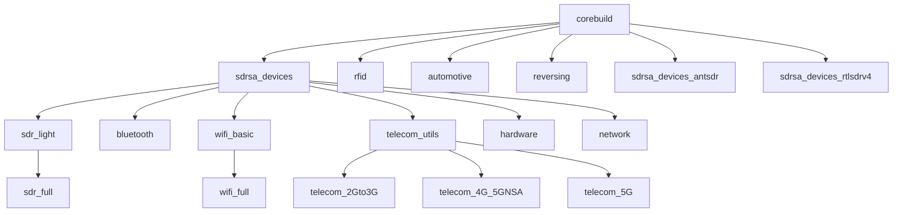


   RF Swift is still in active development so more tools will be expected, and will readapted for all architectures as possible.


RF Swift prebuilt images are compiled with tools you can discover in the next sections.

Here you will find images hierarchy:



## sdrsa_devices




  For RTL-SDR v4, the `rtlsdrv4_devices_install` function can be used instead. For ANTSDR, use `antsdr__devices_install`


### Troubleshootings 

#### RTL-SDR in use

If the RTL-SDR is not available when using tools like `nfc-spy`, try blacklisting the device and restart the host after running this command:

```bash
echo "blacklist dvb_usb_rtl28xxu" | sudo tee /etc/modprobe.d/blacklist-dvb_usb_rtl28xxu.conf
```

### Troubleshooting with some devices

#### PlutoSDR

Using some distribution or system, the PlutoSDR will probably not show with `iio_info -s` command:

```
with backends: local xml ip usb
Unable to create Local IIO context : No such file or directory (2)
ERROR: Unable to create Avahi DNS-SD client :Daemon not running
Scanning for IIO contexts failed: Text file busy (26)
```

This can be fixed running `avahi-daemon` on your host if using Linux, or by running a daemon inside the container with following command :

```
avahi-daemon --no-drop-root --no-rlimits
```

## sdr_light



## sdr_full

### GNU Radio Out-Of-Tree Modules



### Extra-softwares



## RFID



## Bluetooth



## Wi-Fi



## Telecom 

### Utils



### 2G to 3G



### 4G to 5G



## Automotive



## Reversing



## Network



## Hardware

