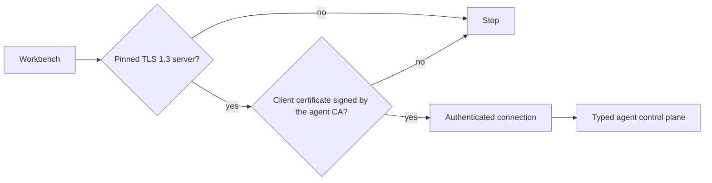

The remote agent lets the [Workbench](/docs/guide/workbench/) on your laptop drive RF Swift on another machine: the one that holds the hardware (SDR, RFID reader, serial adapters, GPU). The agent is part of the lean `rfswift` binary, so any Linux, macOS or Windows host that runs RF Swift can serve: a workstation in the lab, a server in a rack, or a small ARM64 or RISC-V board placed next to the antenna.

**In short**

- On the lab machine: generate a certificate bundle once, then start the agent.
- On your laptop: import a client credential file, then connect from the Workbench.
- Keep the agent on loopback or behind a VPN or SSH tunnel. A valid client certificate means full command execution on the lab machine.

```bash
# on the lab machine
rfswift agent certs init --dir "$HOME/.config/rfswift/remote/lab" --name lab-agent --host lab.internal
rfswift agent --bundle "$HOME/.config/rfswift/remote/lab"
rfswift agent certs client --bundle "$HOME/.config/rfswift/remote/lab" --name laptop   # credential file for the laptop
```


**Command reference**: [agent](/docs/commands/agent/). **Limits** of remote mode: [below](#limits-of-remote-agent-mode) and in [Known limits](/docs/guide/limitations/#remote-agent-mode).


## Security model

Authentication uses a single mechanism: a CA-verified **mutual-TLS client certificate**.



**Connection**

- TLS 1.3 only. The client **pins** the server certificate by its SHA-256 fingerprint.
- The server checks the client certificate during the TLS handshake. A client without a trusted certificate never reaches HTTP: no `/health`, no `/v1/info`, no route hints. Unknown routes are closed without a response.
- There is no network password, FIDO2, bearer token or plaintext-key fallback.

**Keys and certificates**

- CA, server and client private keys are password-encrypted PKCS#8 files. The random passwords live in the OS vault: macOS Keychain, Windows Credential Manager or Linux Secret Service. Profiles hold only paths and opaque vault references.
- RF Swift fails closed when the vault is unavailable.
- Certificates use neutral subjects (no RF Swift, Penthertz, user or agent names). Their DNS name or IP remains visible by necessity.
- Credential files that move between machines are sealed by an integrity tag derived from the transfer passphrase (v4.0.2): a file whose CA, certificate, endpoint or pin was modified in transit is refused at import. Files issued by older releases import with a warning; compare the fingerprint by hand.

**Logging**

- Every authenticated request is logged on the agent's stderr with the client certificate's fingerprint prefix, the source address and the method. Rejected handshakes are logged too.


Possession of a valid client identity grants command execution on the agent host. There are no roles, per-command policies, revocation service or request rate limits.

- Keep the agent on loopback or a private authenticated tunnel.
- Protect the key directory with owner-only permissions.
- Re-issue the bundle after a loss or a personnel change.

The [Remote agent hardening](/docs/security/remote-agent/) page is the deployment checklist for an agent that will be exposed.


## VPN-first deployment

Keep the agent bound to `127.0.0.1:8443` (the default) and reach it through WireGuard, another authenticated VPN, or an SSH tunnel:

```bash
# on the Workbench machine
ssh -N -L 18443:127.0.0.1:8443 user@lab.internal
# the endpoint is then https://localhost:18443
```

An open TLS port remains detectable when exposed directly. Make it appear filtered by dropping unauthorised traffic at the firewall, or by exposing it only inside the VPN. **Do not bind the agent to the public Internet.**

## Step by step

{}

### Prepare the secure store on the agent host

The agent's key passwords are kept in the vault of the user who creates the bundle:

- **Linux**: a logged-in, non-root desktop user with Secret Service (GNOME Keyring, KDE Wallet) available.
- **macOS**: the current user's login Keychain.
- **Windows**: the current user's Credential Manager.

### Generate the bundle

Use the DNS name or IP that clients will dial:

```bash
rfswift agent certs init --dir "$HOME/.config/rfswift/remote/lab" --name lab-agent --host lab.internal
```

The private directory now holds:

- `ca.pem`, `ca-key.pem`, `server.pem`, `server-key.pem`, `client.pem`, `client-key.pem` (keys are `0600`);
- `bundle.json`: paths, fingerprints and vault references.

The command ends by printing the start command and the fingerprint to pin.

### Start the agent

```bash
rfswift agent --bundle "$HOME/.config/rfswift/remote/lab"
```

- `--bundle` expands to `--cert`, `--key`, `--key-ref` and `--client-ca`, which can also be given by hand.
- The agent prints "listening" only once the key is decrypted and the socket is bound.
- Run it as the **same user** who ran `certs init`, in a session where that user's vault is unlocked. On Windows, a scheduled task or service under another account has no access to the vault.

### Give a Workbench on another machine its credentials

The keys in the bundle only open with the vault of the user who generated them, so:

- copying `client-key.pem` to another machine does not work;
- running `certs init` again on the other machine produces a different CA and server certificate, which the Workbench then reports as `agent certificate pin changed`.

Issue a **client credential file** instead:

```bash
rfswift agent certs client --bundle "$HOME/.config/rfswift/remote/lab" --name laptop
```

It asks for a transfer passphrase (12 characters or more) and writes `clients/laptop-client.json`. The file contains the CA, a client certificate signed for `laptop`, that client's private key encrypted with the passphrase (scrypt and AES-256-GCM), the agent address and the server fingerprint.

Move the file to the laptop and import it, either:

- in the Workbench: **Connection & security > Add agent > Import client credentials**, which fills the endpoint, the pinned fingerprint and the secrets location, then **Connect**;
- or on the command line: `rfswift agent certs import laptop-client.json --dir ~/.config/rfswift/remote/lab-client`.

What the import does:

1. verifies the file's integrity tag under the passphrase, so a file modified in transit is refused;
2. checks the certificate against the CA;
3. decrypts the key and re-encrypts it under a random password in that machine's vault. The passphrase is not kept.

Each machine gets its own certificate. Compare the endpoint and the server fingerprint printed by the import with those printed by `certs client`: for a file from an older release, which has no tag, that comparison is the only integrity check.

The reverse direction exists too: `rfswift agent certs export --bundle DIR` packs the agent's own side for a bundle generated in the Workbench, and `certs import` installs it on the agent host.

### Connect from the Workbench

1. Open **Connection & security**.
2. Enter the agent address (`https://lab.internal:8443` or the tunnel endpoint), the pinned SHA-256 fingerprint and the client secrets directory (the Workbench derives the vault reference from it).
3. Press **Connect**. The Workbench validates TLS 1.3, the pin, the CA, the client certificate and the encrypted key.

Saved agent profiles hold only the endpoint, the fingerprint and the credential directory. **Forget** removes the entry without deleting certificates or vault entries. See the [Workbench guide](/docs/guide/workbench/#remote-agents-and-connection-security) for the dialog.

{}

## What runs where once connected

After authentication the Workbench switches to the remote engine, **fail-closed**: there is no fallback to the local machine, a live heartbeat watches the connection, and **Disconnect** returns to local operation explicitly.

| Routed to the agent host | Stays on the Workbench machine |
|---|---|
| Listing every RF Swift container on every engine of the host (Docker, Podman, Lima) and every Nix environment | Mission notes, findings, captures, reports, secrets (the Workbench store) |
| Inspection, start and stop, deletion, container configuration | Starting or stopping the Lima VM |
| Container and Nix creation as jobs with live progress (Nix build status and log tail, layer-by-layer pull); "Stop & clean" cancels on the agent host | The coding-agent (MCP) terminal and its client CLI |
| Image checks and pulls, profile defaults, tool search and install | Theme, panel layout, saved agent profiles |
| Security audits of remote targets | |
| Interactive terminals (PTY; ConPTY on a Windows agent) | |
| Mission-workspace artifact listing and transfer into the local evidence store | |
| Engine doctor report of the agent host, "Reclaim space", Nix "Collect garbage" | |
| USB passthrough on a macOS (Lima) or Windows (usbipd) agent host | |

Everything the Workbench asks for is a typed control call or a JSON argument array for the remote `rfswift` binary, never text interpolated into a shell. The free-form command box of earlier versions is gone.

## Limits of remote-agent mode

**Trust and identity**

- **Trust**: a valid client certificate is full remote command execution as the agent's user. No roles, no per-command policy, no revocation, no rate limiting, no audit log. Rotate the bundle to revoke.
- **Enrollment**: the client's private key is generated on the agent host and travels inside the passphrase-protected file. A CSR flow where the key never leaves the client is not implemented yet.
- **Same-user vault**: the agent must run as the user who generated (or imported) its credentials, with that vault reachable. Headless services under another account cannot start it.

**Compatibility**

- **Version skew**: creation uses the `targets.create.v2` schema. Upgrade the agent alongside the Workbench; an older agent is rejected rather than silently ignoring requested protections such as Nix isolation. Older agents still answer the synchronous creation and pull calls but show no live progress. The connection audit compares the agent's reported version with the Workbench's and warns on a mismatch.
- **Endpoints**: only a bare HTTPS origin is accepted (`https://host:port`, trailing slash allowed): no credentials, paths, queries or fragments. IPv6 literals are supported.

**Scope**

- **What is not remote**: Lima VM lifecycle, the local MCP coding-agent bridge, and the Workbench store itself. The mission's workspace directory lives on the agent host; register the files you need as evidence to copy them locally.
- **Listing**: only containers carrying the `org.container.project=rfswift` label (every container RF Swift creates) are listed.
- **Remote environment audits** stay separate from mission findings, as they do locally.
- **CLI client**: the CLI has no remote-client mode; the Workbench is the client.

{}

- Remote command output is capped at 16 MiB and marked when truncated.
- Artifact transfers are limited to 16 MiB per file.
- Workspace listings stop at 5,000 files and never read file contents (preview is text only).
- Terminal output buffered per poll is capped at 4 MiB and marked when truncated.
- Request bodies are capped at 2 MiB.
- The probe on connect uses an 8-second HTTP client; command execution and terminals are bounded by the caller's deadline instead.
- The server applies a 5-second header timeout, a 15-second read timeout and a 30-second idle timeout.

{}

## Windows notes

Both roles work on Windows (verified on Windows 11 with Docker Desktop).

- **As an agent host**: `certs init` stores the key passwords in the current user's Credential Manager, and `rfswift agent` serves TLS 1.3 + mTLS from `rfswift.exe`. Interactive terminals go through a Windows pseudo console (ConPTY, Windows 10 1809+). usbipd passthrough and WSLg display and audio apply to containers created through the agent as well.
- **As a Workbench client**: the encrypted client key password lives in Credential Manager.
- **File permissions**: Windows ignores POSIX file modes, so keep the bundle inside the user profile, whose default ACL already restricts other accounts.

## Common failures

| Error | Action |
|-------|--------|
| `secure store: ...` | Unlock or start the current non-root user's native vault |
| `secret not found in keyring` | Use the reference from `bundle.json`; the error names the reference and key file it tried |
| `encrypted private key requires a secure-store reference` | `--key-ref` was empty. Pass `--bundle DIR` |
| `agent certificate pin changed` | The pinned fingerprint belongs to another bundle. Pin the one printed by `certs init` on the agent host, or import a client file issued from the agent's current bundle |
| `wrong passphrase, or the credential file is damaged` | The passphrase at import differs from the one chosen at issue time. Issue a new file if it was lost |
| `read client CA ... no such file` | `--client-ca` must be `ca.pem`, not a vault reference |
| `private key must be ... encrypted PKCS#8` | Plaintext or legacy PEM keys are rejected; use a generated bundle |
| TLS hostname error | Regenerate the bundle for the DNS name or IP the client uses |
| Connected, but no containers listed | Open the engine doctor: it shows the agent host's engines as the agent's user sees them. A Docker socket that user cannot open means the `docker` group was joined after the agent's session started: log out and in, restart the agent |

{}

```bash
./scripts/test-remote.sh unit
RFSWIFT_FUZZ_TIME=30s ./scripts/test-remote.sh fuzz
./scripts/test-remote.sh all
```

CI covers encrypted PKCS#8 parsing, wrong passwords, malformed certificates, fingerprints, the mandatory mTLS policy, silent unknown routes and neutral subjects.

{}
