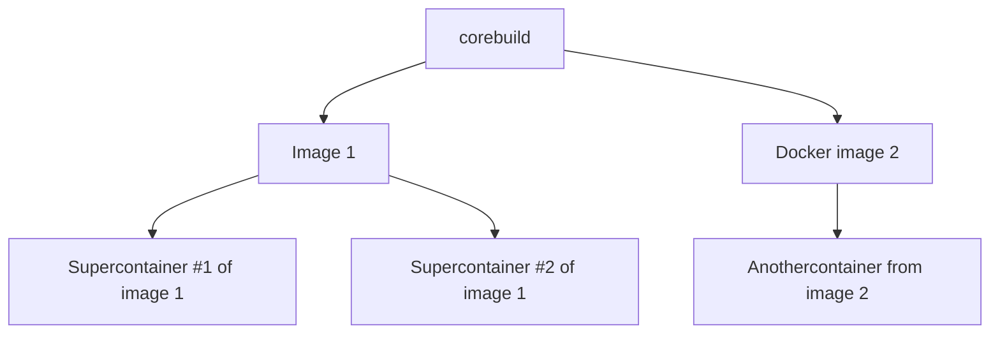

Running RF Swift is pretty straight forward and only requires a few command line to use your hacking tools as you wish.


  **On Linux**, unless your are using Docker Desktop, you will have to use `rfswift` with sudo most of the time.


## Options

Let us first discover the different options of the tool by typing `rfswift --help`:

```bash
rfswift --help
[...]                                                                                                                                              
                                     

  888~-_   888~~        ,d88~~\                ,e,   88~\   d8   
  888   \  888___       8888    Y88b    e    /  "  _888__ _d88__ 
  888    | 888          'Y88b    Y88b  d8b  /  888  888    888   
  888   /  888           'Y88b,   Y888/Y88b/   888  888    888   
  888_-~   888             8888    Y8/  Y8/    888  888    888   
  888 ~-_  888          \__88P'     Y    Y     888  888    "88_/       

                RF toolbox for HAMs and professionals                                                                             

[+] You are running version: 0.4.9 (Up to date)
rfswift is a super fancy CLI (kidding)
   
One can use stringer to modify or inspect strings straight from the terminal

Usage:
  rfswift [flags]
  rfswift [command]

Available Commands:
  commit      Commit a container
  completion  Generate the autocompletion script for the specified shell
  delete      Delete an rfswift images
  exec        Exec a command
  help        Help about any command
  host        Host configuration
  images      RF Swift images management remote/local
  install     Install function script
  last        Last container run
  remove      Remove a container
  rename      Rename a container
  retag       Rename an image
  run         Create and run a program
  update      Update RF Swift

Flags:
  -h, --help   help for rfswift

Use "rfswift [command] --help" for more information about a command.

```


  Using Docker Desktop (Windows and macOS) or OrbStack on macOS, **`sudo` is not necessary**. In other cases, you will have to use it particularly on Linux dealing with images and containers, but not host actions.



  **On Windows**, commands related to USB binding will need to be run as an administrator.



## Stay up-to-date

In case you binary is older than latest official release, you can pull the latest source from [our official GitHub repository ↗](https://github.com/PentHertz/RF-Swift/).

At launch time, the binary will check your binary against latest official release:

```bash
[!] You are running version: 0.4.8 (Obsolete)
[+] Do you want to update to the latest version? (yes/no): 
```

Or you can also use the `upate` command that will download the [latest ↗](https://github.com/PentHertz/RF-Swift/tags) binary compiled for your architecture:

```bash
rfswift update 
...                                                                         

[!] Your current version (0.4.8) is obsolete. Please update to version (v0.4.9).
[+] Do you want to update to the latest version? (yes/no): yes
Latest release download URL: https://github.com/PentHertz/RF-Swift/releases/download/v0.4.9/rfswift_linux_amd64
[+] Do you want to replace the existing binary with this new release? (yes/no): yes
13.67 MiB / 13.67 MiB [---------------------------------------------------------------------------------------------------------------------------------------------------------------------------] 100.00%%
File downloaded and replaced successfully.
```

After that, your binary should be up-to-date!


## Changing tag and running

After pulling an image, you can choose to change the tag name as you wish for conveniency, and also match the tag to the default image to run as described in the configuration in your profile directory (e.g: on Linux):



  
```bash
cat /home/username/.config/rfswift/config.ini
[general]
imagename = myrfswift:latest
...
```
  
  
```powershell
type C:\Users\username\AppData\Roaming\rfswift\config.ini
[general]
imagename = myrfswift:latest
...
```
  
  
```bash
cat /Users/username/.config/rfswift/config.ini
[general]
imagename = myrfswift:latest
...
```
  



So if you change your the tag name of your desired image, or last image you have pulled, to the default tag name `myrfswift:latest` that way:

```bash
rfswift retag -i penthertz/rfswiftdev:sdr_full_amd64 -t myrfswift:latest
...                                                                            

[+] You are running version: 0.4.9 (Up to date)
[+] Image renamed!
```

This will simplify the `run` command and avoid you to use `-i` argument:

```bash
rfswift run -n supertagname1 # -> same as 'rfswift run -i myrfswift:latest -n supertagname1'
...

  🧊 Container Summary                                                                                                                                                                                
╭──────────────────────────────────────────────────────────────────────────────────────────────────────────────────────────────────────────────────────────────────────────────────────────────────────╮
│ Container Name  │ supertagname1                                                                                                                                                                      │
├─────────────────┼────────────────────────────────────────────────────────────────────────────────────────────────────────────────────────────────────────────────────────────────────────────────────┤
│ X Display       │ :0                                                                                                                                                                                 │
├─────────────────┼────────────────────────────────────────────────────────────────────────────────────────────────────────────────────────────────────────────────────────────────────────────────────┤
│ Shell           │ /bin/zsh                                                                                                                                                                           │
├─────────────────┼────────────────────────────────────────────────────────────────────────────────────────────────────────────────────────────────────────────────────────────────────────────────────┤
│ Privileged Mode │ true                                                                                                                                                                               │
├─────────────────┼────────────────────────────────────────────────────────────────────────────────────────────────────────────────────────────────────────────────────────────────────────────────────┤
│ Network Mode    │ host                                                                                                                                                                               │
├─────────────────┼────────────────────────────────────────────────────────────────────────────────────────────────────────────────────────────────────────────────────────────────────────────────────┤
│ Image Name      │ myrfswift:latest (Custom)                                                                                                                                                          │
├─────────────────┼────────────────────────────────────────────────────────────────────────────────────────────────────────────────────────────────────────────────────────────────────────────────────┤
│ Size on Disk    │ 16635.22 MB                                                                                                                                                                        │
├─────────────────┼────────────────────────────────────────────────────────────────────────────────────────────────────────────────────────────────────────────────────────────────────────────────────┤
│ Bindings        │ /tmp/.X11-unix:/tmp/.X11-unix,/dev/bus/usb:/dev/bus/usb,/run/dbus/system_bus_socket:/run/dbus/system_bus_socket,/dev/snd:/dev/snd,/dev/dri:/dev/dri,/dev/input:/dev/input          │
├─────────────────┼────────────────────────────────────────────────────────────────────────────────────────────────────────────────────────────────────────────────────────────────────────────────────┤
│ Extra Hosts     │ pluto.local:192.168.2.1                                                                                                                                                            │
╰──────────────────────────────────────────────────────────────────────────────────────────────────────────────────────────────────────────────────────────────────────────────────────────────────────╯

[+] Container 'supertagname1' started successfully
┌─[root@topms] - [~] - [Tue Sep 03, 13:57]
└─[$]> exit

```


  Note that changing tag name will also make your image custom, and you will not be able to track this image for update from official registry.



Note that if you run a container without enabling audio with `pulseaudio` options, you will generally miss the sound on many tools, and a warning will notify you that the audio is not enabled:

```bash
┌──────────────────────────────────────────────────────────────────────────────────────────────────┐
│ ⚠️  Warning                                                                                       │
├──────────────────────────────────────────────────────────────────────────────────────────────────┤
│ Warning: Unable to connect to Pulse server at 127.0.0.1:34567                                    │
│ To install Pulse server on Linux, follow these steps:                                            │
│ 1. Update your package manager: sudo apt update (for Debian-based) or sudo yum update (for Red   │
│ Hat-based).                                                                                      │
│ 2. Install Pulse server: sudo apt install pulse-server (for Debian-based) or sudo yum install    │
│ pulse-server (for Red Hat-based).                                                                │
│ After installation, enable the module with the following command as unprivileged user:           │
│ ./rfswift host audio enable                                                                      │
└──────────────────────────────────────────────────────────────────────────────────────────────────┘
```

To enable the audio, use the following command **without sudo** and you should see the following message:

```bash
rfswift host audio enable
...
[+] Successfully loaded module-native-protocol-tcp with index 29
```

When running a container, you should get a different shell indicating you are using now the container.

Using the `run` command, you are creating a new container from desired images everytime:



This architecture has several benefits:

* more portability;
* possibility to have kind of "light" and isolated environment;
* you can create, mess, and destroy the environment;
* have specific environments for specific tasks;
* stop wasting time reinstalling the entire system with your tools;
* better performance than VMs that consume more CPU, memory, and disk space;
* and more such as using it as for microservices, etc.

These benefits are what you are generally what you are looking for when doing lots of assessments, particularly when you have to prepare at the last moment.


  Using RF Swift instead of manual host, and Docker commands also makes things easy when the learning curve for Docker can be blocking for most people, and also allow to save a lot of time dealing with host resources for you.



## Restarting a previous container

Of course, to avoid creating new containers with `run` command, you can use `exec` command that will automatically restart the latest container you run:

```bash
rfswift exec                                                                                             
...                                                                        
[+] You are running version: 0.4.9 (Up to date)
[+] Container 'a9c76a227726357a9b403d703923a57ae62a024bace11c1d1df893ea6c7e9623' started successfully
  🧊 Container Summary                                                                                                                                                                                
╭──────────────────────────────────────────────────────────────────────────────────────────────────────────────────────────────────────────────────────────────────────────────────────────────────────╮
│ Container Name  │ supertagname1                                                                                                                                                                      │
├─────────────────┼────────────────────────────────────────────────────────────────────────────────────────────────────────────────────────────────────────────────────────────────────────────────────┤
│ X Display       │ :0                                                                                                                                                                                 │
├─────────────────┼────────────────────────────────────────────────────────────────────────────────────────────────────────────────────────────────────────────────────────────────────────────────────┤
│ Shell           │ /bin/zsh                                                                                                                                                                           │
├─────────────────┼────────────────────────────────────────────────────────────────────────────────────────────────────────────────────────────────────────────────────────────────────────────────────┤
│ Privileged Mode │ true                                                                                                                                                                               │
├─────────────────┼────────────────────────────────────────────────────────────────────────────────────────────────────────────────────────────────────────────────────────────────────────────────────┤
│ Network Mode    │ host                                                                                                                                                                               │
├─────────────────┼────────────────────────────────────────────────────────────────────────────────────────────────────────────────────────────────────────────────────────────────────────────────────┤
│ Image Name      │ myrfswift:latest (Custom)                                                                                                                                                          │
├─────────────────┼────────────────────────────────────────────────────────────────────────────────────────────────────────────────────────────────────────────────────────────────────────────────────┤
│ Size on Disk    │ 16635.22 MB                                                                                                                                                                        │
├─────────────────┼────────────────────────────────────────────────────────────────────────────────────────────────────────────────────────────────────────────────────────────────────────────────────┤
│ Bindings        │ /tmp/.X11-unix:/tmp/.X11-unix,/dev/bus/usb:/dev/bus/usb,/run/dbus/system_bus_socket:/run/dbus/system_bus_socket,/dev/snd:/dev/snd,/dev/dri:/dev/dri,/dev/input:/dev/input          │
├─────────────────┼────────────────────────────────────────────────────────────────────────────────────────────────────────────────────────────────────────────────────────────────────────────────────┤
│ Extra Hosts     │ pluto.local:192.168.2.1                                                                                                                                                            │
╰──────────────────────────────────────────────────────────────────────────────────────────────────────────────────────────────────────────────────────────────────────────────────────────────────────╯
┌─[root@topms] - [~] - [Tue Sep 03, 14:57]
└─[$]> 
```

With `-c` argument precising the name, or container ID, used when creating the container you can also call other container you have previously made:

```bash
rfswift exec -c containername3
...                                                                         
[+] You are running version: 0.4.9 (Up to date)
[+] Container 'containername3' started successfully
  🧊 Container Summary                                                                                                                                                                                
╭──────────────────────────────────────────────────────────────────────────────────────────────────────────────────────────────────────────────────────────────────────────────────────────────────────╮
│ Container Name  │ containername3                                                                                                                                                                     │
├─────────────────┼────────────────────────────────────────────────────────────────────────────────────────────────────────────────────────────────────────────────────────────────────────────────────┤
│ X Display       │ :0                                                                                                                                                                                 │
├─────────────────┼────────────────────────────────────────────────────────────────────────────────────────────────────────────────────────────────────────────────────────────────────────────────────┤
│ Shell           │ /bin/zsh                                                                                                                                                                           │
├─────────────────┼────────────────────────────────────────────────────────────────────────────────────────────────────────────────────────────────────────────────────────────────────────────────────┤
│ Privileged Mode │ true                                                                                                                                                                               │
├─────────────────┼────────────────────────────────────────────────────────────────────────────────────────────────────────────────────────────────────────────────────────────────────────────────────┤
│ Network Mode    │ host                                                                                                                                                                               │
├─────────────────┼────────────────────────────────────────────────────────────────────────────────────────────────────────────────────────────────────────────────────────────────────────────────────┤
│ Image Name      │ penthertz/rfswiftdev:sdr_full_amd64 (Up to date)                                                                                                                                   │
├─────────────────┼────────────────────────────────────────────────────────────────────────────────────────────────────────────────────────────────────────────────────────────────────────────────────┤
│ Size on Disk    │ 16635.22 MB                                                                                                                                                                        │
├─────────────────┼────────────────────────────────────────────────────────────────────────────────────────────────────────────────────────────────────────────────────────────────────────────────────┤
│ Bindings        │ /tmp/.X11-unix:/tmp/.X11-unix,/dev/bus/usb:/dev/bus/usb,/run/dbus/system_bus_socket:/run/dbus/system_bus_socket,/dev/snd:/dev/snd,/dev/dri:/dev/dri,/dev/input:/dev/input          │
├─────────────────┼────────────────────────────────────────────────────────────────────────────────────────────────────────────────────────────────────────────────────────────────────────────────────┤
│ Extra Hosts     │ pluto.local:192.168.2.1                                                                                                                                                            │
╰──────────────────────────────────────────────────────────────────────────────────────────────────────────────────────────────────────────────────────────────────────────────────────────────────────╯
┌─[root@topms] - [~] - [Tue Sep 03, 15:00]
└─[$]> 
```

## Starting programs

Depending on the Docker image you are using, some software can be used, like `sdrangel` after plugging an SDR device like the RTL-SDR one:

```bash
┌─[root@topms] - [~] - [Tue Sep 03, 15:15]
└─[$]> sdrangel
```



  `xhost` on Linux, or `XQuartz` on macOS (well configured), should be installed on the computer to handle graphic elements.


Of course, other software are installed among images, so you can discover the lists in the next pages.

## Retrieving last containers name

If you do not remember how you have named your container, it is not a problem as you can recover the details with the command `last`:

```bash
rfswift last
[+] You are running version: 0.4.9 (Up to date)
  🤖 Last Run Containers                                                                                    
┌───────────────────────────┬─────────────────────────────────────┬────────────────┬──────────────┬──────────┐
│ Created                   │ Image Tag                           │ Container Name │ Container ID │ Command  │
├───────────────────────────┼─────────────────────────────────────┼────────────────┼──────────────┼──────────┤
│ 2024-09-04T12:51:15+02:00 │ penthertz/rfswift:telecom           │ supertelecom   │ e1a8c7c5f419 │ /bin/zsh │
├───────────────────────────┼─────────────────────────────────────┼────────────────┼──────────────┼──────────┤
│ 2024-09-04T12:47:11+02:00 │ penthertz/rfswift:reversing         │ superreverse   │ 70b9269b2819 │ /bin/zsh │
├───────────────────────────┼─────────────────────────────────────┼────────────────┼──────────────┼──────────┤
│ 2024-09-04T12:38:09+02:00 │ penthertz/rfswift:automotive        │ superauto      │ 9063f86f9cf7 │ /bin/zsh │
├───────────────────────────┼─────────────────────────────────────┼────────────────┼──────────────┼──────────┤
...
``` 
 
## Saving Changes to a Container

You can save changes made inside a running container to a new image using the `commit` command. This allows you to preserve the current state of your container as a reusable image.

To commit the changes from a container, use the following command in RF Swift:

```bash
rfswift commit -c supertelecom -i supernewimage
...
[+] You are running version: 0.4.9 (Up to date)
sha256:3e287dbff4ea78ae782f19f50db6e7645ef45294c8990f2a5d595936c1f9d47b
```

## Renaming a container

If the name of the container does not suit you anymore, you can also rename it with the `rename` command as follows:

```bash
rfswift rename -n oldcontainername -d newcontainername
...
[+] You are running version: 0.4.9 (Up to date)
[+] Container 'supertelecom2' renamed to 'newnametelecom'!
```

## Deleting a container

If you want to remove a container, and save space once for a while, you can issue the `remove` command precing the name or ID of the container:

```bash
rfswift remove -c newnametelecom
...
[+] Container 'newnametelecom' removed successfully
```

## Deleting an image

If deleting the container is not enough and need to also remove the image, you can use `delete` command with image tag as follows:

```bash
rfswift detele -c penthertz/rfswift:<tagname>
```