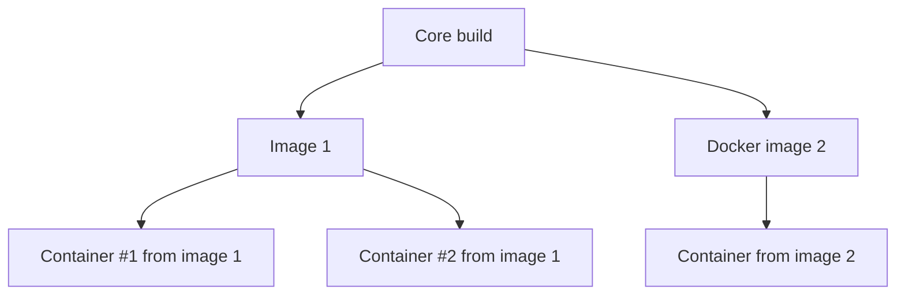

# Running RF Swift

RF Swift provides a streamlined command-line interface to manage containers for RF and hardware security applications. This guide covers essential commands and workflows.


**On Linux**, unless you are using Docker Desktop, you will need to use `sudo` with the `rfswift` command for operations that require elevated privileges.


## Command Overview

Let's explore the available commands with `rfswift --help`:

```bash
rfswift --help
[...]                                                                                                                                              


  888~-_   888~~        ,d88~~\                ,e,   88~\   d8   
  888   \  888___       8888    Y88b    e    /  "  _888__ _d88__ 
  888    | 888          'Y88b    Y88b  d8b  /  888  888    888   
  888   /  888           'Y88b,   Y888/Y88b/   888  888    888   
  888_-~   888             8888    Y8/  Y8/    888  888    888   
  888 ~-_  888          \__88P'     Y    Y     888  888    "88_/       

                RF toolbox for HAMs and professionals                                                                             

rfswift is THE toolbox for any HAM & radiocommunications and hardware professionals

Usage:
  rfswift [flags]
  rfswift [command]

Available Commands:
  bindings    Manage devices and volumes bindings
  commit      Commit a container
  completion  Generate the autocompletion script for the specified shell
  delete      Delete an rfswift images
  exec        Exec a command
  help        Help about any command
  host        Host configuration
  images      RF Swift images management remote/local
  install     Install function script
  last        Last container run
  remove      Remove a container
  rename      Rename a container
  retag       Rename an image
  run         Create and run a program
  stop        Stop a container
  update      Update RF Swift

Flags:
  -q, --disconnect   Don't query updates (disconnected mode)
  -h, --help         help for rfswift

Use "rfswift [command] --help" for more information about a command.
```


**Privilege requirements by platform:**
- **Linux**: `sudo` is required for most container operations when not using Docker Desktop
- **Windows/macOS**: With Docker Desktop or OrbStack, `sudo` is not necessary
- **Windows**: Commands related to USB binding require Administrator privileges


## Core Workflows

### 1. Keeping RF Swift Updated

RF Swift automatically checks for updates when launched:

```bash
[!] You are running version: 0.4.8 (Obsolete)
[+] Do you want to update to the latest version? (yes/no): 
```

You can also trigger updates manually:

```bash
rfswift update

[!] Your current version (0.4.8) is obsolete. Please update to version (v0.6.0).
[+] Do you want to update to the latest version? (yes/no): yes
Latest release download URL: https://github.com/PentHertz/RF-Swift/releases/download/v0.6.0/rfswift_linux_amd64
[+] Do you want to replace the existing binary with this new release? (yes/no): yes
13.67 MiB / 13.67 MiB [---------------------------------------------------------------------------------------------------------------------------------------------------------------------------] 100.00%%
File downloaded and replaced successfully.
```

### 2. Image Management

#### Customizing Image Tags

You can rename image tags for convenience or to match your default configuration:

```bash
rfswift retag -i penthertz/rfswiftdev:sdr_full_amd64 -t myrfswift:latest
[+] You are running version: 0.4.9 (Up to date)
[+] Image renamed!
```

This allows you to use the default tag in your configuration file:


  
```bash
cat /home/username/.config/rfswift/config.ini
[general]
imagename = myrfswift:latest
...
```
  
  
```powershell
type C:\Users\username\AppData\Roaming\rfswift\config.ini
[general]
imagename = myrfswift:latest
...
```
  
  
```bash
cat /Users/username/.config/rfswift/config.ini
[general]
imagename = myrfswift:latest
...
```
  


With the default tag set, you can simplify the `run` command:

```bash
rfswift run -n my_container  # Equivalent to: rfswift run -i myrfswift:latest -n my_container
```


Changing an image's tag makes it a "custom" image in RF Swift, which means it won't receive automatic updates from the official registry.


### 3. Container Management

#### Creating and Running Containers

Create a new container from an image:

```bash
rfswift run -i sdr_full -n my_sdr_container
```

#### Container Listing and Selection

If you forget container names, use the `last` command:

```bash
rfswift last
┌──────────────────────────────────────────────────────────────────────────────────────────────────┐
│ ℹ️  Up-to-date                                                                                    │
├──────────────────────────────────────────────────────────────────────────────────────────────────┤
│ You are running the latest version: 0.6.0-dev                                                    │
└──────────────────────────────────────────────────────────────────────────────────────────────────┘
  🤖 Last Run Containers                                                                                                                   
┌───────────────────────────┬─────────────────────────────┬───────────────────────────────────────────────────────┬──────────────┬──────────┐
│ Created                   │ Image Tag (ID)              │ Container Name                                        │ Container ID │ Command  │
├───────────────────────────┼─────────────────────────────┼───────────────────────────────────────────────────────┼──────────────┼──────────┤
│ 2025-04-11T16:47:02+02:00 │ penthertz/rfswift:hardware  │ hardware                                              │ b6e43a87e1f6 │ /bin/zsh │
├───────────────────────────┼─────────────────────────────┼───────────────────────────────────────────────────────┼──────────────┼──────────┤
│ 2025-04-11T16:23:43+02:00 │ penthertz/rfswift:bluetooth │ missionbluetooth                                      │ 3d92cb59560f │ /bin/zsh │
├───────────────────────────┼─────────────────────────────┼───────────────────────────────────────────────────────┼──────────────┼──────────┤
│ 2025-04-11T16:18:22+02:00 │ penthertz/rfswift:rfid      │ missionrfid2                                          │ 50cbccef53f5 │ /bin/zsh │
├───────────────────────────┼─────────────────────────────┼───────────────────────────────────────────────────────┼──────────────┼──────────┤
...
``` 

#### Restarting Existing Containers

To restart the most recently used container:

```bash
rfswift exec
```

To restart a specific container by name:

```bash
rfswift exec -c my_sdr_container
```

#### Container Lifecycle Management

**Save container changes as a new image:**
```bash
rfswift commit -c my_container -i my_new_image
```

**Rename a container:**
```bash
rfswift rename -n old_name -d new_name
```

**Remove a container:**
```bash
rfswift remove -c container_name
```

**Delete an image:**
```bash
rfswift delete -c penthertz/rfswift:tag_name
```

### 4. Device and Resource Management

#### Audio Support

RF Swift will warn if audio support is not properly configured:

```
┌──────────────────────────────────────────────────────────────────────────────────────────────────┐
│ ⚠️  Warning                                                                                       │
├──────────────────────────────────────────────────────────────────────────────────────────────────┤
│ Warning: Unable to connect to Pulse server at 127.0.0.1:34567                                    │
...
└──────────────────────────────────────────────────────────────────────────────────────────────────┘
```

Enable audio support (run **without sudo**):

```bash
rfswift host audio enable
[+] Successfully loaded module-native-protocol-tcp with index 29
```

#### Dynamic Device and Volume Binding

One of RF Swift's most powerful features is the ability to add or remove device bindings to running containers:

```bash
# Add a USB device to an existing container
rfswift bindings add -c my_container -d -s /dev/ttyUSB0:/dev/ttyUSB0

# For some destination, use shortcuts with -t only
rfswift bindings add -c my_container -d -t /dev/ttyUSB0

# Add a shared folder
rfswift bindings add -c my_container -b ~/projects:/root/projects

# Remove a binding
rfswift bindings rm -c my_container -t /dev/ttyUSB0 [-d]

# List current bindings
rfswift bindings list -c my_container
```

Don't forget the `-d` switch if you want to deal with devices and not volumes.

### 5. Network Configuration

RF Swift supports various network isolation modes:

| Mode | Description |
|------|-------------|
| `host` | No network isolation (default) |
| `bridge` | Default Docker network driver with isolation |
| `none` | Complete network isolation |
| `overlay` | Connect multiple Docker daemons |
| `ipvlan` | Full IPv4/IPv6 addressing control |
| `macvlan` | Assign MAC addresses to containers |

Example of using bridge mode with port mapping:

```bash
rfswift run -i bluetooth -n my_container -t bridge -z 8000 -w 8000:127.0.0.1:80/tcp
```

This command:
- Uses the `-t bridge` option to enable bridge networking
- Maps container port 8000 to host port 80 on localhost with `-w 8000:127.0.0.1:80/tcp`
- Exposes port 8000 to other containers with `-z 8000`


For Wi-Fi and Bluetooth tools, you may need to add the `NET_ADMIN` capability: `rfswift run -i wifi_tools -n my_container -a NET_ADMIN`
Be cautious when adding capabilities as they increase security risks if the container is compromised.


## Container Architecture Benefits



This architecture provides significant advantages:
- **Portability**: Move environments between systems easily
- **Isolation**: Create separate environments for different tasks
- **Disposability**: Create, experiment with, and destroy environments without impact
- **Specialization**: Tailored environments for specific assessment needs
- **Efficiency**: No need to reinstall entire systems
- **Performance**: Less resource-intensive than VMs
- **Time-saving**: Quick deployment for last-minute assessment preparations


RF Swift significantly flattens the Docker learning curve while providing powerful features like dynamic device binding and host resource integration that would otherwise require considerable Docker expertise.


## Using RF Tools

Once your container is running, you can use any included RF tools. For example, with an SDR device connected:

```bash
┌─[root@topms] - [~] - [Tue Sep 03, 15:15]
└─[$]> sdrangel
```



GUI applications require:
- **Linux**: `xhost` installed and configured
- **macOS**: `XQuartz` properly configured
- **Windows**: Native support via Docker Desktop


## Advanced Features

### Host Isolation

RF Swift implements host isolation through several security mechanisms configured in your `config.ini` file:

```ini
[container]
privileged = false
caps =
seccomp =
cgroups = c 189:* rwm,c 166:* rwm,c 188:* rwm
```

#### Default Security Configuration

By default, RF Swift runs containers in unprivileged mode with specific cgroup restrictions:

- **Unprivileged Mode**: Containers run without full root privileges on the host (`privileged = false`)
- **Cgroup Restrictions**: Controlled device access through character device major numbers:
  - `c 189:* rwm`: Access to USB serial devices (ttyUSB*)
  - `c 166:* rwm`: Access to ACM devices (ttyACM*)
  - `c 188:* rwm`: Access to USB serial converters

This provides a reasonable balance between functionality and security for RF applications.

#### Customizing Security Settings

You can customize security settings both in the config file and via command-line parameters:

**Adding Capabilities**:
```bash
# Via command line
rfswift run -i sdr_full -n my_container -a NET_ADMIN,SYS_PTRACE

# Via config.ini
caps = NET_ADMIN,SYS_PTRACE
```

**Custom Seccomp Profile**:
```bash
# Via command line
rfswift run -i sdr_full -n my_container -m /path/to/seccomp.json

# Via config.ini
seccomp = /path/to/seccomp.json
```

**Additional Cgroup Rules**:
```bash
# Via command line
rfswift run -i sdr_full -n my_container -g "c 226:* rwm"

# Via config.ini
cgroups = c 189:* rwm,c 166:* rwm,c 188:* rwm,c 226:* rwm
```


Cgroup rules use the format `type major:minor permission` where:
- `type` is c (character) or b (block)
- `major:minor` defines the device number (use * for wildcard)
- `permission` is r (read), w (write), m (mknod)

For example, `c 189:* rwm` grants full access to all devices with major number 189.


#### Command-Line Security Configuration

RF Swift allows you to override or extend security settings directly from the command line when running containers. This is particularly useful for one-off tasks or testing configurations before adding them to your config file.

**Complete List of Security-Related Flags:**

```bash
rfswift run [options]

Security Options:
  -u, --privileged int        Set privilege level (1: privileged, 0: unprivileged)
  -a, --capabilities string   Extra capabilities (separate with commas)
  -g, --cgroups string        Extra cgroup rules (separate with commas)
  -m, --seccomp string        Set Seccomp profile ('default' one used by default)
  -s, --devices string        Extra devices mapping (separate with commas)
  
Network Options:  
  -t, --network string        Network mode (default: 'host')
  -z, --exposedports string   Exposed ports
  -w, --bindedports string    Ports to bind between host and container
  -x, --extrahosts string     Set extra hosts (default: 'pluto.local:192.168.1.2')
  
Resource Options:
  -b, --bind string           Extra volume bindings (separate with commas)
  -d, --display string        Set X Display (default "DISPLAY=:0")
  -p, --pulseserver string    PULSE SERVER TCP address (default "tcp:127.0.0.1:34567")
```

**Examples of Command-Line Security Configurations:**

1. **Run with specific privileges and capabilities**:
   ```bash
   rfswift run -i penthertz/rfswift:wifi -n wifi_tools -u 0 -a NET_ADMIN,NET_RAW
   ```
   This runs a container in unprivileged mode but adds the NET_ADMIN and NET_RAW capabilities.

2. **Add custom cgroup rules and device mappings**:
   ```bash
   rfswift run -i penthertz/rfswift:sdr -n rtlsdr -g "c 226:* rwm" -s "/dev/rtlsdr0:/dev/rtlsdr0"
   ```
   This adds permission for device major number 226 and maps a specific RTL-SDR device.

3. **Set a custom seccomp profile**:
   ```bash
   rfswift run -i penthertz/rfswift:security -n forensics -m ~/custom_seccomp.json
   ```
   This applies a custom seccomp profile to the container.

4. **Combined security settings**:
   ```bash
   rfswift run -i penthertz/rfswift:bluetooth -n bt_scanner \
     -t bridge \
     -a NET_ADMIN \
     -g "c 226:* rwm,c 116:* rwm" \
     -s "/dev/bluetooth:/dev/bluetooth" \
     -u 0
   ```
   This creates a container with:
   - Bridge networking mode
   - NET_ADMIN capability
   - Custom cgroup rules for devices with major numbers 226 and 116
   - Specific Bluetooth device mapping
   - Unprivileged mode


Command-line settings always take precedence over config file settings. When using both, command-line options will extend or override the corresponding settings in your config.ini file.
